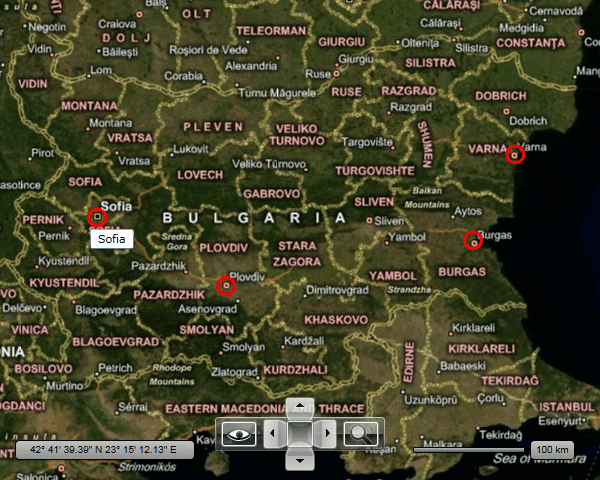

# Data Binding

When displaying a map, you might also want to visualize some data on it in the form of hot spots, pin points, etc. As showed in the topics under the Information Layer section, you can declare them as static objects. However, the __InformationLayer__ object allows you to dynamically load and display map markers via data binding.

>tip To learn more about the __InformationLayer__ class and its usage read [this topic]().

In order to display your map data dynamically you just have to treat the __InformationLayer__ as a typical __ItemsControl__. This means you have to use its __ItemsSource__ and __ItemTemplate__ properties. You can also make a use of the __ItemTemplateSelector__ property, in order to implement advanced visualization depending on the data item.

There are two approaches you can use:

* [Directly bind the appropriate attached properties in the DataTemplate](#using-data-binding-in-the-datatemplate)

* [Use DataMappings](#using-datamappings)

## Using Data Binding in the DataTemplate

When loading your map data dynamically there are several attached properties that you can use in order to position and display the marker on its proper place:

* __MapLayer.Location__ - represents the latitude and the longitude of the map point.

* __MapLayer.BaseZoomLevel__ - represents the zoom level of the map for which the marker should have its normal size.

* __MapLayer.ZoomRange__ - represents a range of zoom levels on which the marker should appear.

>tip To learn more about the usage of these properties read [this topic]().

In order to provide the needed data to your __RadMap__ control, you have to create a collection of business objects, which represent the desired data.

The next step is to define the __ItemTemplate__ for the information layer and set the desired bindings in it. In the current example, the marker will be represented by an ellipse marked as a Hot Spot.

<snippet id='radmap-features-information-layer-data-binding-block_1-xaml' />

The last thing to do is to set the __ItemsSource__ property of the __InformationLayer__. This has to be done after the initialization of the map provider, otherwise the marker elements will appear before the map has loaded. For this purpose you have to use the __InitializationCompleted__ event, which get raised after the initialization of the map provider completes.

<snippet id='radmap-features-information-layer-data-binding-block_2-cs' />
<snippet id='radmap-features-information-layer-data-binding-block_2-vb' />

As a result you should be able to see the markers on your __RadMap__.

## Using DataMappings

By using this approach you have to define mappings between the data fields and the respective __MapLayer__ properties. This is done by creating the respective __DataMapping__ objects and adding them to the __DataMappings__ collection of the __InformationLayer__.

>tip The __DataMember__ enumeration used for the ValueMember value allows you to map not only the __Location__, __ZoomLevel__ and __ZoomRange__. You can also map __Latitude__, __Longitude__, __ZoomRangeMin__ and __ZoomRangeMax__. Which means that your business object can provide simple double properties for these values instead of the complex __Location__ and __ZoomRange__ ones.

>In this example, the same __ItemTemplate__, business object and sample data will be used as in the example from the previous section of this topic. 

To learn how and when to set the __ItemsSource__ of the __InformationLayer__, please read [the previous section](#using-data-binding-in-the-datatemplate).

<snippet id='radmap-features-information-layer-data-binding-block_3-xaml' />

Finally here is the code for the business object and the __GetMapData()__ method.

<snippet id='radmap-features-information-layer-data-binding-block_4-cs' />
<snippet id='radmap-features-information-layer-data-binding-block_4-vb' />

<snippet id='radmap-features-information-layer-data-binding-block_5-cs' />
<snippet id='radmap-features-information-layer-data-binding-block_5-vb' />

## See Also
 * [Getting Started]()
 * [Information Layer]()
 * [Hot Spots]()