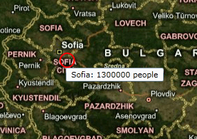

# Extended Data

The __MapShape__ object exposes a property called __ExtendedData__. It allows you to attach additional data to the shape. For example, if a shape represents a country on the map, you can use the __ExtendedData__ property to attach information about the country such as Area, Capitol, Population etc. Later this data can be accessed through the __ExtendedData__ property.

>tip To learn more about the __MapShape__ objects read [here]().

>The __ExtendedData__ represents a set of properties and their values. To access a value you have to use the property name as a key.

This topic will explain the following:

* [Extended Data and MapShapeReader](#extended-data-and-mapshapereader)

* [Manual Extended Data creation](#manual-extended-data-creation)

* [Extended Data Converter](#extended-data-converter)

## Extended Data and MapShapeReader

When generating shapes automatically from the various data formats via __MapShapeReader__, the __Extended Data__ gets automatically extracted from the files and stored inside the __ExtendedData__ property. This way you can directly use it where needed.

>tip To learn more about the __MapShapeReader__ object read [here]().

## Manual Extended Data creation

In case you are manually generating the shapes inside a layer, you have to manually wrap and pass the data to the ExtendedData property. This one by using the __ExtendedData__ and the __ExtendedPropertySet__ classes. Here is an example:

#### __XAML__
```XAML
	<telerik:RadMap x:Name="radMap">
	    <telerik:InformationLayer x:Name="informationLayer" />
	</telerik:RadMap>
```

#### __C#__
```C#
	// Create extended property set.
	// It can be shared between the number
	// of the map shapes.
	ExtendedPropertySet propertySet = new ExtendedPropertySet();
	propertySet.RegisterProperty( "Name", "City Name", typeof( string ), String.Empty );
	propertySet.RegisterProperty( "Population", "Population", typeof( int ), 0 );
	MapEllipse sofiaEllipse = new MapEllipse()
	{
	    ShapeFill = new MapShapeFill()
	    {
	        Stroke = new SolidColorBrush( Colors.Red ),
	        StrokeThickness = 2,
	        Fill = new SolidColorBrush( Colors.Transparent )
	    },
	    Width = 20,
	    Height = 20,
	    Location = new Location( 42.6957539183824, 23.3327663758679 ),
	};
	// Create extended data for the ellipse
	// using existing property set.
	ExtendedData sofiaData = new ExtendedData( propertySet );
	// Set the extended properties.
	sofiaData.SetValue( "Name", "Sofia" );
	sofiaData.SetValue( "Population", 1300000 );
	
	// Assign extended data to the map shape.
	sofiaEllipse.ExtendedData = sofiaData;
	this.informationLayer.Items.Add( sofiaEllipse );
```

#### __VB.NET__
```VB.NET
	' Create extended property set.'
	' It can be shared between the number'
	' of the map shapes.'
	Dim propertySet As New ExtendedPropertySet()
	propertySet.RegisterProperty("Name", "City Name", GetType(String), String.Empty)
	propertySet.RegisterProperty("Population", "Population", GetType(Integer), 0)
	Dim sofiaEllipse As New MapEllipse() With {.ShapeFill = New MapShapeFill() With {.Stroke = New SolidColorBrush(Colors.Red), .StrokeThickness = 2, .Fill = New SolidColorBrush(Colors.Transparent)}, .Width = 20, .Height = 20, .Location = New Location(42.6957539183824, 23.3327663758679)}
	' Create extended data for the ellipse'
	' using existing property set.'
	Dim sofiaData As New ExtendedData(propertySet)
	' Set the extended properties.'
	sofiaData.SetValue("Name", "Sofia")
	sofiaData.SetValue("Population", 1300000)
	' Assign extended data to the map shape.'
	sofiaEllipse.ExtendedData = sofiaData
	Me.informationLayer.Items.Add(sofiaEllipse)
```

## Extended Data Converter

To access the data stored in the __ExtendedData__ property simply bind directly to it and use the __ExtendedDataConverter__ class, that comes out of the box with the __RadMap__. To get the desired value you have to also pass the name of the respective property from the set as the __ConverterParameter__. Here is an example, based on the one in the previous section:

>tip You can pass a string to the ConvertParameter that combines the values of two or more properties from the Extended Data. To learn how to compose your format string read the [following topic](#ToolTipFormat).

#### __XAML__
```XAML
	<telerik:RadMap x:Name="radMap">
	    <telerik:InformationLayer x:Name="informationLayer" />
	</telerik:RadMap>
```

#### __C#__
```C#
	ExtendedPropertySet propertySet = new ExtendedPropertySet();
	propertySet.RegisterProperty( "Name", "City Name", typeof( string ), String.Empty );
	propertySet.RegisterProperty( "Population", "Population", typeof( int ), 0 );
	MapEllipse sofiaEllipse = new MapEllipse()
	{
	    ShapeFill = new MapShapeFill()
	    {
	        Stroke = new SolidColorBrush( Colors.Red ),
	        StrokeThickness = 2,
	        Fill = new SolidColorBrush( Colors.Transparent )
	    },
	    Width = 20,
	    Height = 20,
	    Location = new Location( 42.6957539183824, 23.3327663758679 ),
	};
	ExtendedData sofiaData = new ExtendedData( propertySet );
	sofiaData.SetValue( "Name", "Sofia" );
	sofiaData.SetValue( "Population", 1300000 );
	sofiaEllipse.ExtendedData = sofiaData;
	// Assign tooltip which uses the extended properties.
	ToolTip tooltip = new ToolTip();
	Binding tooltipBinding = new Binding()
	{
	    Converter = new ExtendedDataConverter(),
	    ConverterParameter = "{Name}: {Population} people",
	    Source = sofiaEllipse.ExtendedData
	};
	tooltip.SetBinding(ContentProperty, tooltipBinding );
	ToolTipService.SetToolTip( sofiaEllipse, tooltip );
	this.informationLayer.Items.Add( sofiaEllipse );
```

#### __VB.NET__
```VB.NET
	Dim propertySet As New ExtendedPropertySet()
	propertySet.RegisterProperty("Name", "City Name", GetType(String), String.Empty)
	propertySet.RegisterProperty("Population", "Population", GetType(Integer), 0)
	Dim sofiaEllipse As New MapEllipse() With {.ShapeFill = New MapShapeFill() With {.Stroke = New SolidColorBrush(Colors.Red), .StrokeThickness = 2, .Fill = New SolidColorBrush(Colors.Transparent)}, .Width = 20, .Height = 20, .Location = New Location(42.6957539183824, 23.3327663758679)}
	Dim sofiaData As New ExtendedData(propertySet)
	sofiaData.SetValue("Name", "Sofia")
	sofiaData.SetValue("Population", 1300000)
	sofiaEllipse.ExtendedData = sofiaData
	' Assign tooltip which uses the extended properties.'
	Dim _tooltip As New ToolTip()
	Dim tooltipBinding As New Binding() With {.Converter = New ExtendedDataConverter(), .ConverterParameter = "{Name}: {Population} people", .Source = sofiaEllipse.ExtendedData}
	_tooltip.SetBinding(ContentProperty, tooltipBinding)
	ToolTipService.SetToolTip(sofiaEllipse, _tooltip)
	Me.informationLayer.Items.Add(sofiaEllipse)
```

Here is a snapshot of the result:

