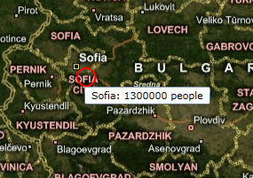

# Extended Data

The __MapShape__ object exposes a property called __ExtendedData__. It allows you to attach additional data to the shape. For example, if a shape represents a country on the map, you can use the __ExtendedData__ property to attach information about the country such as Area, Capitol, Population etc. Later this data can be accessed through the __ExtendedData__ property.

>tip To learn more about the __MapShape__ objects read [here]().

>The __ExtendedData__ represents a set of properties and their values. To access a value you have to use the property name as a key.

This topic will explain the following:

* [Extended Data and MapShapeReader](#extended-data-and-mapshapereader)

* [Manual Extended Data creation](#manual-extended-data-creation)

* [Extended Data Converter](#extended-data-converter)

## Extended Data and MapShapeReader

When generating shapes automatically from the various data formats via __MapShapeReader__, the __Extended Data__ gets automatically extracted from the files and stored inside the __ExtendedData__ property. This way you can directly use it where needed.

>tip To learn more about the __MapShapeReader__ object read [here]().

## Manual Extended Data creation

In case you are manually generating the shapes inside a layer, you have to manually wrap and pass the data to the ExtendedData property. This one by using the __ExtendedData__ and the __ExtendedPropertySet__ classes. Here is an example:

<snippet id='radmap-features-information-layer-extended-data-block_1-xaml' />

<snippet id='radmap-features-information-layer-extended-data-block_2-cs' />
<snippet id='radmap-features-information-layer-extended-data-block_2-vb' />

## Extended Data Converter

To access the data stored in the __ExtendedData__ property simply bind directly to it and use the __ExtendedDataConverter__ class, that comes out of the box with the __RadMap__. To get the desired value you have to also pass the name of the respective property from the set as the __ConverterParameter__. Here is an example, based on the one in the previous section:

>tip You can pass a string to the ConvertParameter that combines the values of two or more properties from the Extended Data. 

<snippet id='radmap-features-information-layer-extended-data-block_3-xaml' />

<snippet id='radmap-features-information-layer-extended-data-block_4-cs' />
<snippet id='radmap-features-information-layer-extended-data-block_4-vb' />

Here is a snapshot of the result:

