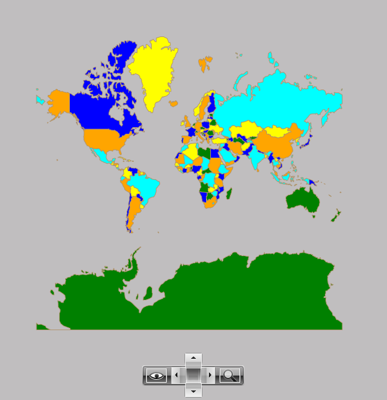

# Graph Colorizer

The __RadMap__ provides Graph Colorizer which sets filling to the Map shapes using the coloring of graph approach as its name implies. In short when any 2 shapes which have common border they will be colored differently.

The Graph Colorizer has two major properties: __ShapeFillCollection__ and __HighlightFillCollection__. The ShapeFillCollection specifies a collection of the MapShapeFill instances for the shape fillings. This property is content property, so the shape fillings can be set in XAML directly as children of the GraphColorizer element. The HighlightFillCollection property specifies a collection of the MapShapeFill instances for the shapes highlighting.

The following example will demonstrate how you can color the RadMap using the Graph Colorizer. 

#### __XAML__
```XAML
	<telerik:InformationLayer.Colorizer>
		<telerik:GraphColoriser>
			<telerik:GraphColoriser.ShapeFillCollection>
				<telerik:MapShapeFill Fill="Green" Stroke="#B1946D" StrokeThickness="1" />
				<telerik:MapShapeFill Fill="Blue" Stroke="#B1946D" StrokeThickness="1" />
				<telerik:MapShapeFill Fill="Yellow" Stroke="#B1946D" StrokeThickness="1" />
				<telerik:MapShapeFill Fill="Orange" Stroke="#B1946D" StrokeThickness="1" />
				<telerik:MapShapeFill Fill="Aqua" Stroke="#B1946D" StrokeThickness="1" />
			</telerik:GraphColoriser.ShapeFillCollection>
			<telerik:GraphColoriser.HighlightFillCollection>
				<telerik:MapShapeFill Fill="Red" Stroke="#B1946D" StrokeThickness="1" />
			</telerik:GraphColoriser.HighlightFillCollection>            
		</telerik:GraphColoriser>
	</telerik:InformationLayer.Colorizer>
```

The result can be seen below:

