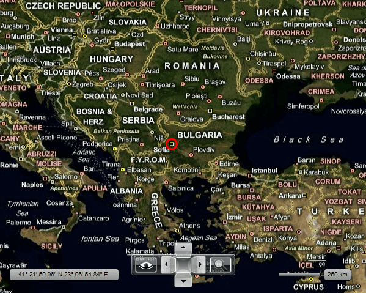
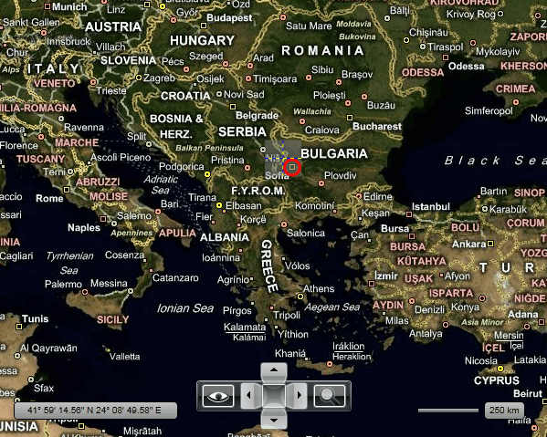

# Hot Spots

Normally the elements placed in the [Information Layer]() get positioned via __Location__ coordinates. In this way their top-left corner will coincide with the point representing the location. When using __FrameworkElements__ in your __InformationLayer__ you can additionally arrange them around the point via their __HorizontalAlignment__ and __VerticalAlignment__ properties.      

>tip For more information about using __FrameworkElements__ in the __InformationLayer__ read [here]().      

This example will show an ellipse, which should be positioned over the geographical location. It will also focus on the following:

* [Specifying a Hot Spot](#specifying-a-hot-spot)

* [Positioning a Hot Spot](#positioning-a-hot-spot)

* [Hot Spot inside a Complex UI](#hot-spot-inside-a-complex-ui)

## Specifying a Hot Spot

To mark an element as a __HotSpot__ you have to set its __MapLayer__.__HotSpot__ attached property.        

#### __XAML__
```XAML
	<telerik:RadMap x:Name="radMap"
	                Width="600"
	                Height="480">
	    <telerik:InformationLayer>
	        <Ellipse x:Name="Ellipse"
	                    telerik:MapLayer.Location="42.6957539183824, 23.3327663758679"
	                    Width="20"
	                    Height="20"
	                    Stroke="Red"
	                    StrokeThickness="3">
	            <telerik:MapLayer.HotSpot>
	                <telerik:HotSpot />
	            </telerik:MapLayer.HotSpot>
	        </Ellipse>
	    </telerik:InformationLayer>
	</telerik:RadMap>
```

## Positioning a Hot Spot

To adjust the position of the element via the __HotSpot__ you have to set its __X__ and __Y__ properties. Their value can be measured in different units. To choose the desired unit you have to set the __XUnits__ and __YUnits__ properties. They can have one of the following values:        

* __Fractions (default)__ - means fractions of the element size. This makes the values of the __X__ and __Y__ properties, proportional to the element size.            

* __Pixels__ - pixel distance from the location to the element.            

* __InsetPixels__ - offset from the upper right corner of the element given in pixels.            

Here is the ellipse element that is centered over the location point:

#### __XAML__
```XAML
	<telerik:RadMap x:Name="radMap"
	                Width="600"
	                Height="480">
	    <telerik:InformationLayer>
	        <Ellipse x:Name="PART_Ellipse"
	                    telerik:MapLayer.Location="42.6957539183824, 23.3327663758679"
	                    Width="20"
	                    Height="20"
	                    Stroke="Red"
	                    StrokeThickness="3">
	            <telerik:MapLayer.HotSpot>
	                <telerik:HotSpot X="0.5"
	                                    Y="0.5"
	                                    XUnits="Fraction"
	                                    YUnits="Fraction" />
	            </telerik:MapLayer.HotSpot>
	        </Ellipse>
	    </telerik:InformationLayer>
	</telerik:RadMap>
```

Here is a snapshot of the final result:



## Hot Spot inside a Complex UI

In some cases you might have a more complex structure, where the element representing the __HotSpot__ is wrapped inside other __FrameworkElements__. In this case you have to set the __MapLayer.HotSpot__ property of the root element and use the __ElementName__ of the __HotSpot__ object to indicate the element to which it should be attached.        

Here is an example of an __Ellipse__, that is placed inside a __Grid__ control with two rows and two columns. Note that the Ellipse is still the control that is centered over the location.        

#### __XAML__
```XAML
	<telerik:RadMap x:Name="radMap"
	                Width="600"
	                Height="480">
	    <telerik:InformationLayer>
	        <Grid telerik:MapLayer.Location="42.6957539183824, 23.3327663758679"
	                ShowGridLines="True"
	                Background="#80808080">
	            <Grid.RowDefinitions>
	                <RowDefinition Height="20" />
	                <RowDefinition Height="20" />
	            </Grid.RowDefinitions>
	            <Grid.ColumnDefinitions>
	                <ColumnDefinition Width="20" />
	                <ColumnDefinition Width="20" />
	            </Grid.ColumnDefinitions>
	            <telerik:MapLayer.HotSpot>
	                <telerik:HotSpot X="0.5"
	                                    Y="0.5"
	                                    XUnits="Fraction"
	                                    YUnits="Fraction"
	                                    ElementName="PART_Ellipse" />
	            </telerik:MapLayer.HotSpot>
	            <Ellipse x:Name="PART_Ellipse"
	                        Grid.Row="1"
	                        Grid.Column="1"
	                        Width="20"
	                        Height="20"
	                        Stroke="Red"
	                        StrokeThickness="3" />
	        </Grid>                
	    </telerik:InformationLayer>
	</telerik:RadMap>
```

Here is a snapshot of the final result:



## See Also
 * [Information Layer]()
 * [Framework Elements]()
 * [Map Shapes]()
 * [Pin Points]()