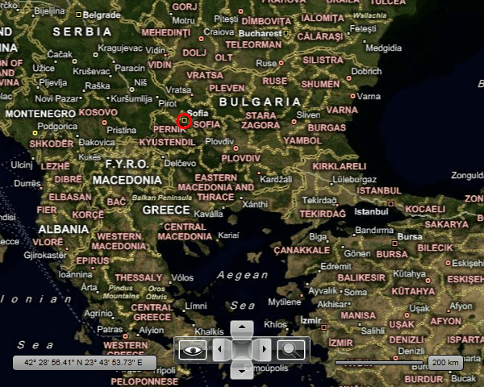

# Information Layer

The __InformationLayer__ allows you to display additional data on top of the displayed map. This data can be in the form of simple framework elements, pin points or map shapes. As the __InformationLayer__ derives from the __ItemsControl__ class you are able to display more than one item in one and the same __InformationLayer__. You can even data bind the __InformationLayer__ to a collection of locations.      

>tip To learn more about data binding the __InformationLayer__ read [here]().        

>tip The __InformationLayer__ loads the entire data at once. If you want to implement data virtualization and to load and display items when they are needed only, you have to use the __DynamicLayer__ instead. To learn more, please read the [Dynamic Layer]() topic.        

>tip The information layer is always geographically limited i.e. it does not cover the whole map surface but only a fraction of it in order to improve element positioning precision.There are two properties that control the geographic bounds of the information layer:

* __InformationLayer.Region__ – Gets or sets geographical region that is covered by the layer.            

* __InformationLayer.RegionMode__ – Gets or sets the geographic region size mode. It can be “Static” or “Dynamic” (default). “Static” means that region has constant geographic location and size which are specified in the Region” property. “Dynamic” means that location and size of the region is calculated when items are added or removed to/from information layer.

If elements are grouped into several regions on the map then it is recommended to use several information layers (one per region).

This topic will make you familiar with the following:

* [InformationLayer Item Types](#informationlayer-item-types)

* [Adding an Item](#adding-an-item)

* [Positioning an Item](#positioning-an-item)

* [Binding Items](#binding-items)

* [InformationLayer and InitializedCompleted](#InformationLayer_and_InitializedCompleted)

## InformationLayer Item Types

The __InformationLayer__ allows you to display the following items:        

* __FrameworkElements__ - this means that you can display anything (charts, images, etc.) by wrapping it inside a framework element.            

* __MapShapes__ - this is a set of shape objects, created for usage with the __RadMap__. Among them you will find equivalents of the standard shape controls like __Line__, __Rectangle__, __Ellipse__, __Polyline__, __Polygon__ and __Path__.            

* __PinPoints__ - the __PinPoint__ object is usually used to display points from a KML file, but can be also used on its own. The benefit is that it allows you to precisely position it on the map.            

>tip The precise positioning of the framework elements and the pin points are done via __HotSpot__ objects. Although the __HotSpot__ is a native feature for the __PinPoint__, you can apply a __HotSpot__ to a framework element, too. This is done via the __HotSpot__ attached property of the __MapLayer__ class.          

## Adding an Item

In order to add an item to the __InformationLayer__, the only thing you have to do is to put it inside the __InformationLayer__'s tag. Here is an example:        

#### __XAML__
```XAML
	<telerik:RadMap x:Name="radMap"
	                Width="600"
	                Height="480">
	    <telerik:InformationLayer x:Name="informationLayer">
	        <Ellipse x:Name="Ellipse"
	                    Width="20"
	                    Height="20"
	                    Stroke="Red"
	                    StrokeThickness="3"
	                    Fill="Transparent" />
	    </telerik:InformationLayer>
	</telerik:RadMap>
```

If you want to add more than one element, you just have to place it after the previous element. Here is an example:

#### __XAML__
```XAML
	<telerik:RadMap x:Name="radMap"
	                Width="600"
	                Height="480">
	    <telerik:InformationLayer x:Name="informationLayer">
	        <Ellipse x:Name="Ellipse1"
	                    Width="20"
	                    Height="20"
	                    Stroke="Red"
	                    StrokeThickness="3"
	                    Fill="Transparent" />
	        <Ellipse x:Name="Ellipse2"
	                    Width="20"
	                    Height="20"
	                    Stroke="Red"
	                    StrokeThickness="3"
	                    Fill="Transparent" />
	    </telerik:InformationLayer>
	</telerik:RadMap>
```

## Positioning an Item

After adding your elements you have to position them according to a location on the map. This is done by passing a __Location__ object, that contains the longitude and the latitude of the position, to the element. The __MapShape__ objects expose a __Location__ property, but for the __PinPoints__ and for the __FrameworkElements__ you have to use the __Location__ attached property of the __MapLayer__ class.        

You can take advantage of the __UseLayoutRounding__ property when it is necessary to have fully readable framework elements (text for example). To take advantage of the layout rounding you should set the __UseLayoutRounding__ property to *true* as it is *false* by default.        

Additionally you can use these two attached properties provided by the __MapLayer__ class:        

* __BaseZoomLevel__ - represents the zoom level, for which the element should have its scale transformation equal to 1.            

* __ZoomRange__ - represents the range of zoom levels for which the element should be visible.            

Here is an example for an __Ellipse__, positioned above Sofia, Bulgaria and visible only when the zoom level is grater or equal to 5 and less or equal to 12. The __Ellipse__ will also have its normal size (100%) when the zoom level is 5.        

>If you are using a more complex composition of UI Elements, these properties should be set to the one that represent the root. For example, if you have a __Grid__, which layouts an __Ellipse__ and a __TextBlock__, you have to set the attached properties to the __Grid__.          

<!-- -->
>Note that the location of the element on the map coincides with its top left corner, not with its center. To change the position of the element towards the location you can use its __HorizontalAlignment__ or __VerticalAlignment__ properties or use the __HotSpot__ feature. To learn how read [here]().          

#### __XAML__
```XAML
	<telerik:RadMap x:Name="radMap"
	                Width="600"
	                Height="480">
	    <telerik:InformationLayer x:Name="informationLayer">
	        <Ellipse x:Name="Ellipse1"
	                    telerik:MapLayer.BaseZoomLevel="5"
	                    telerik:MapLayer.Location="42.6957539183824, 23.3327663758679"
	                    telerik:MapLayer.ZoomRange="5,12"
	                    Width="20"
	                    Height="20"
	                    Stroke="Red"
	                    StrokeThickness="3"
	                    Fill="Transparent"
	                    HorizontalAlignment="Center"
	                    VerticalAlignment="Center" />
	    </telerik:InformationLayer>
	</telerik:RadMap>
```

Here is a snapshot of the result:



## Binding Items

The __InformationLayer__ derives from the __ItemsControl__, so it's able to display not only statically defined items, but dynamic collections of data. To do this you have to simply use its ItemsSource and ItemTemplate properties. If you want to learn more and to see an example, pleas read the [Data Binding]() topic.        

>By using the __InformationLayer__ to display your collection of data, you have to provide the entire data to it. Assuming that your data comes from a service or/and contains a lot of entries, you might want to have a data virtualization. By default the InformationLayer control doesn't support this scenario. For that purpose you can use the __DynamicLayer__ control, which is specially designed to request data upon region or zoom level change. To learn more and how to use it, please read the Dynamic Layer article.          

## See Also
 * [Dynamic Layer]()
 * [Framework Elements]()
 * [Map Shapes]()
 * [Pin Points]()
 * [Hot Spots]()