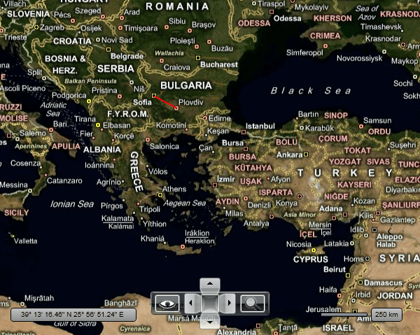
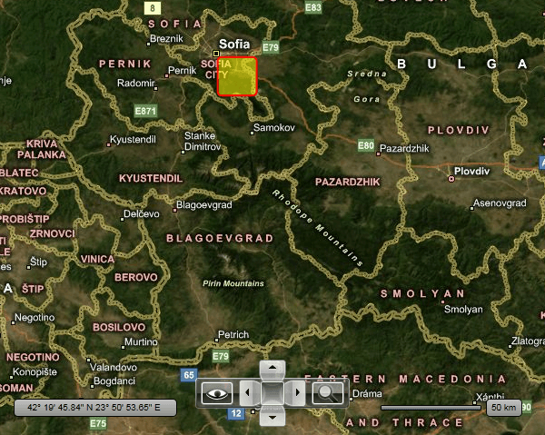
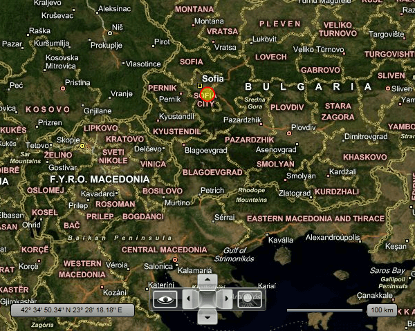
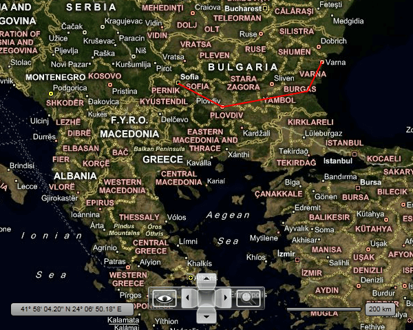
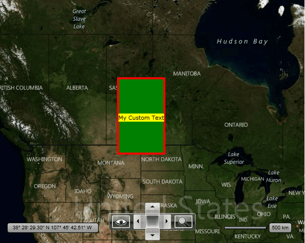
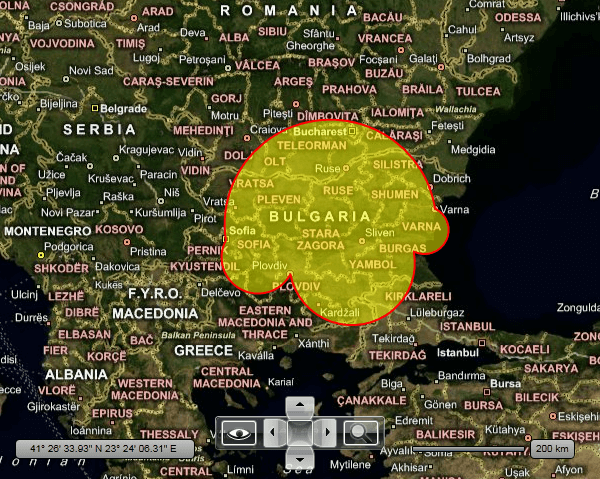

# Map Shapes

The __RadMap__ control provides you with a set of shape objects, which are specifically designed to work with the __RadMap__. You will be able to find equivalents to most of the __Shapes__ introduced in SilverlightWPF.

>tip To learn the different ways of specifying the appearance colors of a shape read the [Shape Appearance]() topic.

>tip The __MapShape__ objects allow you to attach additional data to them. This is done via their __ExtendedData__ property. To learn more about it read [this topic]().

As the shapes are used identical to their counterparts, this topic will focus briefly on showing you how to use the most important of them:

* [MapLine](#mapline)

* [MapRectangle](#maprectangle)

* [MapEllipse](#mapellipse)

* [MapPolyline](#mappolyline)

* [MapPolygon](#mappolygon)

* [MapPath](#mappath)

The __MapShape__ class gives you the ability to specify caption for your Shapes using the __CaptionLocation__ and __CaptionTemplate__ properties. For example see __MapPolygon__ below. 

## MapLine

The most important things when using the __MapLine__ object are the __Point1__ and __Point2__ properties, which are of type __Location__. They define the start and the end points of the line. Here is an example.


```XAML
	<telerik:RadMap x:Name="radMap"
	        Width="600"
	        Height="480">
	    <telerik:InformationLayer>
	        <telerik:MapLine Point1="42.6957539183824, 23.3327663758679"
	                    Point2="42.1429369264591, 24.7498095849434"
	                    Stroke="Red"
	                    StrokeThickness="2" />
	    </telerik:InformationLayer>
	</telerik:RadMap>
```



## MapRectangle

To use the __MapRectangle__ in your __RadMap__ you have to set the following of its properties:

* __Location__ - represents the location on the map, to which the rectangle is bound.

* __Width__ - represents the width of the rectangle in the current distance unite (mile or kilometer), e.g. 1 is equal to 1km.

* __Height__ - represents the height of the rectangle in the current distance unite (mile or kilometer), e.g. 1 is equal to 1km.

>tip In order to change the distance unit, you have to set the __DistanceUnit__ property of the __RadMap__ to the desired value - __Mile__ or __Kilometer__.

Additionally you can use the following properties:

* __RadiusX__, __RadiusY__ - represent the radius of the rectangle corners. Just like the __Width__ and __Height__ properties, these are also measured in the current distance unit.

>Note that the top left coner coincides with the given location. In order to position the rectangle otherwise you might want to use the [HotSpot]() feature.

Here is an example:


```XAML
	<telerik:RadMap x:Name="radMap"
	        Width="600"
	        Height="480">
	    <telerik:InformationLayer>
	        <telerik:MapRectangle Location="42.6957539183824, 23.3327663758679"
	                        Width="20"
	                        Height="20"
	                        RadiusX="2"
	                        RadiusY="2"
	                        Fill="#7FFFFF00"
	                        Stroke="Red"
	                        StrokeThickness="2" />
	    </telerik:InformationLayer>
	</telerik:RadMap>
```



## MapEllipse

To use the __MapEllipse__ in your __RadMap__ you have to set the following of its properties:

* __Location__ - represents the location on the map, to which the rectangle is bound.

* __Width__ - represents the width of the ellipse in the current distance unite (mile or kilometer), e.g. 1 is equal to 1km.

* __Height__ - represents the height of the ellipse in the current distance unite (mile or kilometer), e.g. 1 is equal to 1km.

>tip In order to change the distance unit, you have to set the __DistanceUnit__ property of the __RadMap__ to the desired value - __Mile__ or __Kilometer__.

>Note that the top left coner coincides with the given location. In order to position the rectangle otherwise you might want to use the [HotSpot]() feature.

Here is an example:


```XAML
	<telerik:RadMap x:Name="radMap"
	        Width="600"
	        Height="480">
	    <telerik:InformationLayer>
	        <telerik:MapEllipse Location="42.6957539183824, 23.3327663758679"
	                    Width="20"
	                    Height="20"
	                    Fill="#7FFFFF00"
	                    Stroke="Red"
	                    StrokeThickness="2" />
	    </telerik:InformationLayer>
	</telerik:RadMap>
```



## MapPolyline

The only difference between the standard __Polyline__ and the __MapPolyline__ is that the __Points__ property of the __MapPolyline__ is a set of __Locations__. Here is an example:


```XAML
	<telerik:RadMap x:Name="radMap"
	        Width="600"
	        Height="480">
	    <telerik:InformationLayer>
	        <telerik:MapPolyline Points="42.6957539183824, 23.3327663758679 42.1429369264591, 24.7498095849434 42.5131732087098, 27.4611884843576 43.2073941930888, 27.9275176988258"
	                        Stroke="Red"
	                        StrokeThickness="2" />
	    </telerik:InformationLayer>
	</telerik:RadMap>
```



## MapPolygon

The only difference between the standard __Polygon__ and the __MapPolygon__ is that the __Points__ property of the __MapPolygon__ is a set of __Locations__. Here is an example:


```XAML
	<telerik:RadMap x:Name="radMap" Width="600" Height="480">
		<telerik:InformationLayer>
			<telerik:MapPolygon Points="56,-100 56,-108 48,-108 48,-100"
								Fill="Green" Stroke="Red" StrokeThickness="4"
								CaptionLocation="52,-104">
				<telerik:MapPolygon.CaptionTemplate>
					<DataTemplate>
						<Grid Background="Yellow" telerik:MapLayer.HotSpot="0.5,0.5">
							<TextBlock Text="My Custom Text" />
						</Grid>
					</DataTemplate>
				</telerik:MapPolygon.CaptionTemplate>
			</telerik:MapPolygon>
		</telerik:InformationLayer>
	</telerik:RadMap>
```



## MapPath

Except the __MapPath__ class you also have an analog for each standard __Geometry__ or __Segment__ class. Here is an example of an __MapPath__ that uses __MapArcSegments.__


```XAML
	<telerik:RadMap x:Name="radMap"
	        Width="600"
	        Height="480">
	    <telerik:InformationLayer Name="InformationLayer">
	        <telerik:MapPath Fill="#7FFFFF00"
	                    Stroke="Red"
	                    StrokeThickness="2">
	            <telerik:MapPath.Data>
	                <telerik:MapPathGeometry>
	                    <telerik:MapPathFigure StartPoint="42.6957539183824, 23.3327663758679">
	                        <telerik:MapArcSegment Point="42.1429369264591, 24.7498095849434"
	                                        IsLargeArc="True"
	                                        Size="1,1"
	                                        SweepDirection="Counterclockwise" />
	                        <telerik:MapArcSegment Point="42.5131732087098, 27.4611884843576"
	                                        IsLargeArc="True"
	                                        Size="1,1"
	                                        SweepDirection="Counterclockwise" />
	                        <telerik:MapArcSegment Point="43.2073941930888, 27.9275176988258"
	                                        IsLargeArc="False"
	                                        Size="1,1"
	                                        SweepDirection="Counterclockwise" />
	                        <telerik:MapArcSegment Point="42.6957539183824, 23.3327663758679"
	                                        IsLargeArc="True"
	                                        Size="1,1"
	                                        SweepDirection="Counterclockwise" />
	                    </telerik:MapPathFigure>
	                </telerik:MapPathGeometry>
	            </telerik:MapPath.Data>
	        </telerik:MapPath>
	    </telerik:InformationLayer>
	</telerik:RadMap>
```



## See Also
 * [Information Layer]()
 * [Framework Elements]()
 * [Pin Points]()
 * [Hot Spots]()