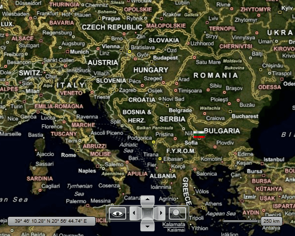
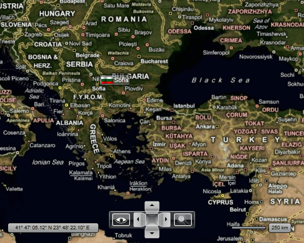

# Pin Points

The __MapPinPoint__ class is designed to represent __Point__ objects from __KML__ files. However, it can be also used outside the __KML__ context in order to mark points of interest (POIs) or something else.      

## Adding a MapPinPoint

To insert a pin point on your map you have to add a __MapPinPoint__ object to your __InformationLayer__.        

>tip To learn more about the __Information Layer__ read [here]().          

Here is an example:

<snippet id='radmap-features-information-layer-pin-points-block_1-xaml' />

## Configuring the MapPinPoint

In order to configure the position of the __MapPinPoint__ you have to set the __Location__ attached property of the __MapLayer__ class. Here is an example:        

<snippet id='radmap-features-information-layer-pin-points-block_2-xaml' />

In order to position the pin point more precisely you can use the __MapLayer.HotSpot__ attached property. Here is an example.        

>tip To learn more about the __HotSpot__ functionality read [here]().          

<snippet id='radmap-features-information-layer-pin-points-block_3-xaml' />

With these values defined, the __MapPinPoint__ will be placed above the location and will be centered towards it.        

## Setting MapPinPoint's Content

By default the __MapPinPoint__ exposes two properties that allow you to set its content. The __Text__ property allows you to specify a string for the __MapPinPoint__ and the __ImageSource__ allows you to specify an image to display.       

Here is an example:

<snippet id='radmap-features-information-layer-pin-points-block_4-xaml' />

Here is a snapshot of the result:

## Modifying the MapPinPoint's appearance

As you can see in the previous section the __MapPinPoint__ doesn't look very good. In order to boost its appearance you can use the standard properties:        

* __Background__

* __Foreground__

* __BorderBrush__

* __BorderThickness__

Here is an example:

<snippet id='radmap-features-information-layer-pin-points-block_5-xaml' />

Here is a snapshot of the final result:

## See Also
 * [Information Layer]()
 * [Framework Elements]()
 * [Map Shapes]()
 * [Hot Spots]()