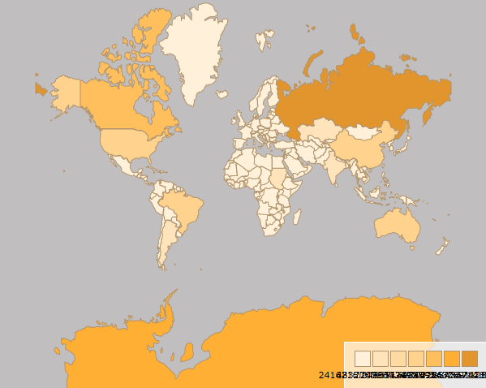
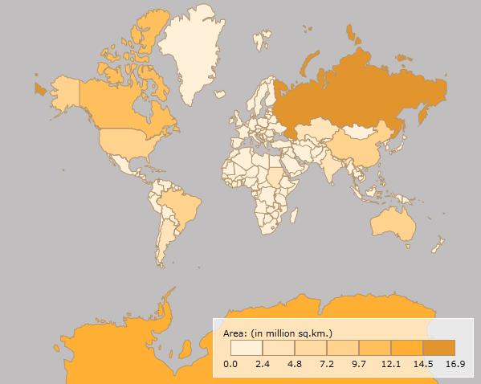

# Map Legend

The __RadMap__ control introduces the __MapLegend__ object. It allows you to display a legend for a particular __Information Layer__ inside the __RadMap__ control. This topic will explain you the following:

* [Using the MapLegend object](#using-the-maplegend-object)

* [Configuring the Map Legend](#configuring-the-map-legend)

## Using the MapLegend object

The __MapLegend__ object shouldn't be defined in the context of the __RadMap__ control. It can be defined in any part of the __UserControl__. Here is an example of a __RadMap__ that doesn't uses its default layout and a __MapLegend__ that appears in the bottom right corner of the map.


```XAML
	<telerik:RadMap x:Name="radMap"
	                Width="600"
	                Height="480"
	                UseDefaultLayout="False">
	</telerik:RadMap>
	<telerik:MapLegend x:Name="mapLegend">
	</telerik:MapLegend>
```

At this point the __MapLegend__ is not connected to the __RadMap__ and the __RadMap__ doesn't display any data, that should be reflected in the legend. Here is a __RadMap__ that displays the world countries, read from an __ESRI Shapefile__. It uses its __Colorizer__ property to color each country in different color depending on its area. On the other side the __MapLegend__ object is connected to the __InformationLayer__ displaying the countries via its __Layer__ property.

>tip You can learn more about the MapShapeReader in the [Shape Reader]() help topic.

>The __MapLegend__ creates the items in the legend on the basis of the __ColorMeasureScale__ object set to the __Colorizer__ property of the __Information Layer__.


```XAML
	<telerik:RadMap x:Name="radMap"
	                Width="600"
	                Height="480"
	                UseDefaultLayout="False">
	    <telerik:InformationLayer x:Name="informationLayer">
	        <telerik:InformationLayer.Reader>
	            <telerik:MapShapeReader DataSource="/Silverlight.Help.RadMapSamples;component/Data/world.dbf"
	                                    Source="/Silverlight.Help.RadMapSamples;component/Data/world.shp" />
	        </telerik:InformationLayer.Reader>
	        <telerik:InformationLayer.Colorizer>
	            <telerik:ColorMeasureScale ExtendedPropertyName="SQKM"
	                                        Mode="Count"
	                                        TickMarkCount="7">
	                <telerik:ColorMeasureScale.ShapeFillCollection>
	                    <telerik:MapShapeFill Fill="#FFF0D9"
	                                            Stroke="#B1946D"
	                                            StrokeThickness="1" />
	                    <telerik:MapShapeFill Fill="#FFE4BA"
	                                            Stroke="#B1946D"
	                                            StrokeThickness="1" />
	                    <telerik:MapShapeFill Fill="#FFDBA3"
	                                            Stroke="#B1946D"
	                                            StrokeThickness="1" />
	                    <telerik:MapShapeFill Fill="#FFD28D"
	                                            Stroke="#B1946D"
	                                            StrokeThickness="1" />
	                    <telerik:MapShapeFill Fill="#FFBF5C"
	                                            Stroke="#B1946D"
	                                            StrokeThickness="1" />
	                    <telerik:MapShapeFill Fill="#FFAF33"
	                                            Stroke="#B1946D"
	                                            StrokeThickness="1" />
	                    <telerik:MapShapeFill Fill="#E2942D"
	                                            Stroke="#B1946D"
	                                            StrokeThickness="1" />
	                </telerik:ColorMeasureScale.ShapeFillCollection>
	                <telerik:ColorMeasureScale.HighlightFillCollection>
	                    <telerik:MapShapeFill Fill="Orange"
	                                            Stroke="#B1946D"
	                                            StrokeThickness="1" />
	                </telerik:ColorMeasureScale.HighlightFillCollection>
	            </telerik:ColorMeasureScale>
	        </telerik:InformationLayer.Colorizer>
	    </telerik:InformationLayer>
	</telerik:RadMap>
	<telerik:MapLegend x:Name="mapLegend"
	                    Layer="{Binding ElementName=informationLayer}"
	                    VerticalAlignment="Bottom"
	                    HorizontalAlignment="Right">
	</telerik:MapLegend>
```


```C#
	this.radMap.Provider = new EmptyProvider();
```


```VB.NET
	Me.radMap.Provider = New EmptyProvider()
```

Here is a snapshot of the result.

>tip To learn how to configure the appearance of the __MapLegend__ and its items read the [next](#configuring-the-map-legend) section.



## Configuring the Map Legend

To configure the appearance of the __MapLegend__ you can use the following properties:

* __Format__ - specifies the format string for the labels of the legend items. 

* __Header__ - specifies the content for the header of the legend. It is of type object and can be used as any other content property. Additionally you can use the __HeaderTemplate__ and __HeaderTemplateSelecotr__ properties with it. 

* __MarkerSize__ - specifies the size of the marker inside the legend item. 

* __MarkerSpacing__ - specifies the spacing between the legend items. 

* __MarkerRadiusX__ - specifies the X radius for the marker inside the legend item. 

* __MarkerRadiusY__ - specifies the Y radius for the marker inside the legend item 

* __LabelLayout__ - specifies whether the Label should be position in the center of the item or between the items. 

* __LabelLocation__ - specifies whether the label should be positioned in the top left corner or in the bottom right one.

* __Orientation__ - specifies whether the order of the items in the legend should be vertical or horizontal.

Since __Q2 2011__ you are allowed of using an arbitrary strings as map range labels in the *MapLegend* control. For the purpose - the __MaxOutput__ and __MinOutput__ properties of the *MapRange* class can be used. If these properties have not null and non-empty value, they will be used by MapLegend as range label.

Here is an example of a __MapLegend__ configured via these properties:

>tip Defining format strings in XAML can be done in the following way - __{}:{0:your format string}.__ To learn more about formatting visit the [Formatting Overview](http://msdn.microsoft.com/en-us/library/26etazsy.aspx) chapter in MSDN.


```XAML
	<telerik:MapLegend x:Name="mapLegend"
	                    Layer="{Binding ElementName=informationLayer}"
	                    Header="Area (in million sq.km.):"
	                    VerticalAlignment="Bottom"
	                    HorizontalAlignment="Right"
	                    Format="{}{0:0,,.0}"
	                    MarkerSize="40,20"
	                    MarkerSpacing="0"
	                    LabelLayout="Between"
	                    LabelLocation="BottomRight"
	                    Margin="0,0,10,10">
	</telerik:MapLegend>
```

Here is a snapshot of the result:



## See Also
 * [Shape Reader]()
 * [Colorizer]()
 * [Shape Appearance]()