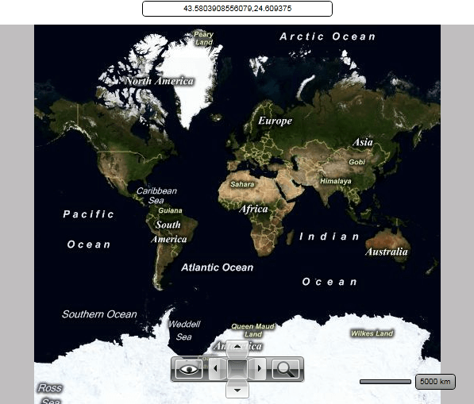

# Mouse Location

The __RadMap__ uses an UI control to display the current mouse location on the map. It displays the latitude and the longitude of the mouse position.

The UI control is represented by the __MapMouseLocationIndicator__ control. You are able to use it outside the __RadMap__ and place it somewhere around it. In this case you have to either hide the original one by using the __MouseLocationIndicatorVisibility__ property of the __RadMap__ or the __UseDefaultLayout__ one.

>tip Setting the __UseDefaultLayout__ property to __False__ will hide all of the UI controls inside the __RadMap__. To learn more read [here]().

In order to use the __MapMouseLocationIndicator__ outside the __RadMap__ you have to set its __MapControl__ property to the respective __RadMap__ instance. Additionally you can modify its appearance and the location formatting. Here is an example:

#### __XAML__
```XAML
	<StackPanel>
	    <telerik:MapMouseLocationIndicator MapControl="{Binding ElementName=radMap}"
	                                        LocationFormat="Number"
	                                        Margin="10"
	                                        HorizontalAlignment="Center"
	                                        Width="250"
	                                        IndicatorLabelBackground="White"
	                                        IndicatorLabelBorderBrush="Black"
	                                        Foreground="Black" />
	    <telerik:RadMap x:Name="radMap"
	                    Width="600"
	                    Height="480"
	                    MouseLocationIndicatorVisibility="Collapsed" />
	</StackPanel>
```

Here is a snapshot of the result:



## See Also
 * [Navigation]()
 * [Click Modes]()
 * [Zoom Modes]()
 * [Distance and Scale]()
 * [Default Layout]()