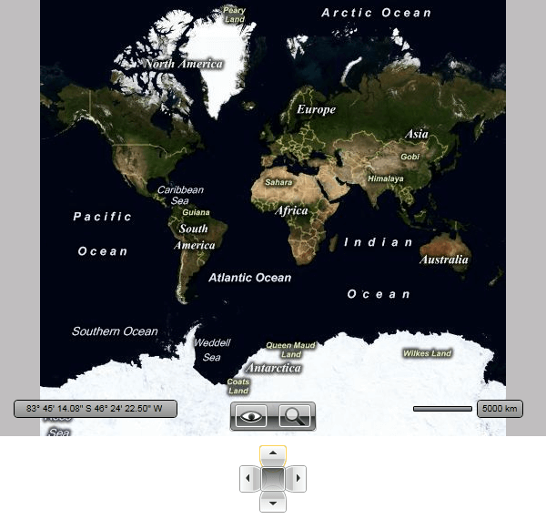

# Navigation

## 

When working with the __RadMap__ control, the user would likely try to pan or zoom the map using mouse and/or keyboard or using the map navigation control. The developer is also able to implement outside navigation using the __RadMap__'s API  or to just predefine a start location. To do this you can use the following properties:

* __Center__ - represents the center point of the map view and is of type Location.

* __ZoomLevel__ - represents different levels of detail available on the map. The maximum level of available detail is determined by the location you are zooming into, for example some areas can be zoomed in further than other areas. 

>tipBy default each change of the current map location is animated. The animation is controlled via the __UseSpringAnimations__ property with default value of __True__. If you want to disable the animation simply set it to __False__.

If you want to hide the navigation control you have to set the __NaviagtionVisibility__ to __Collapsed__.

#### __XAML__

{{region radmap-features-navigation_0}}
	<telerik:RadMap x:Name="radMap"
	                NavigationVisibility="Collapsed">
	</telerik:RadMap>
	{{endregion}}

If you want to disable the user from zooming and panning, you have to set the following properties:

#### __XAML__

{{region radmap-features-navigation_1}}
	<telerik:RadMap x:Name="radMap"
	                NavigationVisibility="Collapsed"
	                IsMouseWheelZoomEnabled="False"
	                IsKeyboardNavigationEnabled="False"
	                MouseClickMode="None"
	                MouseDoubleClickMode="None"
	                MouseDragMode="None"
	                ZoomBarVisibility="Collapsed">
	</telerik:RadMap>
	{{endregion}}

Additionally as the UI navigation control is represented by the __MapNavigation__control, you are able to use it outside the __RadMap__ and place it somewhere around it. In this case you have to either hide the original one by using the __NavigationVisibility__property of the __RadMap__ or the __UseDefaultLayout__ one.

>tipSetting the __UseDefaultLayout__ property to __False__ will hide all of the UI controls inside the __RadMap__. To learn more click [here]().

In order to use the __MapNavigation__outside of the __RadMap__ you have to set its __MapControl__ property to the respective __RadMap__ instance. Additionally you can handle its __CenterButtonClick__ event and implement your custom logic in the event handler. Here is an example:

#### __XAML__

{{region radmap-features-navigation_2}}
	<StackPanel>
	    <telerik:RadMap x:Name="radMap"
	                    Width="600"
	                    Height="480"
	                    NavigationVisibility="Collapsed">
	    </telerik:RadMap>
	    <telerik:MapNavigation MapControl="{Binding ElementName=radMap}"
	                            Margin="10" />
	</StackPanel>
	{{endregion}}

Here is a snapshot of the result.

         
      

# See Also

 * [Click Modes]()

 * [View Modes]()

 * [Zoom Modes]()

 * [Distance and Scale]()

 * [Mouse Location]()

 * [Default Layout]()
