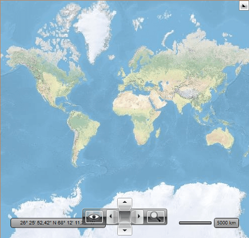
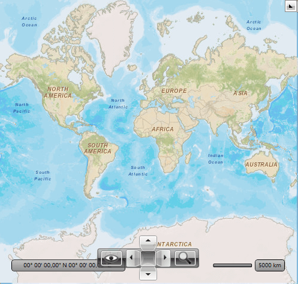
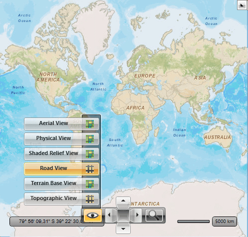

# ArcGIS Online Map Provider

The [ArcGIS online services](http://www.esri.com/software/arcgis/arcgisonline/maps/maps-and-map-layers) can be used via the `ArcGisMapProvider` class.

>tip To use the [ArcGIS vector tile services](https://developers.arcgis.com/rest/services-reference/enterprise/vector-tile-service.htm) refer to the [Migrating to Vector Tile Map Provider](#migrating-to-vector-tile-map-provider) section of this article.

Currently the ArcGIS map provider support six modes which specify the type of appearance of the map can and be set using the `Mode` property:        

1. Aerial
2. Physical
3. Shaded Relief
4. Street
5. Terrain
6. Topographic

The following example of the `ArcGisMapProvider` definition uses the `Physical` mode:

#### __[XAML] Defining the ArcGisMapProvider in XAML__
{{region xaml-radmap-features-providers-arcgis-0}}
	<telerik:RadMap x:Name="radMap" ZoomLevel="1">
		<telerik:RadMap.Provider>
			<telerik:ArcGisMapProvider Mode="Physical" />
		</telerik:RadMap.Provider>
	</telerik:RadMap>
{{endregion}}

#### __[C#] Defining the ArcGisMapProvider in code-behind__
{{region cs-radmap-features-providers-arcgis-1}}
	ArcGisMapProvider provider = new ArcGisMapProvider();
	provider.Mode = ArcGisMapMode.Physical;
	this.radMap.Provider = provider;
{{endregion}}

#### __[VB.NET] Defining the ArcGisMapProvider in code-behind__	
{{region vb-radmap-features-providers-arcgis-2}}
	Dim provider As New ArcGisMapProvider ()
	provider.Mode = ArcGisMapMode.Physical
	Me.radMap.Provider = provider
{{endregion}}

__ArcGisMapProvider when using the `Physical` mode__

## Attribution Copyright Label

When using the ArcGisMapProvider, you have to display an attribution copyright label to the ArcGis services. To learn more about the accurate copyright label's content, please refer to the [Esri and data attribution](https://developers.arcgis.com/documentation/esri-and-data-attribution/) article.

>tip To learn how to customize the RadMap to allocate space for displaying an element containing a sample attribution copyright label, check this [article]().

## Security Protocol

ArcGIS Online services only accept connections using [TLS 1.2](https://docs.microsoft.com/en-us/mem/configmgr/core/plan-design/security/enable-tls-1-2). Thus, you need to explicitly set the `ServicePointManager.SecurityProtocol` property if you're using a .NET Framework version prior to __4.7__.

#### __[C#] Setting the ServicePointManager.SecurityProtocol__
{{region cs-radmap-features-providers-arcgis-3}}
	public App()
	{
		// ArcGis rest services require TLS 1.2 protocol.
		ServicePointManager.SecurityProtocol = (SecurityProtocolType)3072;
	}
{{endregion}}

#### __[VB.NET] Setting the ServicePointManager.SecurityProtocol__
{{region vb-radmap-features-providers-arcgis-4}}
	Partial Public Class App
		Inherits Application

		Public Sub New()
			' ArcGis rest services require TLS 1.2 protocol.
			ServicePointManager.SecurityProtocol = CType(3072, SecurityProtocolType)
		End Sub
	End Class
{{endregion}}

For comparison, the following snapshot demonstrates the appearance of the map for the `Street` mode:

The ArcGisMapProvider also allows the user to change the map mode using the __Map View__ button of the toolbar.

## Migrating to Vector Tile Map Provider

To migrate to a vector-based tile provider that uses the [ArcGIS vector tile services](https://developers.arcgis.com/rest/services-reference/enterprise/vector-tile-service.htm) you can create a custom vector tile providers. The [Custom Vector Tile Provider]() article demonstrates how to do this.

Additional to this, as of 2023, part of the ArcGIS raster-based services are obsolete and no longer supported. The following list shows the end-points of the map layers that are obsolete and if they have alternatives in the vector-based services.

| Map Layer | Old Address | New Address |
| --------- | ----------- | ----------- |
| Physical  | https://www.arcgis.com/home/item.html?id=c4ec722a1cd34cf0a23904aadf8923a0 | no longer supported |
| ShadedRelief | https://www.arcgis.com/home/item.html?id=9c5370d0b54f4de1b48a3792d7377ff2 |  no longer supported |
| Streets (world streets) | https://www.arcgis.com/home/item.html?id=3b93337983e9436f8db950e38a8629af |  https://www.arcgis.com/home/item.html?id=de26a3cf4cc9451298ea173c4b324736 |
| Terrain (world terrain) | https://www.arcgis.com/home/item.html?id=c61ad8ab017d49e1a82f580ee1298931 |  no longer supported |
| Topographic (world topographic) | https://www.arcgis.com/home/item.html?id=30e5fe3149c34df1ba922e6f5bbf808f |  https://www.arcgis.com/home/item.html?id=7dc6cea0b1764a1f9af2e679f642f0f5 |

## See Also
 * [Providers Overview]()