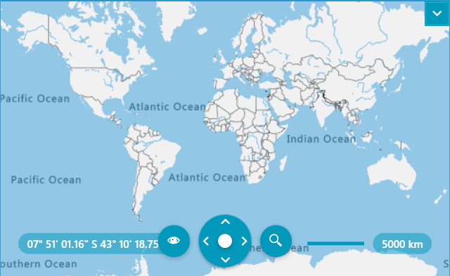
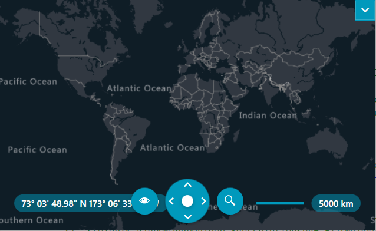
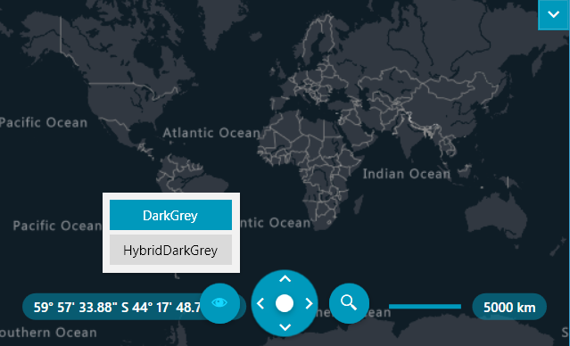
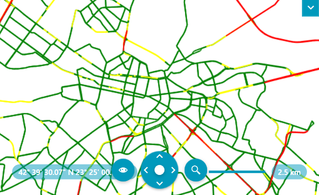
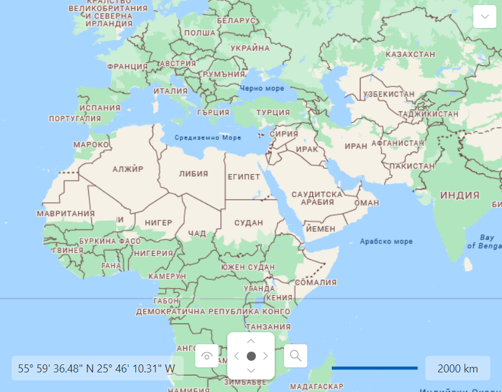

# Azure Map Provider

The `RadMap` control supports visualizing tile data using the [Azure Maps services](https://azure.microsoft.com/en-us/products/azure-maps/). This is done via the `AzureMapProvider` class. This provider supports both raster and vector sources.

>important The AzureMapProvider class derives from `VectorTileMapProvider`, which works with the Newtonsoft.Json framework. To use the AzureMapProvider, add a reference to the corresponding .dll or install the [nuget package](https://www.nuget.org/packages/Newtonsoft.Json/).

## Setting the AzureMapProvider

To use this provider, create a new AzureMapProvider instance and add it to the `Providers` collection of the RadMap control. After that, you will need to set the subscription key of the user's Azure account to the `SubscriptionKey` property of the AzureMapProvider instance. To obtain a key, you can review the [Manage authentication in Azure Maps](https://learn.microsoft.com/en-gb/azure/azure-maps/how-to-manage-authentication#view-authentication-details/) article.

#### __[XAML] Adding the AzureMapProvider to the RadMap control__
{{region radmap-features-providers-azuremapprovider-0}}
    <telerik:RadMap>
        <telerik:RadMap.Providers>
            <telerik:AzureMapProvider SubscriptionKey="Azure_Maps_Subscription_Key"/>
        </telerik:RadMap.Providers>
    </telerik:RadMap>
{{endregion}}

__RadMap with AzureMapProvider__

>If the provider’s initialization fails, the AzureMapProvider will raise its `InitializationFaulted` event. The event can be fired for example, when the internet connection is lost or when the service is unavailable. The event arguments are of type `InitializationFaultEventArgs` type. The arguments provide an `Error` property which contains the exception that is thrown while initialization.

## Specifying the TileSet

The Azure Maps services provide a set of different map layers ([tilesets](https://learn.microsoft.com/en-us/rest/api/maps/render-v2/get-map-tileset?tabs=HTTP#tilesetid)). The AzureMapProvider class will allow you to specify one of these raster or vector tilesets, by setting the `TileSet` property.

#### __[XAML] Specifying the tileset__
{{region radmap-features-providers-azuremapprovider-1}}
    <telerik:RadMap x:Name="map">
        <telerik:RadMap.Providers>
            <telerik:AzureMapProvider SubscriptionKey="Azure_Maps_Subscription_Key"
                                      TileSet="DarkGrey"/>
        </telerik:RadMap.Providers>
    </telerik:RadMap>
{{endregion}}

__AzureMapProvider with specified tileset__

By default RadMap's navigation UI doesn't display any modes for the AzureMapProvider. To enable this, set the provider's `UserAccessibleModes` collection property.

#### __[XAML] Setting the tileset modes__
{{region radmap-features-providers-azuremapprovider-2}}
    <telerik:RadMap>
        <telerik:RadMap.Providers>
            <telerik:AzureMapProvider SubscriptionKey="Azure_Maps_Subscription_Key"
                                      TileSet="DarkGrey">
                <telerik:AzureMapProvider.UserAccessibleModes>
                    <telerik:AzureTileSet>DarkGrey</telerik:AzureTileSet>
                    <telerik:AzureTileSet>HybridDarkGrey</telerik:AzureTileSet>
                </telerik:AzureMapProvider.UserAccessibleModes>
            </telerik:RadMap.Providers>
        </telerik:AzureMapProvider>
    </telerik:RadMap>
{{endregion}}

__AzureMapProvider with specified AzureTileSet instances for the UserAccessibleModes property__

## Styling Vector Tiles via Custom Styles

The RadMap's default styling of vector tiles does not support the vector tiles of the Azure Maps services. Instead, you can use third-party styles to style them, for example, using [TomTom Map Styles](https://developer.tomtom.com/map-display-api/documentation/mapstyles/map-styles). After retrieving the custom style, set it to the `StyleFileSource` property of the AzureMapProvider instance.

## Manually Customizing the Appearance of the Vector Tiles via NoStyleVectorTileRenderingEventArgs Event

An alternative approach for styling the vector tiles is via the `NoStyleVectorTileRendering` event. It will be raised for each vector tile before being rendered.

The event arguments of the NoStyleVectorTileRendering event are of the type `NoStyleVectorTileRenderingEventArgs` and expose the following properties:

* `ZoomLevel`&mdash;The ZoomLevel property provides the ability to control the zoom level of the vector tile.
* `BackgroundColor`&mdash;This property allows you to specify the background color of the vector tile.
* `Layers`&mdash;Collection that contains `VectorTileLayerRenderInfo` instances.

>important The NoStyleVectorTileRendering event will be raised when the `IgnoreStyle` property of the AzureMapProvider instance is set to `False`.

#### __[C#] Manually customizing the appearance the vector tiles__
{{region radmap-features-providers-azuremapprovider-3}}
    private void AzureMapsProvider_NoStyleVectorTileRendering(object sender, NoStyleVectorTileRenderingEventArgs e)
    {
        VectorTileLayerRenderInfo trafficLayer = e.Layers.Where(x => x.Name == "Traffic flow").FirstOrDefault();
    
        if (trafficLayer != null)
        {
            foreach (VectorTileFeatureRenderInfo featureInfo in trafficLayer.Features)
            {
                // Set layer type 
                featureInfo.LayerType = Telerik.Windows.Controls.Map.VectorTiles.Styles.LayerType.Line;
    
                // Get data values from Properties.
                double trafficValue = (double)featureInfo.Properties["traffic_level"];
    
                if (trafficValue < 0)
                {
                    featureInfo.Cancel = true;
                }
    
                if (!featureInfo.Cancel)
                {
                    featureInfo.Paint.LineWidth = 2;
    
                    this.SetLineColor(featureInfo, trafficValue);
                }
            }
        }
    }
    
    private void SetLineColor(VectorTileFeatureRenderInfo featureInfo, double trafficValue)
    {
        if (trafficValue >= 0 && trafficValue < 50)
        {
            featureInfo.Paint.LineColor = Brushes.Green.Color;
        }
        else if (trafficValue >= 50 && trafficValue < 65)
        {
            featureInfo.Paint.LineColor = Brushes.Yellow.Color;
        }
        else if (trafficValue >= 65)
        {
            featureInfo.Paint.LineColor = Brushes.Red.Color;
        }
    }
{{endregion}}

__Manually customizing the appearance the vector tiles__

>tip You can see an example of this styling approach for the vector tiles and the AzureMapProvider in our [Demos application](https://demos.telerik.com/wpf/).

## Language

The Azure Maps services provide a culture parameter in its URL address and the AzureMapProvider allows you to utilize it. To do so, set the `Language` property to the desired culture string.

>tip Check the [Localization support in Azure Maps](https://learn.microsoft.com/en-us/azure/azure-maps/supported-languages) article for the supported languages of the Azure Maps services.

#### __[XAML] Setting the Langauge property of the AzureMapProvider__
{{region radmap-features-providers-azuremapprovider-4}}
    <telerik:RadMap x:Name="radMap">
        <telerik:RadMap.Provider>
            <telerik:AzureMapProvider SubscriptionKey="Azure_Maps_Subscription_Key" Language="bg-BG"/>
        </telerik:RadMap.Provider>
    </telerik:RadMap>
{{endregion}}

__AzureMapProvider with localized tile sets__

## APIVersion

The AzureMapProvider provides the functionality to specify the [Render](https://learn.microsoft.com/en-us/rest/api/maps/render?view=rest-maps-2025-01-01) Rest API version of the Azure Maps services. This is done via the `APIVersion` property of the provider. The lastest version of the Render Rest API is __2024-04-01__ and the AzureMapProvider uses it.

#### __[XAML] Setting a previous version of the Render Rest API version__
{{region radmap-features-providers-azuremapprovider-5}}
    <telerik:RadMap x:Name="radMap">
        <telerik:RadMap.Provider>
            <telerik:AzureMapProvider SubscriptionKey="Azure_Maps_Subscription_Key" APIVersion="2022-08-01"/>
        </telerik:RadMap.Provider>
    </telerik:RadMap>
{{endregion}}