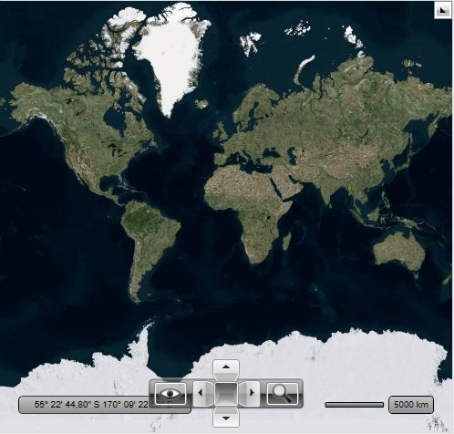
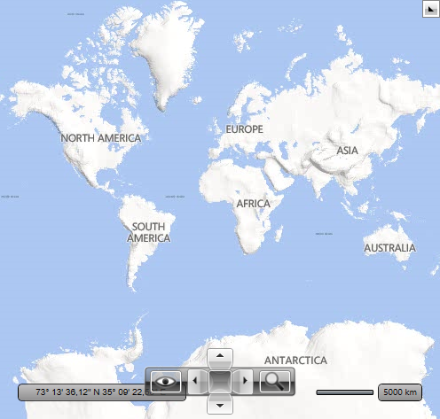
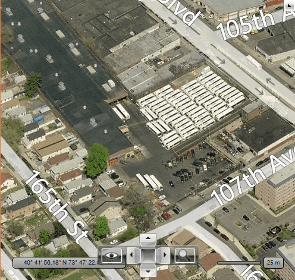

# Bing Map Provider

## Properties

The __RadMap__ supports using of the [Bing Maps](http://www.bing.com/maps/) imagery services for displaying the map. There are 2 types of providers which are used in Bing Maps. The tile images of Bing Maps can be used via the __BingMapProvider__ (SOAP imagery service) or __BingRestMapProvider__ (RESTful imagery service) class. In order to create an instance of the __BingMapProvider__ you have to use the third overload of its constructor. In this way you can easily pass the required parameters - map mode, labels visibility and a __Bing Maps Key__. The most important of them is the __Bing Maps Key__ parameter. Without supplying a valid key you will not be able to visualize the map inside the __RadMap__ control. In order to learn how to obtain one, please read [this article](http://msdn.microsoft.com/en-us/library/ee681900.aspx).
        

Here is a list of the most important properties which are used by __BingMapProvider__ and __BingRestMapProvider__:
        

* __ApplicationId__ - gets or sets __Bing Maps Key__.
            

* __IsLabelVisible__ - gets or sets value which indicates whether labels should be visible on the map.
            

* __Mode__ - gets or sets the mode defining how the map looks. You can choose between *Road*, *Aerial* and *Birdseye* options.
            

* __UseSession__ - gets or sets value which indicates whether *Bing session* should be used. Make sense during provider initialization only.
            

>The __BingMapProvider__ and __BingRestMapProvider__ can raise the __InitializationFaulted__ event. It occurs when initialization of the Bing Maps service has faulted. It can be raised for example when the internet connection is lost or when the service is unavailable. This event contains a parameter of __InitializationFaultEventArgs__ type. This parameter provides the __Error__ property which contains the exception which is thrown while initialization.
          

Here is an example of a __BingMapProvider__ definition:
        

	
          <telerik:RadMap x:Name="radMap" ZoomLevel="1">
            <telerik:RadMap.Provider>
              <telerik:BingMapProvider ApplicationId="Bing_Map_Key" Mode="Aerial" IsLabelVisible="True"/>
            </telerik:RadMap.Provider>
          </telerik:RadMap>

	
          BingMapProvider bingMap = new BingMapProvider( MapMode.Aerial, true, "key" );
          this.radMap.Provider = bingMap;

	
          Dim bingMap As New BingMapProvider(MapMode.Aerial, True, "key")
          Me.radMap.Provider = bingMap

Here is a snapshot of the map that appears.

You can disable labels using the __IsLabelVisible__ property. When you set it to *False* value then the labels disappear. Here is a snapshot of the Aerial mode for Bing Map Provider when the labels are invisible:
        

## Road Mode

The *Road* mode of Bing Maps ignores the __IsLabelVisible__ property. For this mode the labels are displayed always.
        

Here is an example of the __Road Mode__ definition:
        

	
          <telerik:RadMap x:Name="radMap" ZoomLevel="1">
            <telerik:RadMap.Provider>
              <telerik:BingMapProvider ApplicationId="Bing_Map_Key" Mode="Road" IsLabelVisible="True"/>
            </telerik:RadMap.Provider>
          </telerik:RadMap>

	
          BingMapProvider bingMap = new BingMapProvider( MapMode.Road, true, "key" );
          this.radMap.Provider = bingMap;

	
          Dim bingMap As New BingMapProvider(MapMode.Road, True, "key")
          Me.radMap.Provider = bingMap

Here is a snapshot of the __Road__ mode for __Bing Map Provider__:
        

## Birdseye Mode

The __Bing Map Provider__ also supports the *Birdseye* mode. This mode can be used for high resolution levels only (zoom level 19-20)
        

>The __Birdseye__ mode of Bing Maps does not provide the tile images for all regions around the world. Some regions have not images for Birdseye mode.
          

Here is an example of the __Birdseye Mode__ definition:

	
          <telerik:RadMap x:Name="radMap" ZoomLevel="1">
            <telerik:RadMap.Provider>
              <telerik:BingMapProvider ApplicationId="Bing_Map_Key" Mode="Birdseye" IsLabelVisible="True"/>
            </telerik:RadMap.Provider>
          </telerik:RadMap>

	
          BingMapProvider bingMap = new BingMapProvider( MapMode.Birdseye, true, "key" );
          this.radMap.Provider = bingMap;

	
          Dim bingMap As New BingMapProvider(MapMode.Birdseye, True, "key")
          Me.radMap.Provider = bingMap

Here is a snapshot of the __Birdseye__ mode for __Bing Map Provider__:
        

## BingRestMapProvider

The __BingRestMapProvider__ uses other way to connect Bing Maps imagery service (REST), but it can be configured identically the __BingMapProvider__.
      

	
          <telerik:RadMap x:Name="radMap" ZoomLevel="1">
            <telerik:RadMap.Provider>
              <telerik:BingRestMapProvider ApplicationId=" Bing_Map_Key" Mode="Aerial" IsLabelVisible="True"/>
            </telerik:RadMap.Provider>
          </telerik:RadMap>

	
          BingRestMapProvider bingMap = new BingRestMapProvider( MapMode.Aerial, true, "key" );
          this.radMap.Provider = bingMap;

	
          Dim bingMap As New BingRestMapProvider(MapMode.Aerial, True, "key")
          Me.radMap.Provider = bingMap

# See Also

 * [ArcGIS Online Map Provider]()
