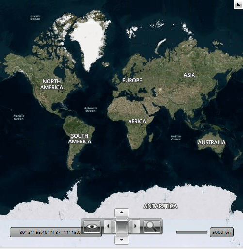
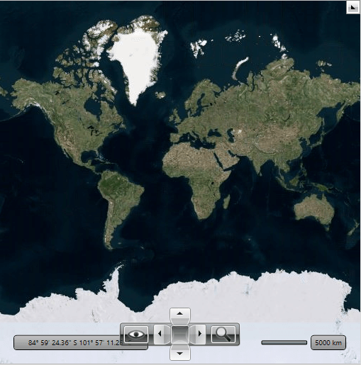

# Bing Map Rest Provider

The `RadMap` control supports visualizing tile data using the Bind Maps Rest imagery service. In order to create an instance of the `BingRestMapProvider` you have to use the third overload of its constructor. This way you can easily pass the required parameters - map mode, labels visibility and a __Bing Maps Key__. The most important of them is the __Bing Maps Key__ parameter. Without supplying a valid key you will not be able to visualize the map inside the RadMap control. In order to learn how to obtain one, please read [Accessing the Control Using a Bing Maps Key](https://learn.microsoft.com/en-us/previous-versions/bing/wpf-control/hh709042(v=msdn.10)).

>The RadMap BingRestMapProvider is based on the Bing Maps [Imagery API](https://msdn.microsoft.com/en-us/library/ff701721.aspx?f=255&MSPPError=-2147217396).

Here is a list of the key properties which are used by BingRestMapProvider:      

* `ApplicationId`&mdash;Gets or sets __Bing Maps Key__.            
* `IsLabelVisible`&mdash;Gets or sets value which indicates whether labels should be visible on the map.            
* `Mode`&mdash;Gets or sets the mode defining how the map looks. You can choose between *Road*, *Aerial* and *Birdseye* options.            
* `UseSession`&mdash;Gets or sets value which indicates whether Bing session should be used.           

>If the provider’s initialization fails, the BingRestMapProvider will raise its `InitializationFaulted` event. The event can be fired for example, when the internet connection is lost or when the service is unavailable. The event arguments are of type `InitializationFaultEventArgs` type. The arguments provides an `Error` property which contains the exception which is thrown while initialization.          

#### __[XAML] Setting BingRestMapProvider in XAML__
{{region xaml-radmap-features-providers-bing-rest-map_0}}
	<telerik:RadMap>
		<telerik:RadMap.Provider>
			<telerik:BingRestMapProvider ApplicationId="Bing_Map_Key" Mode="Aerial" IsLabelVisible="True"/>
		</telerik:RadMap.Provider>
	</telerik:RadMap>
{{endregion}}

#### __[C#] Defining BingRestMapProvider programmaticaly__
{{region cs-radmap-features-providers-bing-rest-map_1}}
	BingRestMapProvider bingMap = new BingRestMapProvider( MapMode.Aerial, true, "Bing_Map_Key" );
	this.radMap.Provider = bingMap;
{{endregion}}

#### __[VB.NET] Defining BingRestMapProvider programmaticaly__
{{region vb-radmap-features-providers-bing-rest-map_2}}
	Dim bingMap As New BingRestMapProvider(MapMode.Aerial, True, "Bing_Map_Key")
	Me.radMap.Provider = bingMap
{{endregion}}

__Aerial mode with labels__

You can disable labels using the `IsLabelVisible` property. When you set it to *False* the labels disappear. The following snapshot of the Aerial mode for Bing Rest Map Provider when the labels are not visible:

__Aerial mode without labels__

## Attribution Copyright Label

When using the BingRestMapProvider, you have to display an attribution copyright label to the Bing Rest Maps services. To learn more about the accurate copyright label's content, please refer to this [article](https://www.microsoft.com/en-us/maps/bing-maps/product/print-rights).

>tip To learn how to customize the RadMap to allocate space for displaying an element containing a sample attribution copyright label, check this [article]().

## Language	

Bing Rest Service provides culture parameter in its url address. This parameter can be used to specify a culture for your request. To change the current culture of the labels shown on the BingRestMapProvider, the `Language` property of the RadMap control can be used.

> For a list of supported cultures, see [Supported Culture Codes](https://docs.microsoft.com/en-us/bingmaps/rest-services/common-parameters-and-types/supported-culture-codes?redirectedfrom=MSDN).

#### __[XAML] Setting Language of RadMap in XAML__
{{region xaml-radmap-features-providers-bing-rest-map_3}}
	<telerik:RadMap Language="fr-FR">
		<telerik:RadMap.Provider>
			<telerik:BingRestMapProvider ApplicationId="Bing_Map_Key" Mode="Aerial" IsLabelVisible="True"/>
		</telerik:RadMap.Provider>
	</telerik:RadMap>
{{endregion}}

__BingRestMapProvider with French culture parameter__

	
## See Also
 * [Providers Overview]()
 * [ArcGIS Online Map Provider]()
