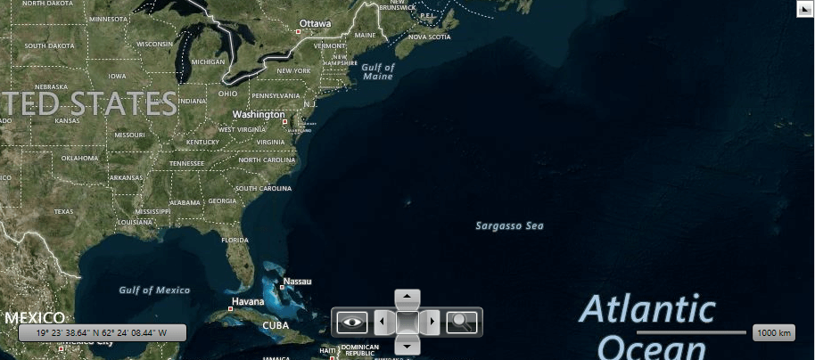
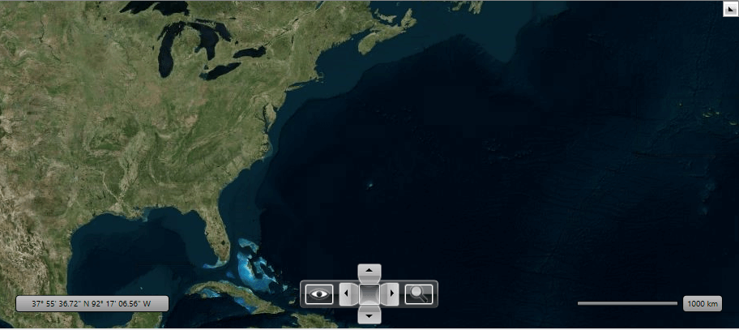
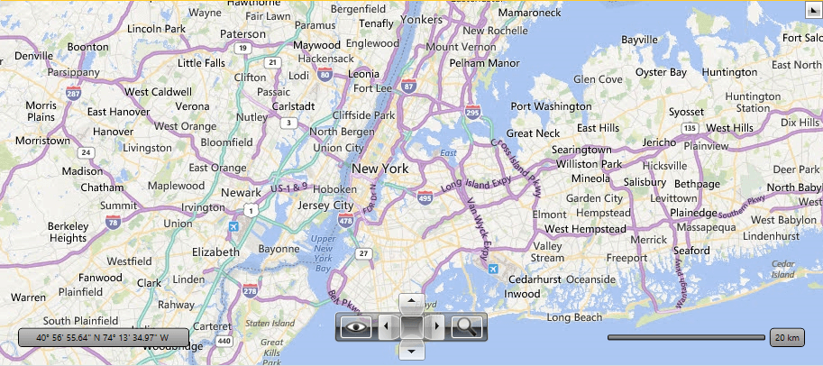
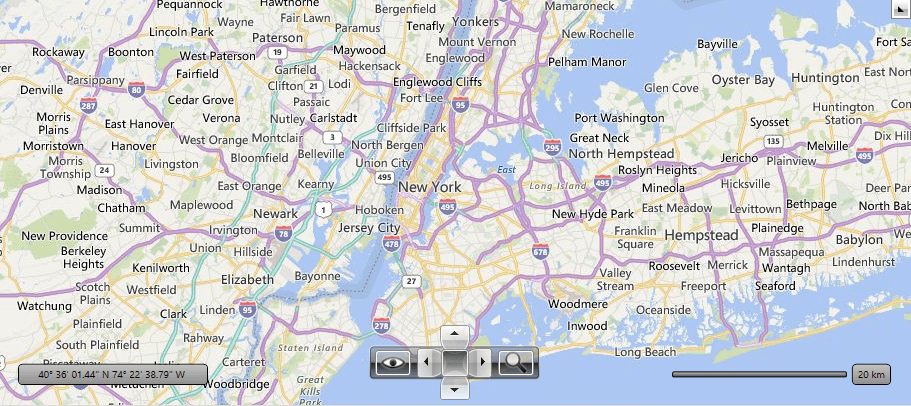
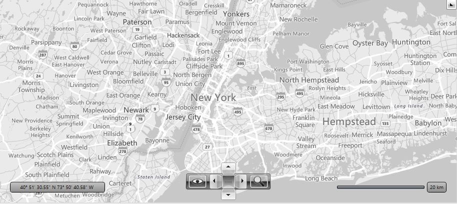
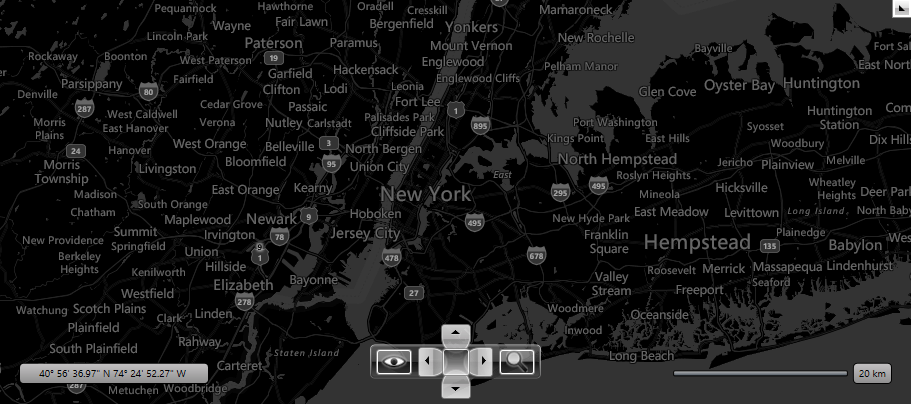

# Imagery sets

The Bind Maps Rest Provider imagery service supports different types of visualization.

>caution The Bing Maps REST Services is [deprecated](https://learn.microsoft.com/en-us/bingmaps/rest-services/). The BingRestMapProvider will be supported until 2026 Q2 inclusive. To avoid disruptions, you can use the [Azure Maps Services](https://learn.microsoft.com/en-us/azure/azure-maps/), which are supported by the RadMap control via the [AzureMapProvider](radmap-features-providers-azuremapprovider).

The possible imagery sets which can be used are:
* [__Aerial with Labels__](#aerial-with-labels)
* [__Aerial without Labels__](#aerial-without-labels)
* [__AerialOnDemand__](#aerialondemand)
* [__Road__](#road)
* [__RoadOnDemand__](#roadondemand)
* [__Birdseye__](#birdseye)
* [__CanvasLight__](#canvaslight)
* [__CanvasGray__](#canvasgray)
* [__CanvasDark__](#canvasdark)

To choose an imagery set, you can set the __Mode__ property of the __BingRestMapProvider__.

__Example 1: Setting Mode property in XAML__
```XAML
	<telerik:RadMap>
		<telerik:RadMap.Provider>
			<telerik:BingRestMapProvider x:Name="bingRestMapProvider" ApplicationId="Bing_Map_Key" Mode="Aerial"/>
		</telerik:RadMap.Provider>
	</telerik:RadMap>
```

The __CanvasLight, CanvasDark, CanvasGray, AerialOnDemand, RoadOnDemand__ are not added to the toolbar of the control by default. To add them to the map view mode commands bar, you can use the __RegisterSetSourceCommand()__ method of __BingRestMapProvider__.

__Example 2: Adding CanvasGray mode to the view mode commands bar__
```C#
	public MainWindow()
	{
		InitializeComponent();
		this.bingRestMapProvider.RegisterSetSourceCommand(MapMode.CanvasGray, LocalizationManager.GetString("MapCanvasGrayCommand"));
	}
```

You can remove specific imagery set from the map view mode commands bar, by removing them from the Commands collection of the __BingRestMapProvider__.

__Example 3: Remove mode from the view mode commands bar__
```C#
	public MainWindow()
	{
		InitializeComponent();
		this.bingRestMapProvider.Commands.RemoveAt(0);
	}
```

## Aerial with Labels

This mode offers worldwide orthographic aerial and satellite imagery. The labels in this mode are enabled by default.

#### __Figure 1: Aerial mode with labels__
	
	

## Aerial without Labels

You can the disable labels using the __IsLabelVisible__ property. When you set it to *False* the labels disappear. __Figure 2__ is a snapshot of the Aerial mode for Bing Map Rest Provider when the labels are not visible.

#### __Figure 2: Aerial mode without labels__


## AerialOnDemand

This imagery set represent Aerial imagery with on-demand road overlay.

#### __Figure 3: AerialOnDemand mode__


## Road

The road imagery type is a set of static tile server. The tiles are generated ahead of time and then stored and served. The *Road* mode of Bing Maps ignores the __IsLabelVisible__ property. For this mode the labels are displayed always. __Figure 4__ is an example of the __Road Mode__ definition.

#### __Figure 4: Road mode__
	

## Birdseye

The __Bing Map Rest Provider__ also supports the *Birdseye* mode. This mode can be used for high resolution levels only (zoom level 19-20).

>The __Birdseye__ mode does not provide the tile images for all regions around the world. Some regions don't have images for Birdseye mode.

Here is an example of the __Birdseye Mode__ definition:

#### __Figure 5: Birdseye mode__


## RoadOnDemand

The road on demand imagery type provides the same map tiles used in the latest Bing maps controls. These tiles are generated on the fly as needed and are the most up to date road maps. 

#### __Figure 6: RoadOnDemand mode__


## CanvasLight

A light version of the road maps which provides neutral background  with minimal colors, labels and features.

#### __Figure 7: CanvasLight mode__


## CanvasGray

A gray version of the road maps which provides neutral background with minimal colors, labels and features.

#### __Figure 8: CanvasGray mode__


## CanvasDark

A dark version of the road maps which provides neutral background with minimal colors, labels and features.

#### __Figure 8: CanvasDark mode__	


## See Also
 * [Providers Overview]()
 * [ArcGIS Online Map Provider]()