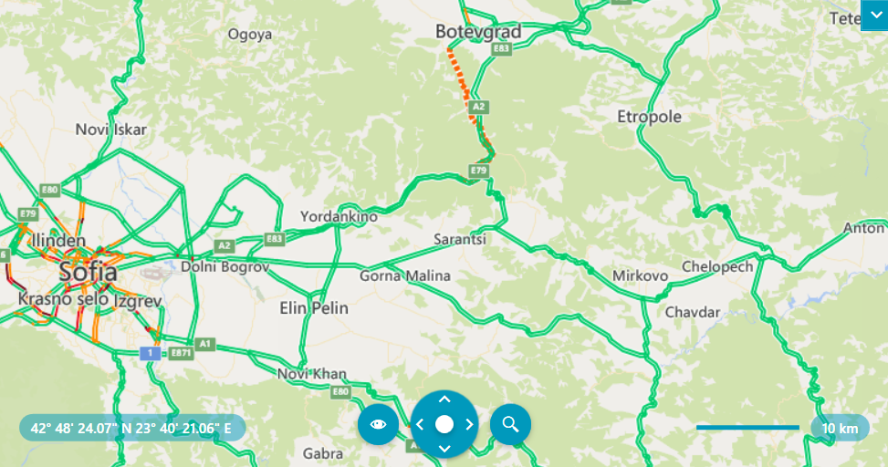

# Top Layer

The `RadMap` control allows you to specify the layer option that will be displayed over the received Bing Maps imagery service. To specify the layer or layers, set the `TopLayer` property of the `BingRestMapProvider` instance. This property is of the type `BingTopLayer`.

>caution The Bing Maps REST Services is [deprecated](https://learn.microsoft.com/en-us/bingmaps/rest-services/). The BingRestMapProvider will be supported until 2026 Q2 inclusive. To avoid disruptions, you can use the [Azure Maps Services](https://learn.microsoft.com/en-us/azure/azure-maps/), which are supported by the RadMap control via the [AzureMapProvider](radmap-features-providers-azuremapprovider).

The TopLayer property is a flag enumeration and it allows you to specify more than one layer. The options that are exposed by the `BingTopLayer` enumeration are as follows:

* `Basemap`&mdash;This option displays the regular road map layer with labels. This option is the default value of the TopLayer property.
* `Background`&mdash;The Background option shows only base geometry layer without labels. This option does not have effect when the `Mode` property of the provider is set to `Ariel` or `Road` modes.
* `Foreground`&mdash;The Foreground option displays only a label layer. This option does not have effect when the `Mode` property of the provider is set to `Ariel` or `Road` modes.
* `TrafficFlow`&mdash;This option shows a traffic flow layer on top of the roads. This option does not have effect when the `Mode` property of the provider is set to `Ariel` or `Road` modes.

#### __[C#] Setting the TopLayer property__
{{region radmap-features-providers-top-layer-0}}
    BingRestMapProvider bingRestMapProvider = new BingRestMapProvider();
    bingRestMapProvider.ApplicationId = "Bing_Map_Key";
    bingRestMapProvider.Mode = MapMode.AerialOnDemand;
    bingRestMapProvider.TopLayer = BingTopLayer.TrafficFlow | BingTopLayer.Background;

    this.radMap.Provider = bingRestMapProvider;
{{endregion}}

#### __[VB.NET] Setting the TopLayer property__
{{region radmap-features-provider-top-layer-1}}
    Dim bingRestMapProvider As BingRestMapProvider = New BingRestMapProvider()
    bingRestMapProvider.ApplicationId = "Bing_Map_Key"
    bingRestMapProvider.Mode = MapMode.AerialOnDemand
    bingRestMapProvider.TopLayer = BingTopLayer.TrafficFlow Or BingTopLayer.Background

    Me.radMap.Provider = bingRestMapProvider
{{endregion}}

__RadMap with TopLayer property set to BingTopLayer.TrafficFlow and BingTopLayer.Background__

>important Modifying the values of the `TopLayer` property at runtime is not fully supported. To change them during runtime, create a new instance of the `BingRestMapProvider` class and set the new values to the TopLayer property.

>important The following scenarios of the TopLayer options are not supported:
>* `Basemap` and `Background`
>* `Basemap` and `Foreground`
>* `Buildings` option

## See Also
* [Elevation]()
* [Imagery sets]()
* [Routing]()
