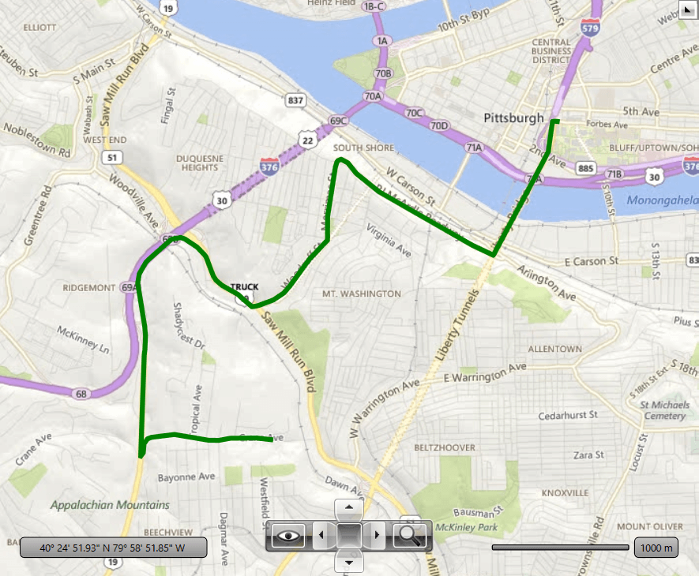

# Truck Routing

RadMap provides an infrastructure that allows you to use the [Bing Maps Truck Routing API](https://docs.microsoft.com/en-us/bingmaps/rest-services/routes/calculate-a-truck-route) to get a set of locations that can be plotted on the map. 

The truck routing API is accessed via the __BingRestMapProvider__ provider, and it is used to calculate a route between different locations on the map.

>caution The Bing Maps REST Services is [deprecated](https://learn.microsoft.com/en-us/bingmaps/rest-services/). The BingRestMapProvider will be supported until 2026 Q2 inclusive. To avoid disruptions, you can use the [Azure Maps Services](https://learn.microsoft.com/en-us/azure/azure-maps/), which are supported by the RadMap control via the [AzureMapProvider](radmap-features-providers-azuremapprovider).

## Creating a Truck Routing Request

To create a request that returns the set of truck routing locations, you can define a __BingRestTruckRouteRequest__, set it up and pass it to the __CalculateTruckRouteAsync__ method of BingRestMapProvider.

The request needs two settings - the route points, defined via the __RoutePoints__ properties, and the RoutePath attribute, set via the __RouteAttributes__ property.

> The BingRestTruckRouteRequest options are described in the [Truck Routing Settings](#truck-routing-settings) section of this article.

#### __[XAML] Example 1: Defining RadMap__
{{region radmap-features-providers-bing-rest-map-provider-truck-routing-0}}
	<telerik:RadMap x:Name="radMap">
		<telerik:RadMap.Provider>
			<telerik:BingRestMapProvider x:Name="bingRestMapProvider" 
										 ApplicationId="Your Bing Maps Application Id" 																				  										
										 CalculateTruckRouteCompleted="BingRestMapProvider_CalculateTruckRouteCompleted"
										 CalculateTruckRouteError="BingRestMapProvider_CalculateTruckRouteError"/>
		</telerik:RadMap.Provider>
		<telerik:VisualizationLayer Name="routeLayer" />
	</telerik:RadMap>	
{{endregion}}

#### __[C#] Example 2: Creating a truck route request__
{{region radmap-features-providers-bing-rest-map-provider-truck-routing-1}}	
	private void RequestTruckRoute()
	{
		BingRestTruckRouteRequest request = new BingRestTruckRouteRequest();		
		request.RoutePoints.Add(new BingRestTruckWaypoint("590 Crane Ave, Pittsburgh, PA"));
		request.RoutePoints.Add(new BingRestTruckWaypoint("600 Forbes Ave, Pittsburgh, PA"));
		request.Options.RouteAttributes = BingRestTruckRouteAttribute.RoutePath;            
		request.Options.VehicleSpec = new BingRestVehicleSpec() { VehicleHazardousMaterials = HazardousMaterial.Flammable };

		this.bingRestMapProvider.CalculateTruckRouteAsync(request);
	}
{{endregion}}

The response from the BingRestTruckRouteRequest is get via the __CalculateTruckRouteCompleted__ event of BingRestMapProvider.

#### __[C#] Example 3: Collecting the truck route response__
{{region radmap-features-providers-bing-rest-map-provider-truck-routing-2}}
	private void BingRestMapProvider_CalculateTruckRouteCompleted(object sender, BingRestRoutingCompletedEventArgs e)
	{
		Telerik.Windows.Controls.DataVisualization.Map.BingRest.Route route = e.Route;
		if (route != null)
		{
			PolylineData routeLine = new PolylineData()
			{
				ShapeFill = new MapShapeFill() { Stroke = Brushes.Green, StrokeThickness = 5, },
				Points = new LocationCollection(),
			};
							
			foreach (double[] coordinatePair in route.RoutePath.Line.Coordinates)
			{
				Location point = new Location(coordinatePair[0], coordinatePair[1]);
				routeLine.Points.Add(point);
			}

			this.routeLayer.Items.Add(routeLine);

			double[] bbox = e.Route.BoundingBox;
			LocationRect rect = new LocationRect(new Location(bbox[2], bbox[1]), new Location(bbox[0], bbox[3]));
			this.radMap.SetView(rect);
		}
	}
{{endregion}}

To listen for errors returned by the Bing Maps service, use the __CalculateTruckRouteError__ event of BingRestMapProvider.

#### __[C#] Example 4: Collecting truck route response errors__
{{region radmap-features-providers-bing-rest-map-provider-truck-routing-3}}
	private void BingRestMapProvider_CalculateTruckRouteError(object sender, Telerik.Windows.Controls.Map.BingRestCalculateRouteErrorEventArgs e)
	{
		Exception error = e.Error;
	}
{{endregion}}

#### Figure 1: Route shape representing the route response returned by the truck route API

## Truck Routing Settings

__BingRestTruckRouteRequest__ provides several different options that can be used to adjust the request. Those options are based on the parameters described by the [Bing Maps Truck Routing API](https://docs.microsoft.com/en-us/bingmaps/rest-services/routes/calculate-a-truck-route) documentation.

The settings can be used via the __Options__ property of __BingRestTruckRouteRequest__. The property is of type __BingRestTruckRouteOptions__ and it provides the following settings:

* __Avoid__: Specifies road types to minimize during the route calculation.

* __BorderRestrictions__: Specifies the border crossing preference with respect to countries, states, special areas, etc.

* __DistanceBeforeFirstTurn__: Specifies the distance before the first turn is allowed in the route. This parameter is useful to make sure that the vehicle has enough distance to make the first turn.

* __Heading__: Specifies the initial heading for the route. The property expects values between 0 and 359 representing degress from north (0) rotation clockwise. Setting the heading of 270 degrees creates a route that initially heads west.

* __Optimize__: Specifies what parameters to use for optimizing the route.

* __OptimizeWaypoints__: Specifies whether the route waypoints should be rearranged in order to reduce the route cost defined with the Optimize property.

* __RouteAttributes__: Specifies what parts of the route response to be included in the received result.

* __DateTime__: Specifies whether predictive traffic data is used to calculate the best route for the set date time of departure. This is applicable when the Optimize property is set to TimeWithTraffic.

* __Tolerance__: Specifies a set of numeric values, where each value specifies a tolerance that is used to reduce the number of points needed to display a route on a map and still maintain the route shape. 

* __VehicleSpec__: Describes the vehicle. This property allows you to provide information like, the vehicle's size, weight, transported hazardous materials, etc.

An additional setting is the distance unit that can be set via the __DistanceUnit__ property of BingRestTruckRouteRequest.

#### __[C#] Example 5: Set request options__
{{region radmap-features-providers-bing-rest-map-provider-truck-routing-4}}	
	private void RequestTruckRoute()
	{
		BingRestTruckRouteRequest request = new BingRestTruckRouteRequest();		
	
		request.DistanceUnit = DistanceUnit.Kilometer;	
		request.Options.RouteAttributes = BingRestTruckRouteAttribute.RoutePath;            
		request.Options.Heading = 270;
		request.Options.Avoid = BingRestTruckRouteAvoidance.Tolls;
		request.Options.VehicleSpec = new BingRestVehicleSpec() { VehicleHazardousMaterials = HazardousMaterial.Flammable };
		
		// add RoutePoints and request the route here
	}
{{endregion}}

## See Also
 * [Providers Overview] ()
 * [Bing Rest Map]()
 * [Search Location]()
 * [Elevation]()
