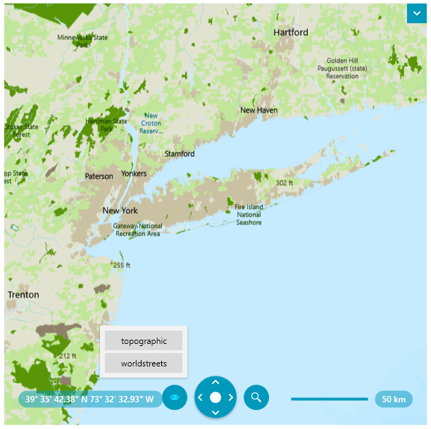

# Custom Vector Tile Provider

The __Map__ component allows you to create custom vector tiled map providers that bring map layers visualization different then the default one.

The easiest way to change the tiles is to use the `UriVectorTileMapProvider` and set its `UriTemplate` and `StyleFileSource` properties. See examples in the [Vector Tile Providers]() article.

For more complex customization, you can create custom class that inherit the `VectorTileMapProvider`. This will allow you to customize also the logic behind the tiles source and also to register custom commands displayed in the [Map View Mode]() list in the navigation element of the Map control.

The following example shows how to implement custom vector tile provider that uses the [ArcGIS vector tile services](https://developers.arcgis.com/rest/services-reference/enterprise/vector-tile-service.htm).

>tip Telerik has also a built-in [ArcGIS provider]() that works with the ArcGIS raster-based services. At this point some of its [layer options are depricated](#migrating-to-vector-tile-map-provider), so in case you are using it, you may want to migrate to a tile vector-based provider. If so, you can use the custom ArcGIS provider implementation from this article.

## Step 1: Creating Vector Tile Map Source

The map source is providing information about the tile that should be downloaded at specific position and zoom level. The custom source allows you to modify the final `Uri` of the tiles. 

To create a custom source, implement a class that derives from `UriVectorTileMapSource`.

__Creating custom UriVectorTileMapSource__
```C#
	public class ArcGisVectorMapSource : UriVectorTileMapSource
	{
		public ArcGisVectorMapSource(string template)
			  : base(template)
		{
			this.UniqueId = "ArcGis Vector Map source";
		}

		protected override Uri GetTile(int tileLevel, int tilePositionX, int tilePositionY)
		{
			Uri baseUri = base.GetTile(tileLevel, tilePositionX, tilePositionY);

			// here you can add accesstoken to the Uri string if needed by the service, or any other modification
			//string uriWithTonen = baseUri.ToString() + string.Format("?token={0}", yourTokenHere);

			return new Uri(baseUri.ToString());
		}
	}
```

In case the custom provider should get the tiles using a `Stream` instead of a `Uri`, implement the `IMapStreamSource` and use its `GetStream` method.

__Implementing the IMapStreamSource interface__
```C#
	public class CustomVectorMapSource : UriVectorTileMapSource, IMapStreamSource
    {
        public CustomVectorMapSource(string template)
              : base(template)
        {
            this.UniqueId = "Custom Vector Map source";
        }

        public Stream GetStream(int tileLevel, int tilePositionX, int tilePositionY)
        {
            // create Stream with the tile image for the requested level, x and y positions
            // return the stream object
        }
    }	
```

The custom map source can be used with a custom vector tile provider.

## Step 2: Creating Vector Provider

The custom provider allows you to use a custom map source and to make sure that the map features are compatible with it. Additional to this, it allows you to register extra commands that will be shown as buttons in the [Map View Mode]() list in the navigation element `RadMap`.

__Creating custom VectorTileMapProvider__
```C#
	public class ArcGisVectorProvider : VectorTileMapProvider
    {
        private const string template = @"https://basemaps.arcgis.com/arcgis/rest/services/World_Basemap_v2/VectorTileServer/tile/{level}/{y}/{x}";
        private ArcGisVectorProvider miniMapProvider;
		
        public ArcGisVectorProvider()
        {
            this.PrepareSource();
			
			// This method call and all related code is required only if you want to add custom commands that are displayed in the UI and change the current layout.
			// If you don't need such customization you can omit this code.
            this.RegisterCommands();
        }

        public new object Clone()
        {
            ArcGisVectorProvider clonedProvider = new ArcGisVectorProvider();
            this.miniMapProvider = clonedProvider;

            this.InheritCurrentSource(clonedProvider);
            this.InheritParameters(clonedProvider);

            return clonedProvider;
        }

        private void PrepareSource()
        {
            ArcGisVectorMapSource source = new ArcGisVectorMapSource(template);
            this.MapSources.Add(source.UniqueId, source);
            if (this.miniMapProvider != null && !this.miniMapProvider.MapSources.ContainsKey(source.UniqueId))
            {
                this.miniMapProvider.MapSources.Add(source.UniqueId, source);
            }

            this.TransferStylesToMapSources();
        }

        private void RegisterCommands()
        {
            this.RegisterSetSourceCommand("topographic");
            this.RegisterSetSourceCommand("worldstreets");
        }

        private void RegisterSetSourceCommand(string text)
        {
            CommandDescription description = new CommandDescription()
            {
                Command = new RoutedUICommand(text, "ChangeStyleCommand", typeof(MapProviderBase)),
                CommandParameter = text,
            };
            this.Commands.Add(description);

            var canExecute = new CanExecuteRoutedEventHandler(this.CanExecuteChangeStyleCommand);
            var executeHandler = new ExecutedRoutedEventHandler(this.ExecuteChangeStyleCommand);

			// This includes the custom options also in the Map View Mode list in the UI.
            this.CommandBindingCollection.Add(new CommandBinding(description.Command, executeHandler, canExecute));
        }

        private void CanExecuteChangeStyleCommand(object sender, CanExecuteRoutedEventArgs e)
        {
            e.CanExecute = true;
        }

        private void ExecuteChangeStyleCommand(object sender, ExecutedRoutedEventArgs e)
        {
            string styleName = e.Parameter as string;
            string outputDir = AppDomain.CurrentDomain.BaseDirectory;
            string relativePath = System.IO.Path.GetRelativePath("../../..", outputDir);
            string projectDir = outputDir.Remove(outputDir.IndexOf(relativePath));
			
			// The file path here points to local files placed in Styles\ESRI\ location in the project directory. 
			// In your case the location may vary so please update this code according to your needs.
			string styleFilePath = String.Format(projectDir + "Styles\\ESRI\\{0}.json", styleName);
            this.StyleFileSource = new Uri(styleFilePath, UriKind.Relative);
        }
    }	
```

__Using the custom map provider__
```XAML
	<telerik:RadMap>
		<telerik:RadMap.Provider>
			<local:ArcGisVectorProvider StyleFileSource="C:\MyWpfApplicationFolder\Styles\ESRI\topographic.json"/>
		</telerik:RadMap.Provider>
	</telerik:RadMap>	
```



## See Also  
* [Vector Tile Providers]()
* [ArcGIS World Street Map Style JSON](https://www.arcgis.com/sharing/rest/content/items/de26a3cf4cc9451298ea173c4b324736/resources/styles/root.json?f=pjson)