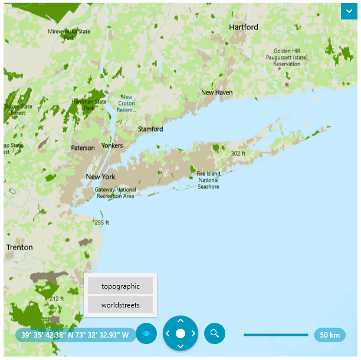

# Custom Vector Tile Provider

The __Map__ component allows you to create custom vector tiled map providers that bring map layers visualization different then the default one.

The easiest way to change the tiles is to use the `UriVectorTileMapProvider` and set its `UriTemplate` and `StyleFileSource` properties. See examples in the [Vector Tile Providers]() article.

For more complex customization, you can create custom class that inherit the `VectorTileMapProvider`. This will allow you to customize also the logic behind the tiles source and also to register custom commands displayed in the [Map View Mode]() list in the navigation element of the Map control.

The following example shows how to implement custom vector tile provider that uses the [ArcGIS vector tile services](https://developers.arcgis.com/rest/services-reference/enterprise/vector-tile-service.htm).

>tip Telerik has also a built-in [ArcGIS provider]() that works with the ArcGIS raster-based services. At this point some of its [layer options are depricated](#migrating-to-vector-tile-map-provider), so in case you are using it, you may want to migrate to a tile vector-based provider. If so, you can use the custom ArcGIS provider implementation from this article.

## Step 1: Creating Vector Tile Map Source

The map source is providing information about the tile that should be downloaded at specific position and zoom level. The custom source allows you to modify the final `Uri` of the tiles. 

To create a custom source, implement a class that derives from `UriVectorTileMapSource`.

__Creating custom UriVectorTileMapSource__
<snippet id='radmap-features-providers-custom-vector-tile-provider-block_1-cs' />

In case the custom provider should get the tiles using a `Stream` instead of a `Uri`, implement the `IMapStreamSource` and use its `GetStream` method.

__Implementing the IMapStreamSource interface__
<snippet id='radmap-features-providers-custom-vector-tile-provider-block_2-cs' />

The custom map source can be used with a custom vector tile provider.

## Step 2: Creating Vector Provider

The custom provider allows you to use a custom map source and to make sure that the map features are compatible with it. Additional to this, it allows you to register extra commands that will be shown as buttons in the [Map View Mode]() list in the navigation element `RadMap`.

__Creating custom VectorTileMapProvider__
<snippet id='radmap-features-providers-custom-vector-tile-provider-block_3-cs' />

__Using the custom map provider__
<snippet id='radmap-features-providers-custom-vector-tile-provider-block_4-xaml' />

## See Also  
* [Vector Tile Providers]()
* [ArcGIS World Street Map Style JSON](https://www.arcgis.com/sharing/rest/content/items/de26a3cf4cc9451298ea173c4b324736/resources/styles/root.json?f=pjson)