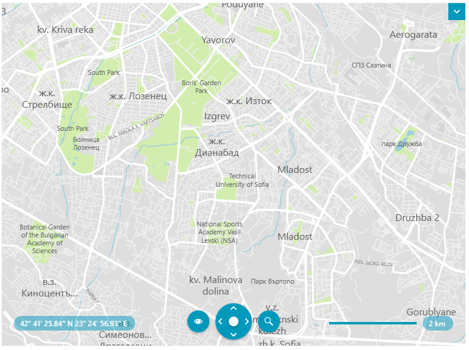
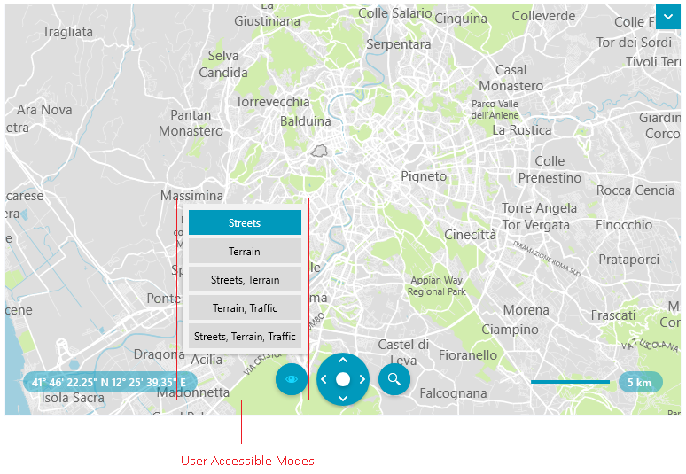

# MapBox Provider

RadMap has a built-in [MapBox vector tile services](https://docs.mapbox.com/data/tilesets/guides/vector-tiles-introduction/) provider that can be easily integrated in the application in order to show a detailed world map.

To use the MapBox services, assign a `MapBoxMapProvider` instance to the `Provider` property of `RadMap`.

In order to download data from the services, the provider needs to assign its `AccessToken` property. An access token can be acquired from the [MapBox tokens API](https://docs.mapbox.com/help/glossary/access-token/). Keep in mind that the token is related to a specific number of requests to the services. Read more on the [MapBox website](https://docs.mapbox.com/accounts/guides/invoices/#details-of-charges).

__Setting up MapBoxMapProvider__
```XAML
	<telerik:RadMap>
		<telerik:RadMap.Provider>
			<telerik:MapBoxMapProvider AccessToken="Your Access Token"/>
		</telerik:RadMap.Provider>
	</telerik:RadMap>
```



## Attribution Copyright Label

When using the MapBoxMapProvider, you have to display an attribution copyright label to the Mapbox services. To learn more about the accurate copyright label's content, please refer to the [MapBox Attribution](https://docs.mapbox.com/help/dive-deeper/attribution/) article.

>tip To learn how to customize the RadMap to allocate space for displaying an element containing a sample attribution copyright label, check this [article]().

## Changing the Tile Set Mode

The MapBox services provide a set of different map layers ([tilesets](https://docs.mapbox.com/studio-manual/reference/tilesets/)). Telerik can make requests to several of the vector tilesets, but the built-in style source supports one of the available sets. To change the mode, set the `Mode` property of `MapBoxMapProvider` or use the UI.

The `Mode` property is a flag enum of type `MapboxVectorTileset` which allows you to set the mode to Streets, Terrain, Traffic or any combination of the modes. Currently, [the default style file source](https://github.com/mapbox/mapbox-gl-styles/blob/master/styles/basic-v9.json) deployed with the provider supports only the `Streets` mode. To visualize other modes, you should [provide a custom style file](#loading-custom-styles).

__Setting the Mode property__
```XAML
	<telerik:RadMap>
		<telerik:RadMap.Provider>			
			<telerik:MapBoxMapProvider AccessToken="Your Access Token"
									   StyleFileSource="C:\MyMapVectorResources\Styles\custom-styles.json"
									   Mode="Streets,Terrain"/>
		</telerik:RadMap.Provider>
	</telerik:RadMap>
```

By default RadMap's navigation UI doesn't display any modes for the `MapBoxMapProvider`. To enable this, set the provider's `UserAccessibleModes` collection property.

__Setting up the tileset modes__
```XAML
	<telerik:RadMap>
		<telerik:RadMap.Provider>			
			<telerik:MapBoxMapProvider AccessToken="Your Access Token"
									   StyleFileSource="C:\MyMapVectorResources\Styles\custom-styles.json">
				<telerik:MapBoxMapProvider.UserAccessibleModes>
					<telerik:MapboxVectorTileset>Streets</telerik:MapboxVectorTileset>
					<telerik:MapboxVectorTileset>Terrain</telerik:MapboxVectorTileset>
					<telerik:MapboxVectorTileset>Streets,Terrain</telerik:MapboxVectorTileset>
					<telerik:MapboxVectorTileset>Terrain, Traffic</telerik:MapboxVectorTileset>
					<telerik:MapboxVectorTileset>Streets, Terrain, Traffic</telerik:MapboxVectorTileset>
				</telerik:MapBoxMapProvider.UserAccessibleModes>
			</telerik:MapBoxMapProvider>
		</telerik:RadMap.Provider>
	</telerik:RadMap>
```



## Loading Custom Styles 

To assign a custom [style](https://docs.mapbox.com/mapbox-gl-js/style-spec/) `.json` file, set the `StyleFileSource` property of `MapBoxMapProvider`.

__Setting custom styles__
```XAML
	<telerik:RadMap>
		<telerik:RadMap.Provider>
			<telerik:MapBoxMapProvider AccessToken="Your Access Token"\
									   StyleFileSource="C:\MyMapVectorResources\Styles\custom-styles.json"/>
		</telerik:RadMap.Provider>
	</telerik:RadMap>
```

## See Also 
* [Vector Tile Providers]()

