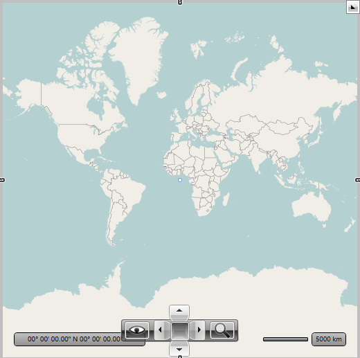

# Providers Overview

The __RadMap__ control doesn't display a map on itself, it needs a map provider from which to consume the required data. Currently the __RadMap__ control supports a few providers:
      

* [Bing Maps](#Bing_Maps)

* [ArcGIS](#ArcGIS)

* [OpenStreet Maps](#OpenStreet_Maps)

* [Empty Provider](#Empty_Provider)

* [UriImageProvider](#Image_Provider)

* [BingMapTrafficProvider](#Bing_Traffic)

>tipIt is now possible to specify multiple map providers that will be displayed one over another through the __RadMap.Providers__ property. Note that in multiple providers scenario the first (master) provider should be tiled provider without geographic limits set. Also, providers that have geographic limits and use tiled map sources should be limited with the __MapLayer.ZoomRange__ attached property. Zoom range should be set into the reasonable value, so the size of the “map window” does not get excessive on the maximum allowed zoom level; otherwise loading of the tiles into the window will dramatically decrease performance of the application.
        

Here is a list of the most important common properties shared by all map providers:

* __GeoBounds__ - Gets or sets region covered by map image (the region represented by map provider can be limited by geographic bounds now).
          

* __Opacity__ - Gets or sets the opacity factor for the respective provider imagery data.
          

* __Commands__ - Gets the collection of the commands supported by the respective provider. This is useful if you want to customize the default command list (i.e. add / remove commands). You can find more information [here]().
          

* __CommandBindingCollection__ - Gets collection of the command bindings.
          

* __SupportedSources__ - Gets the IDs of the supported sources. This property can be used in scenarios where it is necessary to get the list of supported sources and execute some action based on them (e.g. enable or disable source specific commands in the command bar).
          

## Bing Maps

The [Bing Maps](http://www.bing.com/maps/) can be used via the __BingMapProvider__ (SOAP imagery service) or __BingRestMapProvider__ (RESTful imagery service) class. In order to create an instance of the __BingMapProvider__ you have to use the third overload of its constructor. In this way you can easily pass the required parameters - map mode, labels visibility and a __Bing Maps Key__. The most important of them is the __Bing Maps Key__. Without supplying a valid key you won't be able to visualize the map inside the __RadMap__ control. In order to learn how to obtain one, please read [this article](http://msdn.microsoft.com/en-us/library/ee681900.aspx).
        

Here is an example of a __BingMapProvider__ definition:
        

	
          <telerik:RadMap x:Name="radMap" ZoomLevel="1">
            <telerik:RadMap.Provider>
              <telerik:BingMapProvider ApplicationId="Bing_Map_Key" Mode="Aerial" IsLabelVisible="True"/>
            </telerik:RadMap.Provider>
          </telerik:RadMap>

	
          BingMapProvider bingMap = new BingMapProvider( MapMode.Aerial, true, "key" );
          this.radMap.Provider = bingMap;

	
          Dim bingMap As New BingMapProvider(MapMode.Aerial, True, "key")
          Me.radMap.Provider = bingMap

Here is an example of a __BingRestMapProvider__ definition:
        

	
          <telerik:RadMap x:Name="radMap" ZoomLevel="1">
            <telerik:RadMap.Provider>
              <telerik:BingRestMapProvider ApplicationId="Bing_Map_Key" Mode="Aerial" IsLabelVisible="True"/>
            </telerik:RadMap.Provider>
          </telerik:RadMap>

	
          BingRestMapProvider bingMap = new BingRestMapProvider( MapMode.Aerial, true, "key" );
          this.radMap.Provider = bingMap;

	
          Dim bingMap As New BingRestMapProvider(MapMode.Aerial, True, "key")
          Me.radMap.Provider = bingMap

Here is a snapshot of the map that appears.

## OpenStreet Maps

The [Open Street Maps](http://www.openstreetmap.org/) can be used via the __OpenStreetMapProvider__ class. 
        

	
          <telerik:RadMap x:Name="radMap" ZoomLevel="1">
            <telerik:RadMap.Provider>
              <telerik:OpenStreetMapProvider />
            </telerik:RadMap.Provider>
          </telerik:RadMap>

	
          OpenStreetMapProvider openStreetMap = new OpenStreetMapProvider();
          this.radMap.Provider = openStreetMap;

	
          Dim openStreetMap As New OpenStreetMapProvider()
          Me.radMap.Provider = openStreetMap

Here is a snapshot of the map that appears.

## Empty Provider

Empty provider is a provider which doesn't connect to any real imagery services (Virtual Earth, Google etc). It provides definitions and methods which can be used to calculate positions of the framework elements, map shapes and pin points. By using this provider you can create map-relative applications which do not require visibility of the real map data (landscapes or roads), but which require visible elements to be positioned according to the geographical coordinates.

To learn more about the empty provider [read here]().
        

## UriImageProvider

RadMap provides support for single image provider through the __UriImageProvider__ class besides the built-in support for tiled (MultiScaleImage) providers like BingMapProvider and OpenStreetMapProvider. You can either use it with single image for all zoom levels, or you can specify an image for every distinct zoom level.
        

To learn more about the UriImageProvider [read here]().
        

## Bing Maps Traffic Provider

Since Q2 2011 the well known Bing Maps Traffic implementation that shows the consequences of traffic incidents and construction sites as color-coded overlays for both sides of the street is now supported with RadMap control.

The provider can be used together with __BingMapsProvider__or __OpenStreetMapProvider__ the way it's shown below:____

	
          <telerik:RadMap x:Name="RadMap1" Center="40.7254808779182,-73.9034722532031" ZoomLevel="11">
            <telerik:RadMap.Providers>
              <telerik:OpenStreetMapProvider />
              <telerik:BingMapTrafficProvider />
            </telerik:RadMap.Providers>
          </telerik:RadMap>

## ArcGIS online services

The [ArcGIS online services](http://www.esri.com/software/arcgis/arcgisonline/maps/maps-and-map-layers) can be used via the __ArcGisMapProvider__ class. Currently the ArcGIS map provider support 6 modes which can be set using Mode property:
        

1. Aerial

1. Physical

1. Shaded Relief

1. Street

1. Terrain

1. Topographic

	
          <telerik:RadMap x:Name="radMap" ZoomLevel="1">
            <telerik:RadMap.Provider>
              <telerik:ArcGisMapProvider Mode="Physical" />
            </telerik:RadMap.Provider>
          </telerik:RadMap>

	
          ArcGisMapProvider provider = new ArcGisMapProvider();
          provider.Mode = ArcGisMapMode.Physical;
          this.radMap.Provider = provider;

	
          Dim provider As New ArcGisMapProvider ()
          provider.Mode = ArcGisMapMode.Physical
          Me.radMap.Provider = provider

Here is a snapshot of the map that appears.

# See Also

 * [Empty provider]()

 * [Search]()

 * [Geocode]()

 * [Routing]()

 * [UriImageProvider]()
