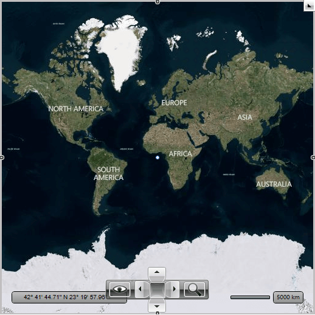
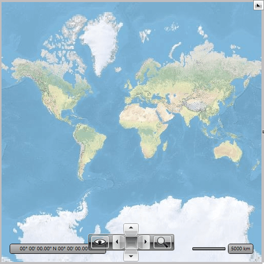

# Providers Overview

The __RadMap__ control doesn't display a map on itself, it needs a map provider from which to consume the required data. Currently the __RadMap__ control supports a few providers:      

* [Bing Maps](#bing-maps)

* [ArcGIS](#arcgis-online-services)

* [OpenStreet Maps](#openstreet-maps)

* [Empty Provider](#empty-provider)

* [UriImageProvider](#uriimageprovider)

>tip It is now possible to specify multiple map providers that will be displayed one over another through the __RadMap.Providers__ property. Note that in multiple providers scenario the first (master) provider should be tiled provider without geographic limits set. Also, providers that have geographic limits and use tiled map sources should be limited with the __MapLayer.ZoomRange__ attached property. Zoom range should be set into the reasonable value, so the size of the “map window” does not get excessive on the maximum allowed zoom level; otherwise loading of the tiles into the window will dramatically decrease performance of the application.        

Here is a list of the most important common properties shared by all map providers:

* __GeoBounds__ - Gets or sets region covered by map image (the region represented by map provider can be limited by geographic bounds now).          

* __Opacity__ - Gets or sets the opacity factor for the respective provider imagery data.          

* __Commands__ - Gets the collection of the commands supported by the respective provider. This is useful if you want to customize the default command list (i.e. add / remove commands). You can find more information [here]().          

* __CommandBindingCollection__ - Gets collection of the command bindings.          

* __SupportedSources__ - Gets the IDs of the supported sources. This property can be used in scenarios where it is necessary to get the list of supported sources and execute some action based on them (e.g. enable or disable source specific commands in the command bar).

## Bing Maps

The [Bing Maps](http://www.bing.com/maps/) can be used via the __BingRestMapProvider__ (RESTful imagery service) class. In order to create an instance of the __BingRestMapProvider__ you can use the third overload of its constructor. This way you can easily pass the required parameters - map mode, labels visibility and __Bing Maps Key__. The most important of them is the __Bing Maps Key__. Without supplying a valid key you won't be able to visualize the map inside the __RadMap__ control. In order to learn how to obtain one, please read the [Accessing the Control Using a Bing Maps Key](http://msdn.microsoft.com/en-us/library/ee681900.aspx) MSDN article.

    

#### __[XAML] Example 1: RadMap with BingMapProvider__
{{region radmap-features-providers-0}}	
	<telerik:RadMap x:Name="radMap" ZoomLevel="1">
		<telerik:RadMap.Provider>
			<telerik:BingRestMapProvider ApplicationId="Bing_Map_Key" Mode="Aerial" IsLabelVisible="True"/>
		</telerik:RadMap.Provider>
	</telerik:RadMap>
{{endregion}}

#### __[C#] Example 2: BingMapProvider set in code__
{{region radmap-features-providers-1}}	
	BingRestMapProvider bingMap = new BingRestMapProvider( MapMode.Aerial, true, "key" );
	this.radMap.Provider = bingMap;
{{endregion}}

#### __[VB] Example 2: BingMapProvider set in code__
{{region radmap-features-providers-2}}
	Dim bingMap As New BingRestMapProvider(MapMode.Aerial, True, "key")
	Me.radMap.Provider = bingMap
{{endregion}}

#### __Figure 1: Result from Examples 1 and 2__

## OpenStreet Maps

The [Open Street Maps](http://www.openstreetmap.org/) can be used via the __OpenStreetMapProvider__ class. Since the __R2 2019__ version, you have the option of passing an API key to it. This key is needed for the Transport and Cycle maps, which come from [ThunderForest](https://www.thunderforest.com/). You can check the [following page](https://www.thunderforest.com/docs/apikeys/) in order to learn how to obtain an API key.

#### __[XAML] Example 3: OpenStreetMapProvider with API key in Xaml__
{{region radmap-features-providers-3}}
	<telerik:RadMap x:Name="radMap" ZoomLevel="1">
		<telerik:RadMap.Provider>
			<telerik:OpenStreetMapProvider APIKey="your-api-key" />
		</telerik:RadMap.Provider>
	</telerik:RadMap>
{{endregion}}

#### __[C#] Example 4: OpenStreetMapProvider set in code__
{{region radmap-features-providers-4}}
	OpenStreetMapProvider openStreetMap = new OpenStreetMapProvider("your-api-key");
	this.radMap.Provider = openStreetMap;
{{endregion}}
	
#### __[VB] Example 4: OpenStreetMapProvider set in code__
{{region radmap-features-providers-5}}
	Dim openStreetMap As New OpenStreetMapProvider("your-api-key")
	Me.radMap.Provider = openStreetMap
{{endregion}}

Since the __R1 2020__ version, you have the option of passing a User-Agent header, which will be used in the web request for downloading the tiles from the Standard tile layer. This allows for compliance with the [OpenStreetMaps Tile Usage Policy](https://operations.osmfoundation.org/policies/tiles/). __Examples 5 and 6__ demonstrate how you can pass such a User-Agent.

#### __[XAML] Example 5: Setting StandardModeUserAgent in Xaml__
{{region radmap-features-providers-6}}
	<telerik:RadMap x:Name="radMap" ZoomLevel="1">
		<telerik:RadMap.Provider>
			<telerik:OpenStreetMapProvider APIKey="your-api-key" StandardModeUserAgent="your custom user agent string" />
		</telerik:RadMap.Provider>
	</telerik:RadMap>
{{endregion}}

#### __[C#] Example 6: Setting StandardModeUserAgent in code__
{{region radmap-features-providers-7}}
	OpenStreetMapProvider openStreeMapProvider = new OpenStreetMapProvider("your-api-key")
	{
		StandardModeUserAgent = "your custom user agent string"
	};
{{endregion}}
	
#### __[VB] Example 6: Setting StandardModeUserAgent in code__
{{region radmap-features-providers-7}}
	Dim openStreeMapProvider As New OpenStreetMapProvider("your-api-key") With {.StandardModeUserAgent = "your custom user agent string"}
{{endregion}}

> If a User-Agent is not provided, the Standard layer tiles will not be downloaded.

## Empty Provider

Empty provider is a provider which doesn't connect to any real imagery services (Virtual Earth, Google etc). It provides definitions and methods which can be used to calculate positions of the framework elements, map shapes and pin points. By using this provider you can create map-relative applications which do not require visibility of the real map data (landscapes or roads), but which require visible elements to be positioned according to the geographical coordinates.

>tip To learn more about the empty provider [read here]().        

## UriImageProvider

RadMap provides support for single image provider through the __UriImageProvider__ class besides the built-in support for tiled (MultiScaleImage) providers like BingRestMapProvider and OpenStreetMapProvider. You can either use it with single image for all zoom levels, or you can specify an image for every distinct zoom level.        

>tip To learn more about the UriImageProvider [read here]().   

## ArcGIS online services

The [ArcGIS online services](http://www.esri.com/software/arcgis/arcgisonline/maps/maps-and-map-layers) can be used via the __ArcGisMapProvider__ class. Currently the ArcGIS map provider support 6 modes which can be set using Mode property:        

* Aerial
* Physical
* Shaded Relief
* Street
* Terrain
* Topographic

#### __[XAML] Example 7: Radmap with ArcGisMapProvider__
{{region radmap-features-providers-8}}
	<telerik:RadMap x:Name="radMap" ZoomLevel="1">
		<telerik:RadMap.Provider>
			<telerik:ArcGisMapProvider Mode="Physical" />
		</telerik:RadMap.Provider>
	</telerik:RadMap>
{{endregion}}

#### __[C#] Example 8: ArcGisMapProvider set in code__
{{region radmap-features-providers-9}}
	ArcGisMapProvider provider = new ArcGisMapProvider();
	provider.Mode = ArcGisMapMode.Physical;
	this.radMap.Provider = provider;
{{endregion}}

#### __[VB] Example 8: ArcGisMapProvider set in code__
{{region radmap-features-providers-10}}
	Dim provider As New ArcGisMapProvider ()
	provider.Mode = ArcGisMapMode.Physical
	Me.radMap.Provider = provider
{{endregion}}

#### __Figure 3: Result from Examples 7 and 8__

## See Also
 * [Empty provider]()
 * [BingRestMapProvider]() 
 * [UriImageProvider]()