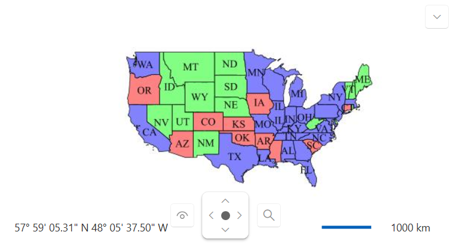

# Wms Tile Provider

The `RadMap` control allows you to display map tiles from a Web Map Service (WMS) server. WMS is a standard protocol for serving georeferenced map images over the internet. The `WmsTiledProvider` provider enables you to connect to a WMS server and display the map tiles it provides.

The WmsTiledProvider provides the following properties:

* `BaseUrl` - Gets or sets the URL of the WMS server.
* `Layers` - Gets or sets the __Layers__ tag of the downloaded map tiles.
* `Version` - Gets or sets the __VERSION__ tag of the downloaded map tiles.
* `ImageFormat` - Gets or sets the __FORMAT__ tag of the downloaded map tiles (e.g., "image/png").

The following example showcases how to use the `WmsTiledProvider` to display map tiles from a WMS server, via [GeoServer](https://geoserver.org/):

```XAML
    <telerik:RadMap>
    	<telerik:RadMap.Provider>
    		<telerik:WmsTiledProvider BaseUri="http://localhost:8080/geoserver/wms"
    								  Layers="topp:states"
    								  Version="1.1.0"
    								  ImageFormat="image/jpeg"/>
    	</telerik:RadMap.Provider>
    </telerik:RadMap>
```

__RadMap displaying map tiles from a WMS server__



## See Also

 * [Providers Overview]()
 * [BingRestMapProvider]() 
 * [OpenStreetMapProvider]()
 * [Empty provider]()
 * [UriImageProvider]()
 * [ArcGisMapProvider]()
 * [AzureMapProvider]()
 * [MapBoxProvider]()