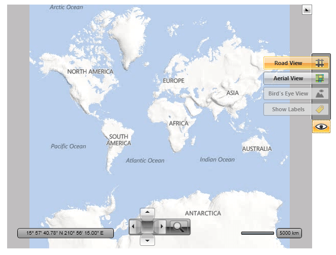

# View Modes

## 

The __RadMap__ allows you to bring the map in several view modes. After setting the desired view mode, the user is also capable of changing the view, depending on his/her needs. He/She can do it via the button with the eye-like icon, which represents the command bar.
        

The available view modes are:

* __Aerial__ - the map is represented by satellite photos.
          

* __Road__ - the map is represented by the standard road map images.
          

* __Birdseye__ - the map is represented by more detailed photos. This mode is not available for all of the regions and not every provider supports it.
          

In order to set the view mode you have to use the __Mode__ property of the __MapProviderBase__ class. As all of the built in providers derive from this base class, you can modify their view mode via that property.
        

>tipYou can see which view modes the map provider supports by iterating its __SupportedSources__ collection property.
          

>Note that the built in map providers have constructors which accept the view mode as an argument, so you can directly pass it.

In addition to the view modes you can control the visibility of the map labels, which are used to annotate the objects on the map - cities, countries, borders, etc. The visibility of the label is controlled via the __IsLabelVisible__ property. This value can also be passed to the constructor.
        

Here is an example:

#### __C#__

{{region radmap-features-view-modes_0}}
	BingMapProvider bingMap = new BingMapProvider( MapMode.Aerial, true, "key" );
	//or
	bingMap.Mode = MapMode.Aerial;
	bingMap.IsLabelVisible = true;
	{{endregion}}

#### __VB.NET__

{{region radmap-features-view-modes_1}}
	Dim bingMap As New BingMapProvider(MapMode.Aerial, True, "key")
	'or
	bingMap.Mode = MapMode.Aerial
	bingMap.IsLabelVisible = True
	{{endregion}}

Additionally as the UI control is represented by the __MapCommandBar__control, you are able use it outside the __RadMap__ and place it somewhere around it. In this case you have to either hide the original one by using the __CommandBarVisibility__ property of the __RadMap__ or the __UseDefaultLayout__ one.
        

>tip
          Setting the __UseDefaultLayout__ property to __False__ will hide all of the UI controls inside the __RadMap__. To learn more read [here]().
        

In order to use the __MapCommandBar__ outside of the __RadMap__ you have to 
          set its __MapControl__ property to the respective __RadMap__ instance. 
          Here is an example:
        

#### __XAML__

{{region radmap-features-view-modes_3}}
	<StackPanel x:Name="LayoutRoot"
	            Background="White"
	            Orientation="Horizontal">
	    <telerik:RadMap x:Name="radMap"
	                    Width="600"
	                    Height="480"
	                    CommandBarVisibility="Collapsed">
	    </telerik:RadMap>
	    <telerik:MapCommandBar MapControl="{Binding ElementName=radMap}"
	                            AllowedCommands="Road,Aerial,Birdseye"
	                            VerticalAlignment="Top" />
	</StackPanel>
	{{endregion}}

Here is a snapshot of the result.

# See Also

 * [Navigation]()

 * [Click Modes]()

 * [Zoom Modes]()

 * [Distance and Scale]()

 * [Mouse Location]()

 * [Default Layout]()
