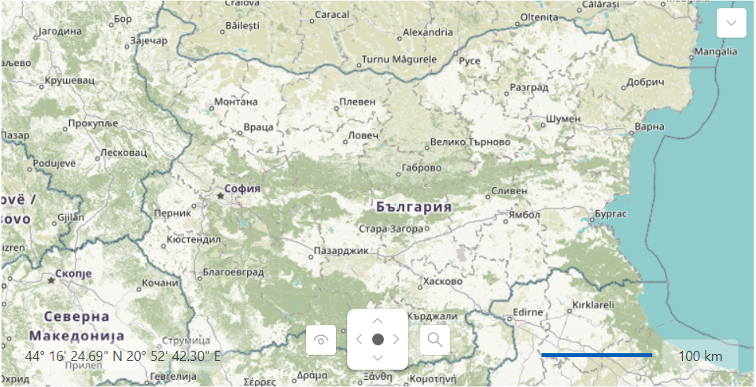
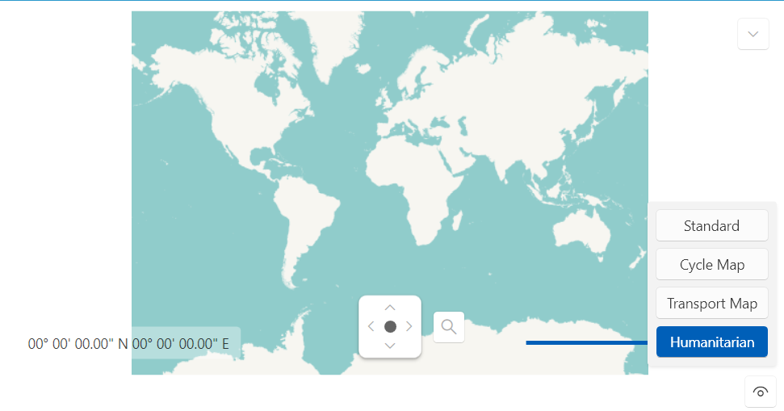

# View Modes

The `RadMap` allows you to bring the map in several view modes. After setting the desired view mode, the user is also capable of changing it. You can do it via the button with the eye-like icon, which represents the command bar. Each provider has predefined view modes (commands).

The following information will cover the view modes defined for the `OpenStreetMapProvider`:

* `Standard`&mdash;the map is represented by the Standard tile layer of Open Street Maps.
* `Cycle Map`&mdash;the map is represented by contour lines that are focused on showing bicycle routes.
* `Transport Map`&mdash;the map displays routes and public transport.
* `Humanitarian`&mdash;the map view focuses on the developing countries with an emphasis on features related to the humanitarian work.

Each provider exposes a different property for controlling the current view mode. To change it for the OpenStreetMapProvider, set the `Layer` property.

#### __[XAML] Setting the view mode for the OpenStreetMapProvider__
{{region radmap-features-view-modes-0}}
	<telerik:RadMap>
	    <telerik:RadMap.Provider>
	        <telerik:OpenStreetMapProvider APIKey="Your API Key" StandardModeUserAgent="Your User Agent" Layer="Humanitarian"/>
	    </telerik:RadMap.Provider>
	</telerik:RadMap>
{{endregion}}

__OpenStreetMapProvider with the Humanitarian view mode set as default__

>tip You can see the supported view modes of each map provider by iterating its `SupportedSources` collection property.

## MapCommandBar

The UI element that represents the eye-like button is of the type of `MapCommandBar`. You can use it outside of the bounds of the RadMap by hiding the default one via the map's `CommandBarVisibility` property or by setting the `UseDefaultLayout` property to __False__. To use the MapCommandBar element outside of the RadMap control, set its `MapControl` property to the respective RadMap instance.

>tip Setting the UseDefaultLayout property to __False__ will hide all of the UI controls inside the RadMap control. To learn more read [here]().

The following example showcases this approach:

#### __[XAML] Using the MapCommandBar outside of RadMap__
{{region radmap-features-view-modes-1}}
	<Grid>
	    <Grid.RowDefinitions>
	        <RowDefinition Height="*"/>
	        <RowDefinition Height="Auto"/>
	    </Grid.RowDefinitions>
	    <telerik:RadMap x:Name="radMap" CommandBarVisibility="Collapsed">
	        <telerik:RadMap.Provider>
	            <telerik:OpenStreetMapProvider APIKey="Your API Key" StandardModeUserAgent="Your User Agent" Layer="Humanitarian">
	            </telerik:OpenStreetMapProvider>
	        </telerik:RadMap.Provider>
	    </telerik:RadMap>
	    <telerik:MapCommandBar MapControl="{Binding ElementName=radMap}" HorizontalAlignment="Right" Grid.Row="1"/>
	</Grid>
{{endregion}}

__RadMap with MapCommandBar outside of its default layout__

>tip You can also customize the commands inside the MapCommandBar element. Check this [article]() to learn more about this functionality.

## See Also

 * [Navigation]()
 * [Click Modes]()
 * [Zoom Modes]()
 * [Distance and Scale]()
 * [Mouse Location]()
 * [Default Layout]()