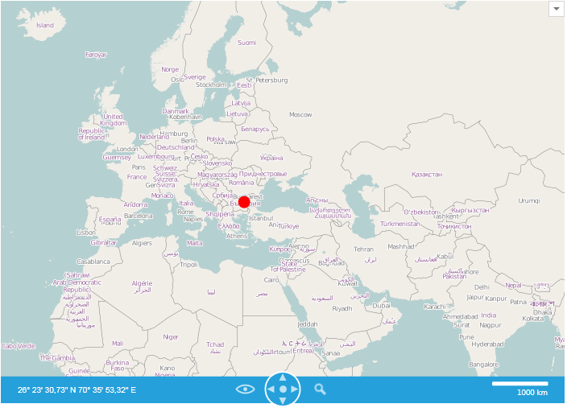
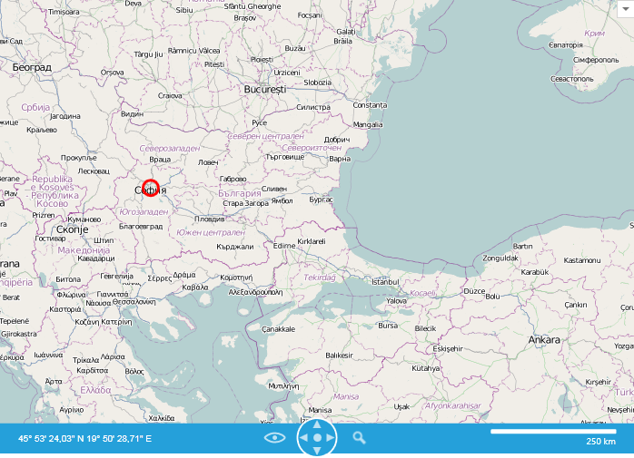

# Virtualization Layer

The Virtualization Layer can be used to visualize large data sources due to its superior performance, compared to the Information Layer or the Dynamic Layer.

Similarly to the Dynamic Layer, the Virtualization Layer raises an items request event when the zoom or center property is changed. The difference is that it processes that request within the background thread, that way freeing the UI thread.        

The Virtualization Layer exposes the following properties:        

* __RenderWhileMotion__ - boolean property indicating whether the layer should request and render items while the user is zooming or scrolling.            

* __ZoomLevelGridList__ - collection of ZoomLevelGrids that are used to specify the [map devision](#map-division).            

* __VirtualizationSource__ - used to specify the item source of the layer. Expects an object of type that implements __IMapVirtualizationSource__.            

## Map Division

Like the DynamicLayer, the Virtualization requires a division of the map space in regions. The division of map space is defined using the VirtualizationLayer.ZoomLevelGridList collection. Each ZoomLevelGrid should define a minimum zoom level for its division. The maximum zoom level for a grid is the minimum zoom layer of the next grid in the list. Also each zoom level is divided in a grid of latitude/longitude divisions.        

The ZoomLevelGrid provides the __CellWidth__ and __CellHeight__ properties which allow specifying the size of cell on the map in pixels. By default the cell has a size which equals the size of tile (256x256) which is usually used by the map providers like AzureMapProvider and OpenStreetMapProvider.        

Specifying the size of cell for the zoom level affects to a number of requests to a Virtualization Source which is depended on the viewport size of the map.        

>important If the requests are performed slowly (for example they use a service which has low performance) you can increase the cell size to lower the number of requests.          

Here is a sample Virtualization Layer declaration:        

#### __XAML__
```XAML
	<telerik:RadMap x:Name="radMap">
	    <telerik:VirtualizationLayer x:Name="virtualizationLayer">
	        <telerik:VirtualizationLayer.ZoomLevelGridList>
	            <telerik:ZoomLevelGrid MinZoom="3"/>
	            <telerik:ZoomLevelGrid MinZoom="6"/>
	        </telerik:VirtualizationLayer.ZoomLevelGridList>
	    </telerik:VirtualizationLayer>
	</telerik:RadMap>
```

## Virtualization Source

The data provided to the __VirtualizationLayer__ should be wrapped in a class that implements the __IMapVirtualizationSource__ interface. This interface contains a __BackgroundItemsRequest()__ method, which is used by the __VirtualizationLayer__ to request new data, whenever the zoom level or the region changes.        

>When there are no __ZoomLevelGrid__  that satisfy the current zoom level, no request would be made. Also when the changed value of the zoom level or the region stays in the range of a __ZoomLevelGrid__ or one of it cells, no request is made neither. In the current case, for example, when the zoom level is 1 or 2, no requests would be made, because there is no grid which represent this range. When the value is bigger than 6, requests would be made only when the grid cell changes, because the gird is defined for the range from 6 to the maximal zoom level.          

The __BackgroundItemsRequestEventArgs__ provides the following properties:        

* __Layer__ - reference to the layer that is requesting items.            

* __minZoom__ - represents the minimum zoom level of the currently active __ZoomGrid__.            

* __upperLeft__ - represents the upper left corner of the currently visible region.            

* __lowerRight__ - represents the lower right corner of the currently visible region.            

* __CompleteItemsRequest__ - represents an __Action__, which is responsible to pass the desired item back to the __VirtualizationLayer__.            

In the __BackgroundItemsRequest()__ method you have to implement your logic for getting the desired items. The items can be represented by static and dynamic data as well.        

Here is an example of how to implement simple static functionality in the __BackgroundItemsRequest()__ method:

#### __C#__
```C#
	public class MapVirtualizationSource : IMapVirtualizationSource
	{
	    static readonly Location bulgariaLocation = new Location(42.7669999748468, 25.2819999307394);
	    static readonly Location sofiaLocation = new Location(42.6957539183824, 23.3327663758679);
	
	    Ellipse BulgariaEllipse { get; set; }
	    Ellipse SofiaEllipse { get; set; }
	
	    public MapVirtualizationSource()
	    {
	        //Exectued ot UI thread
	        BulgariaEllipse = new Ellipse();
	        BulgariaEllipse.Width = 15;
	        BulgariaEllipse.Height = 15;
	        BulgariaEllipse.Fill = new SolidColorBrush(Colors.Red);
	        BulgariaEllipse.SetValue(MapLayer.LocationProperty, bulgariaLocation);
	        MapLayer.SetHotSpot(BulgariaEllipse, new HotSpot { X = 0.5, Y = 0.5 });
	        ToolTipService.SetToolTip(BulgariaEllipse, "Bulgaria");
	
	        SofiaEllipse = new Ellipse();
	        SofiaEllipse.Width = 20;
	        SofiaEllipse.Height = 20;
	        SofiaEllipse.Stroke = new SolidColorBrush(Colors.Red);
	        SofiaEllipse.Fill = new SolidColorBrush(Colors.Transparent);
	        SofiaEllipse.StrokeThickness = 3;
	        SofiaEllipse.SetValue(MapLayer.LocationProperty, sofiaLocation);
	        MapLayer.SetHotSpot(SofiaEllipse, new HotSpot { X = 0.5, Y = 0.5 });
	        ToolTipService.SetToolTip(SofiaEllipse, "Sofia");
	    }
	
	    public void BackgroundItemsRequest(object sender, BackgroundItemsRequestEventArgs e)
	    {
	        LocationRect currentRegion = new LocationRect(e.UpperLeft, e.LowerRight);
	
	        List<object> visibleItems = new List<object>();
	
	        if (currentRegion.Contains(bulgariaLocation))
	        {
	            if (e.MinZoom == 3)
	            {
	                visibleItems.Add(this.BulgariaEllipse);
	            }
	            else if (e.MinZoom == 6)
	            {
	                visibleItems.Add(this.SofiaEllipse);
	            }
	        }
	        e.CompleteItemsRequest(visibleItems);
	    }
	}
```

#### __VB.NET__
```VB.NET
	Public Class MapVirtualizationSource Implements IMapVirtualizationSource
		Shared ReadOnly bulgariaLocation As New Location(42.7669999748468, 25.2819999307394)
		Shared ReadOnly sofiaLocation As New Location(42.6957539183824, 23.3327663758679)
	
		Private Property BulgariaEllipse() As Ellipse
			Get
				Return m_BulgariaEllipse
			End Get
			Set
				m_BulgariaEllipse = Value
			End Set
		End Property
		Private m_BulgariaEllipse As Ellipse
		Private Property SofiaEllipse() As Ellipse
			Get
				Return m_SofiaEllipse
			End Get
			Set
				m_SofiaEllipse = Value
			End Set
		End Property
		Private m_SofiaEllipse As Ellipse
	
		Public Sub New()
			'Exectued ot UI thread'
			BulgariaEllipse = New Ellipse()
			BulgariaEllipse.Width = 15
			BulgariaEllipse.Height = 15
			BulgariaEllipse.Fill = New SolidColorBrush(Colors.Red)
			BulgariaEllipse.SetValue(MapLayer.LocationProperty, bulgariaLocation)
			MapLayer.SetHotSpot(BulgariaEllipse, New HotSpot() With { .X = 0.5,  .Y = 0.5 })
			ToolTipService.SetToolTip(BulgariaEllipse, "Bulgaria")
	
			SofiaEllipse = New Ellipse()
			SofiaEllipse.Width = 20
			SofiaEllipse.Height = 20
			SofiaEllipse.Stroke = New SolidColorBrush(Colors.Red)
			SofiaEllipse.Fill = New SolidColorBrush(Colors.Transparent)
			SofiaEllipse.StrokeThickness = 3
			SofiaEllipse.SetValue(MapLayer.LocationProperty, sofiaLocation)
			MapLayer.SetHotSpot(SofiaEllipse, New HotSpot() With { .X = 0.5, .Y = 0.5 })
			ToolTipService.SetToolTip(SofiaEllipse, "Sofia")
		End Sub
	
		Public Sub BackgroundItemsRequest(sender As Object, e As BackgroundItemsRequestEventArgs)
			Dim currentRegion As New LocationRect(e.UpperLeft, e.LowerRight)
	
			Dim visibleItems As New List(Of Object)()
	
			If currentRegion.Contains(bulgariaLocation) Then
				If e.MinZoom = 3 Then
					visibleItems.Add(Me.BulgariaEllipse)
				ElseIf e.MinZoom = 6 Then
					visibleItems.Add(Me.SofiaEllipse)
				End If
			End If
			e.CompleteItemsRequest(visibleItems)
		End Sub
	End Class	
```

You can set the virtualization source to a new instance of the *MapVirtualizationSource* and create a new definition for the __OpenStreetMap__ provider:        

#### __C#__
```C#
	public MainWindow()
	{
	    InitializeComponent();
	    this.radMap.Provider = new OpenStreetMapProvider();
	    this.virtualizationLayer.VirtualizationSource = new MapVirtualizationSource();
	}
```

#### __VB.NET__
```VB.NET
	Public Sub New()
		InitializeComponent()
		Me.radMap.Provider = New OpenStreetMapProvider()
		Me.virtualizationLayer.VirtualizationSource = New MapVirtualizationSource()
	End Sub
```

The result:

ZoomLevel = 3:



ZoomLevel = 6:

