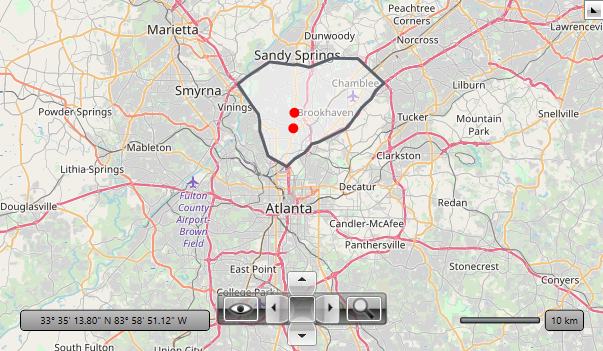

# Async SQL Geospatial Data Reader

RadMap __VisualizationLayer__ supports async reading from an SQL Geospatial data source. To do this use the __AsyncSqlGeospatialDataReader__ class. 

The AsyncSqlGeospatialDataReader allows you to provide an __IEnumerable__ of any object that contains geospatial data in __Wkt__ (Well known text) or __Wkb__ (Well known binary) format. Then you can map a property from the objects that hold the data and the reader will create MapShapeData objects (shapes) based on the fetched information.

## Setting up the Reader

AsyncSqlGeospatialDataReader is supported in the map's VisualizationLayer. You can assign it to the __Reader__ property of the layer.

The IEnumerable collection with the geospatial data is provided to the reader via its __Source__ property. And the mapping to the concrete property that holds the geospatial data is created via the __GeospatialPropertyName__ property of the reader. 

See the [Code Example](#code-example) section of this article for a code sample showing how to setup the data and the reader.

## Supported Geometries

The AsyncSqlGeospatialDataReader supports the following geometry types.

* __Point__

* __LineString__
  
* __Polygon__ 
  
* __Triangle__ 
  
* __MultiPoint__
  
* __MultiLineString__ 
  
* __MultiPolygon__ 
  
* __GeometryCollection__ 

> The geometry coordinates may be 2D (x, y), 3D (x, y, z), 4D (x, y, z, m) with an *m* value that is part of a linear referencing system or 2D with an *m* value (x, y, m). However, the AsyncSqlGeospatialDataReader uses the __x and y coordinates only__, and the z and m coordinates will be ignored.

## Code Example

This section shows how to assemble an example that demonstrates reading Wkt geospatial data.

__Example 1: Defining the Wkt model and the data storage__
```C#
	public class WktItemModel
    {
        public string Name { get; set; }
        public string Geometry { get; set; }
    }
	
	public static class WktDataStorage
    {
        public static ObservableCollection<WktItemModel> GetData()
        {
            ObservableCollection<WktItemModel> result = new ObservableCollection<WktItemModel>();

            WktItemModel northAreaDataRow = new WktItemModel();
            northAreaDataRow.Name = "North Area";
            northAreaDataRow.Geometry = "Polygon (("
                    + "-84.3932461670301, 33.7967217961125"
                    + ", -84.418995373573 33.808989109452"
                    + ", -84.4303250244518 33.8377961143588"
                    + ", -84.4303250244518 33.8480616114576"
                    + ", -84.4320416382213 33.8563301427474"
                    + ", -84.4413113525767 33.8668784860621"
                    + ", -84.4605374267954 33.8908212383562"
                    + ", -84.447147839393 33.8996555568394"
                    + ", -84.4169354370492 33.9161818236152"
                    + ", -84.384663098182 33.9127628588944"
                    + ", -84.3788266113656 33.9133326958734"
                    + ", -84.3633770874397 33.9101985453388"
                    + ", -84.3616604736702 33.9101985453388"
                    + ", -84.3300747803108 33.9204553366171"
                    + ", -84.2957425049201 33.9198855472676"
                    + ", -84.2596936157599 33.8919612018418"
                    + ", -84.2713665893927 33.8831260863279"
                    + ", -84.2768597534552 33.8745751033359"
                    + ", -84.2905926636114 33.8640277109635"
                    + ", -84.3039822510137 33.8480616114574"
                    + ", -84.3125653198613 33.8397922798236"
                    + ", -84.3489575317754 33.8249625088656"
                    + ", -84.3589138916386 33.8226807773054"
                    + ", -84.3688702515018 33.8124122318747"
                    + ", -84.3822598389041 33.8058511269131"
                    + ", -84.3932461670301 33.7967217961125"
                    + ", -84.3932461670301 33.7967217961125"
                    + "))";
            result.Add(northAreaDataRow);

            WktItemModel store1DataRow = new WktItemModel();
            store1DataRow.Name = "Mr. Dorrell";
            store1DataRow.Geometry = "Point (-84.3827345898996 33.858244576749)";
            result.Add(store1DataRow);

            WktItemModel store2DataRow = new WktItemModel();
            store2DataRow.Name = "Family Store";
            store2DataRow.Geometry = "Point (-84.3842473557835 33.840489590028)";
            result.Add(store2DataRow);

            return result;
        }
    } 
```
```VB.NET
	Public Class WktItemModel
		Public Property Name As String
		Public Property Geometry As String
	End Class

	Module WktDataStorage
		Function GetData() As ObservableCollection(Of WktItemModel)
			Dim result As ObservableCollection(Of WktItemModel) = New ObservableCollection(Of WktItemModel)()
			Dim northAreaDataRow As WktItemModel = New WktItemModel()
			northAreaDataRow.Name = "North Area"
			northAreaDataRow.Geometry = "Polygon ((" & "-84.3932461670301, 33.7967217961125" & ", -84.418995373573 33.808989109452" & ", -84.4303250244518 33.8377961143588" & ", -84.4303250244518 33.8480616114576" & ", -84.4320416382213 33.8563301427474" & ", -84.4413113525767 33.8668784860621" & ", -84.4605374267954 33.8908212383562" & ", -84.447147839393 33.8996555568394" & ", -84.4169354370492 33.9161818236152" & ", -84.384663098182 33.9127628588944" & ", -84.3788266113656 33.9133326958734" & ", -84.3633770874397 33.9101985453388" & ", -84.3616604736702 33.9101985453388" & ", -84.3300747803108 33.9204553366171" & ", -84.2957425049201 33.9198855472676" & ", -84.2596936157599 33.8919612018418" & ", -84.2713665893927 33.8831260863279" & ", -84.2768597534552 33.8745751033359" & ", -84.2905926636114 33.8640277109635" & ", -84.3039822510137 33.8480616114574" & ", -84.3125653198613 33.8397922798236" & ", -84.3489575317754 33.8249625088656" & ", -84.3589138916386 33.8226807773054" & ", -84.3688702515018 33.8124122318747" & ", -84.3822598389041 33.8058511269131" & ", -84.3932461670301 33.7967217961125" & ", -84.3932461670301 33.7967217961125" & "))"
			result.Add(northAreaDataRow)
			Dim store1DataRow As WktItemModel = New WktItemModel()
			store1DataRow.Name = "Mr. Dorrell"
			store1DataRow.Geometry = "Point (-84.3827345898996 33.858244576749)"
			result.Add(store1DataRow)
			Dim store2DataRow As WktItemModel = New WktItemModel()
			store2DataRow.Name = "Family Store"
			store2DataRow.Geometry = "Point (-84.3842473557835 33.840489590028)"
			result.Add(store2DataRow)
			Return result
		End Function
	End Module
```

__Example 2: Defining the map with the reader and setting it up__
```XAML
	<telerik:RadMap Center="33.7861647934865,-84.371616833534"
					ZoomLevel="10">
		<telerik:RadMap.Provider>
			<telerik:OpenStreetMapProvider />
		</telerik:RadMap.Provider>
		<telerik:VisualizationLayer>
			<telerik:VisualizationLayer.ItemTemplate>
				<DataTemplate>
					<Ellipse Width="10" Height="10" Fill="Red">
						<telerik:MapLayer.HotSpot>
							<telerik:HotSpot X="0.5" Y="0.5" />
						</telerik:MapLayer.HotSpot>
					</Ellipse>
				</DataTemplate>
			</telerik:VisualizationLayer.ItemTemplate>
			<telerik:VisualizationLayer.Reader>
				<telerik:AsyncSqlGeospatialDataReader x:Name="asyncSqlGeospatialDataReader"                                                           
													  GeospatialPropertyName="Geometry"
													  ToolTipFormat="Name" />
			</telerik:VisualizationLayer.Reader>
			<telerik:VisualizationLayer.ShapeFill>
				<telerik:MapShapeFill Fill="#7FFFFFFF" Stroke="#5A636B" StrokeThickness="3" />
			</telerik:VisualizationLayer.ShapeFill>
			<telerik:VisualizationLayer.HighlightFill>
				<telerik:MapShapeFill Fill="#B2FFFFFF" Stroke="#5A636B" StrokeThickness="3" />
			</telerik:VisualizationLayer.HighlightFill>
		</telerik:VisualizationLayer>
	</telerik:RadMap>
```

Notice the __ToolTipFormat__ setting in the AsyncSqlGeospatialDataReader. It points to the Name property of the WktItemModel class. This enables a tooltip that will show the value of the Name property when you mouse over the corresponding shape.

Additionally, the __ItemTemplate__ of the VisualizationLayer is set. This will affect only the Point geometries. Instead of the default pin we show a simple ellipse. The __MapLayer.HotSpot__ property allows you to define a HotSpot object that offsets the position of the UIElement by relative portion of its size. In this example X=0.5 means half of the width and Y=0.5 half of the height of the Ellipse. The Ellipse will be centered at the location of the Point geometry.

__Example 3: Setting the reader's source in code__
```C#
	public MyUserControl()
	{
		InitializeComponent();
		
		// Note that you can bind the Source property also in XAML
		this.asyncSqlGeospatialDataReader.Source = WktDataStorage.GetData();
	}
```
```VB.NET
	Public Sub New()
		InitializeComponent()
		
		' Note that you can bind the Source property also in XAML
		Me.asyncSqlGeospatialDataReader.Source = WktDataStorage.GetData()
	End Sub
```

#### Figure 1: RadMap populated with MapShapeData objects via the AsyncSqlGeospatialDataReader


> The example is based on the [AsyncSqlGeospatialDataReader](https://github.com/telerik/xaml-sdk/tree/master/Map/WPF/AsyncSqlGeospatialDataReader) SDK example.

## See Also  
* [VisualizationLayer Introduction]()
* [Reading Map Shapes]()
* [Map Shape Data]()


