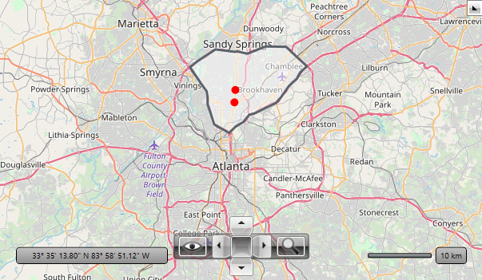

# Async SQL Geospatial Data Reader

RadMap __VisualizationLayer__ supports async reading from an SQL Geospatial data source. To do this use the __AsyncSqlGeospatialDataReader__ class. 

The AsyncSqlGeospatialDataReader allows you to provide an __IEnumerable__ of any object that contains geospatial data in __Wkt__ (Well known text) or __Wkb__ (Well known binary) format. Then you can map a property from the objects that hold the data and the reader will create MapShapeData objects (shapes) based on the fetched information.

## Setting up the Reader

AsyncSqlGeospatialDataReader is supported in the map's VisualizationLayer. You can assign it to the __Reader__ property of the layer.

The IEnumerable collection with the geospatial data is provided to the reader via its __Source__ property. And the mapping to the concrete property that holds the geospatial data is created via the __GeospatialPropertyName__ property of the reader. 

See the [Code Example](#code-example) section of this article for a code sample showing how to setup the data and the reader.

## Supported Geometries

The AsyncSqlGeospatialDataReader supports the following geometry types.

* __Point__

* __LineString__
  
* __Polygon__ 
  
* __Triangle__ 
  
* __MultiPoint__
  
* __MultiLineString__ 
  
* __MultiPolygon__ 
  
* __GeometryCollection__ 

> The geometry coordinates may be 2D (x, y), 3D (x, y, z), 4D (x, y, z, m) with an *m* value that is part of a linear referencing system or 2D with an *m* value (x, y, m). However, the AsyncSqlGeospatialDataReader uses the __x and y coordinates only__, and the z and m coordinates will be ignored.

## Code Example

This section shows how to assemble an example that demonstrates reading Wkt geospatial data.

__Example 1: Defining the Wkt model and the data storage__
<snippet id='radmap-features-visualization-layer-async-sql-geospatial-data-block_1-cs' />
<snippet id='radmap-features-visualization-layer-async-sql-geospatial-data-block_1-vb' />

__Example 2: Defining the map with the reader and setting it up__
<snippet id='radmap-features-visualization-layer-async-sql-geospatial-data-block_2-xaml' />

Notice the __ToolTipFormat__ setting in the AsyncSqlGeospatialDataReader. It points to the Name property of the WktItemModel class. This enables a tooltip that will show the value of the Name property when you mouse over the corresponding shape.

Additionally, the __ItemTemplate__ of the VisualizationLayer is set. This will affect only the Point geometries. Instead of the default pin we show a simple ellipse. The __MapLayer.HotSpot__ property allows you to define a HotSpot object that offsets the position of the UIElement by relative portion of its size. In this example X=0.5 means half of the width and Y=0.5 half of the height of the Ellipse. The Ellipse will be centered at the location of the Point geometry.

__Example 3: Setting the reader's source in code__
<snippet id='radmap-features-visualization-layer-async-sql-geospatial-data-block_3-cs' />
<snippet id='radmap-features-visualization-layer-async-sql-geospatial-data-block_3-vb' />

#### Figure 1: RadMap populated with MapShapeData objects via the AsyncSqlGeospatialDataReader

> The example is based on the [AsyncSqlGeospatialDataReader](https://github.com/telerik/xaml-sdk/tree/master/Map/WPF/AsyncSqlGeospatialDataReader) SDK example.

## See Also  
* [VisualizationLayer Introduction]()
* [Reading Map Shapes]()
* [Map Shape Data]()
