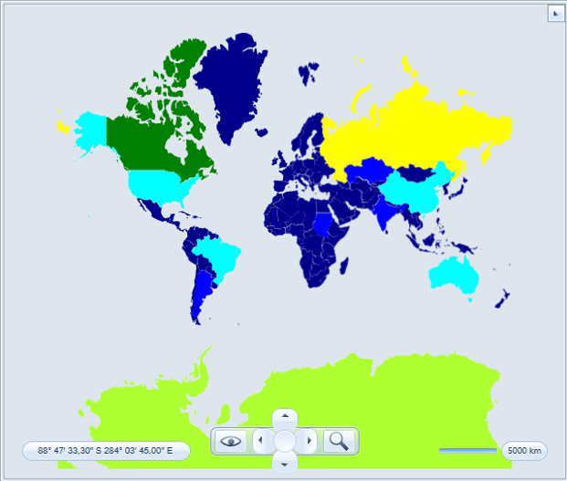
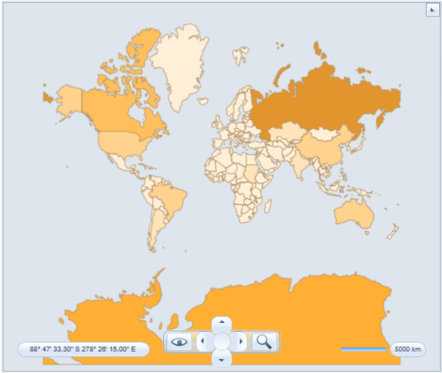

# Colorizer

The __Colorizer__ feature of the __VisualizationLayer__ allows you to colorize the __MapShapeData__ objects inside it on the basis of a condition. For example, you can create maps that display shapes for each country with fill color depending on the population of the country.        

In order to allow you to color the shapes depending on a condition, the __VisualizationLayer__ class exposes the __Colorizer__ property, which is of type __IMapShapeColorizer__.        

Currently __RadMap__ provides 2 colorizers out-of-the-box:        

* __ColorMeasureScale__ - sets filling to the map shapes using value of one of the extended properties.            

* __GraphColorizer__ - sets filling to the map shapes using the coloring of graph approach.            

## Using the ColorMeasureScale object      

To use the __ColorMeasureScale__ object in a layer, just set the __Colorizer__ property of the respective layer to a new instance of it. Here is an example.
        

```XAML
	<telerik:RadMap x:Name="radMap" ZoomLevel="1">
		<telerik:RadMap.Provider>
			<telerik:EmptyProvider />
		</telerik:RadMap.Provider>
		<telerik:VisualizationLayer Name="visualizationLayer">
			<telerik:VisualizationLayer.Colorizer>
				<telerik:ColorMeasureScale />
			</telerik:VisualizationLayer.Colorizer>
		</telerik:VisualizationLayer>
	</telerik:RadMap>
```

## Extended Data Property

The __ColorMeasureScale__ object colors the __MapShapeData__ objects inside a layer on the basis of a value. This value should be specified through the __ExtendedData__ for the __MapShapeData__ object.        

>tip The Extended Data represents a set of properties and their respective values. In order to specify the desired property from the Extended Data, you have to use the __ExtendedPropertyName__ property of the __ColorMeasureScale__ object.          

For purposes of this example we will use __world.shp__ ESRI shape file. The extended data for the shapes from this file contains “SQKM” property which represents area of the country in square kilometers. Here is an example, in which the __MapShapeData__ objects get colored depending on the value of the country area.
        

```XAML
	<telerik:RadMap x:Name="radMap" ZoomLevel="1">
		<telerik:RadMap.Provider>
			<telerik:EmptyProvider />
		</telerik:RadMap.Provider>
		<telerik:VisualizationLayer Name="visualizationLayer">
			<telerik:VisualizationLayer.Colorizer>
				<telerik:ColorMeasureScale ExtendedPropertyName="SQKM" />
			</telerik:VisualizationLayer.Colorizer>
			<telerik:VisualizationLayer.Reader>
				<telerik:AsyncShapeFileReader DataSource="/TestMapFeatures;component/Resources/GeoData/world.dbf" Source="/TestMapFeatures;component/Resources/GeoData/world.shp" />
			</telerik:VisualizationLayer.Reader>
		</telerik:VisualizationLayer>
	</telerik:RadMap>
```

>The property specified through the __ExtendedPropertyName__ should be of type __Double__.          

## Mode

The __ColorMeasureScale__ splits the values passed through its __ExtendedPropertyName__ property and associates a fill color and highlight color for each one. It can automatically create ranges in two ways. For that purpose you have to use the __Mode__ property of the __ColorMeasureScale__ object. It can have the following values:        

* __Count__ - specifies that the data will get split into N equally sized ranges. The N is equal to the value of the __TickMarkCount__ property of the __ColorMeasureScale__.            

* __Step__ - specifies that the data will get split in ranges with step between them equal to X. The X is equal to the value of the __TickMarkStep__ property of the __ColorMeasureScale__ object.            

* __Ranges__ - specifies that the filling of the ranges will be calculated automatically by the __ColorMeasureScale__ colorizer.            

* __RangesPredefinedColors__ - specifies that the __ColorMeasureScale__ colorizer will use filling settings which are set in the __MapRange__ definition.            

* __Auto__

>tip When using the __VisualizationLayer__ object together with one of the asynchronous shape readers (AsyncShapeFileReader, for example), the reader automatically force changing of the __ColorMeasureScale__ properties. In this case you have to only use the __Mode__ and one of the two additional properties. When you are using manually generated shapes, you have to create the ranges manually. To learn more read the [Ranges](#ranges) section.          

Here is an example of a __ColorMeasureScale__ with 7 ranges:
        

```XAML
	<telerik:RadMap x:Name="radMap" ZoomLevel="1">
		<telerik:RadMap.Provider>
			<telerik:EmptyProvider />
		</telerik:RadMap.Provider>
		<telerik:VisualizationLayer Name="visualizationLayer">
			<telerik:VisualizationLayer.Colorizer>
				<telerik:ColorMeasureScale ExtendedPropertyName="SQKM"
										   Mode="Count"
										   TickMarkCount="7" />
			</telerik:VisualizationLayer.Colorizer>
			<telerik:VisualizationLayer.Reader>
				<telerik:AsyncShapeFileReader DataSource="/TestMapFeatures;component/Resources/GeoData/world.dbf" Source="/TestMapFeatures;component/Resources/GeoData/world.shp" />
			</telerik:VisualizationLayer.Reader>
		</telerik:VisualizationLayer>
	</telerik:RadMap>
```

The following example shows how to use the ColorMeasureScale with Ranges mode:


```XAML
	<telerik:VisualizationLayer.Colorizer>
		<telerik:ColorMeasureScale ExtendedPropertyName="SQKM" Mode="Ranges">
			<telerik:ColorMeasureScale.RangeCollection>
				<telerik:MapRange MaxValue="2416216" MinValue="0" />
				<telerik:MapRange MaxValue="4832060" MinValue="2416216" />
				<telerik:MapRange MaxValue="7247904" MinValue="4832060" />
				<telerik:MapRange MaxValue="9663749" MinValue="7247904" />
				<telerik:MapRange MaxValue="12079593" MinValue="9663749" />
				<telerik:MapRange MaxValue="14495437" MinValue="12079593" />
				<telerik:MapRange MaxValue="16911282" MinValue="14495437" />
			</telerik:ColorMeasureScale.RangeCollection>
		</telerik:ColorMeasureScale>
	</telerik:VisualizationLayer.Colorizer>
```

And the following demonstrates the __ColorMeasureScale__ with __RangesPredefinedColors__ mode:
        

```XAML
	<telerik:VisualizationLayer.Colorizer>
		<telerik:ColorMeasureScale ExtendedPropertyName="SQKM" Mode="RangesPredefinedColors">
			<telerik:ColorMeasureScale.RangeCollection>
				<telerik:MapRange MaxValue="2416216" MinValue="0">
					<telerik:MapRange.ShapeFill>
						<telerik:MapShapeFill Fill="DarkBlue" />
					</telerik:MapRange.ShapeFill>
				</telerik:MapRange>
				<telerik:MapRange MaxValue="4832060" MinValue="2416216">
					<telerik:MapRange.ShapeFill>
						<telerik:MapShapeFill Fill="Blue" />
					</telerik:MapRange.ShapeFill>
				</telerik:MapRange>
				<telerik:MapRange MaxValue="7247904" MinValue="4832060">
					<telerik:MapRange.ShapeFill>
						<telerik:MapShapeFill Fill="SkyBlue" />
					</telerik:MapRange.ShapeFill>
				</telerik:MapRange>
				<telerik:MapRange MaxValue="9663749" MinValue="7247904">
					<telerik:MapRange.ShapeFill>
						<telerik:MapShapeFill Fill="Aqua" />
					</telerik:MapRange.ShapeFill>
				</telerik:MapRange>
				<telerik:MapRange MaxValue="12079593" MinValue="9663749">
					<telerik:MapRange.ShapeFill>
						<telerik:MapShapeFill Fill="Green" />
					</telerik:MapRange.ShapeFill>
				</telerik:MapRange>
				<telerik:MapRange MaxValue="14495437" MinValue="12079593">
					<telerik:MapRange.ShapeFill>
						<telerik:MapShapeFill Fill="GreenYellow" />
					</telerik:MapRange.ShapeFill>
				</telerik:MapRange>
				<telerik:MapRange MaxValue="16911282" MinValue="14495437">
					<telerik:MapRange.ShapeFill>
						<telerik:MapShapeFill Fill="Yellow" />
					</telerik:MapRange.ShapeFill>
				</telerik:MapRange>
			</telerik:ColorMeasureScale.RangeCollection>
		</telerik:ColorMeasureScale>
	</telerik:VisualizationLayer.Colorizer>
```

In the snapshots below you can see how the above example will be displayed




## Colors

The __ColorMeasureScale__ can apply a different color to each range it creates. You are able to specify the desired set of colors not only for the normal fill of the shapes, but for the highlighted one too. This is done by using the __ShapeFillCollection__ and __HighlightFillCollection__ properties. They are collections of __MapShapeFill__ objects.        

>If you are creating the ranges manually, you can pass the __MapShapeFill__ object directly to the __MapRange__ object. To learn more read the [Ranges](#ranges) section.

<!-- -->
>The first color will get applied to the lowest layer. 

In case you have more ranges than colors the specified colors will be used as gradient stops along the scale to create filling for all ranges. For example if you want to have the same highlight color for all of the ranges, you just define one entry in the __HighlightFillCollection__ property.
        

```XAML
    <telerik:RadMap x:Name="radMap" ZoomLevel="1">
        <telerik:RadMap.Provider>
            <telerik:EmptyProvider />
        </telerik:RadMap.Provider>
        <telerik:VisualizationLayer Name="visualizationLayer">
            <telerik:VisualizationLayer.Colorizer>
                <telerik:ColorMeasureScale ExtendedPropertyName="SQKM"
                                           Mode="Count"
                                           TickMarkCount="10">
                    <telerik:ColorMeasureScale.ShapeFillCollection>
                        <telerik:MapShapeFill Fill="#FFF0D9"
                                              Stroke="#B1946D"
                                              StrokeThickness="1" />
                        <telerik:MapShapeFill Fill="#FFE4BA"
                                              Stroke="#B1946D"
                                              StrokeThickness="1" />
                        <telerik:MapShapeFill Fill="#FFDBA3"
                                              Stroke="#B1946D"
                                              StrokeThickness="1" />
                        <telerik:MapShapeFill Fill="#FFD28D"
                                              Stroke="#B1946D"
                                              StrokeThickness="1" />
                        <telerik:MapShapeFill Fill="#FFBF5C"
                                              Stroke="#B1946D"
                                              StrokeThickness="1" />
                        <telerik:MapShapeFill Fill="#FFAF33"
                                              Stroke="#B1946D"
                                              StrokeThickness="1" />
                        <telerik:MapShapeFill Fill="#E2942D"
                                              Stroke="#B1946D"
                                              StrokeThickness="1" />
                    </telerik:ColorMeasureScale.ShapeFillCollection>
                    <telerik:ColorMeasureScale.HighlightFillCollection>
                        <telerik:MapShapeFill Fill="Orange"
                                              Stroke="#B1946D"
                                              StrokeThickness="1" />
                    </telerik:ColorMeasureScale.HighlightFillCollection>
                </telerik:ColorMeasureScale>
            </telerik:VisualizationLayer.Colorizer>
            <telerik:VisualizationLayer.Reader>
                <telerik:AsyncShapeFileReader DataSource="/TestMapFeatures;component/Resources/GeoData/world.dbf" Source="/TestMapFeatures;component/Resources/GeoData/world.shp" />
            </telerik:VisualizationLayer.Reader>
        </telerik:VisualizationLayer>
    </telerik:RadMap>
```

>With the approach shown above any 2 shapes (even if they are neighbors) may be colored equally. To avoid this you should use the [Graph Colorizer]().

## Ranges

The ranges for the __ColorMeasureScale__ can be defined in several different ways. The first one is by only using the __Mode__ and the __TickMarkCount__ or __TickMarkStep__ property. This approach is applicable when using the __VisualizationLayer__ object together with one of the asynchronous shape readers (AsyncShapeFileReader, for example). Here is an example:
        

```XAML
    <telerik:RadMap x:Name="radMap" ZoomLevel="1">
        <telerik:RadMap.Provider>
            <telerik:EmptyProvider />
        </telerik:RadMap.Provider>
        <telerik:VisualizationLayer Name="visualizationLayer">
            <telerik:VisualizationLayer.Colorizer>
                <telerik:ColorMeasureScale ExtendedPropertyName="SQKM"
                                           Mode="Count"
                                           TickMarkCount="7">
                    <telerik:ColorMeasureScale.ShapeFillCollection>
                        <telerik:MapShapeFill Fill="#FFF0D9"
                                              Stroke="#B1946D"
                                              StrokeThickness="1" />
                        <telerik:MapShapeFill Fill="#FFE4BA"
                                              Stroke="#B1946D"
                                              StrokeThickness="1" />
                        <telerik:MapShapeFill Fill="#FFDBA3"
                                              Stroke="#B1946D"
                                              StrokeThickness="1" />
                        <telerik:MapShapeFill Fill="#FFD28D"
                                              Stroke="#B1946D"
                                              StrokeThickness="1" />
                        <telerik:MapShapeFill Fill="#FFBF5C"
                                              Stroke="#B1946D"
                                              StrokeThickness="1" />
                        <telerik:MapShapeFill Fill="#FFAF33"
                                              Stroke="#B1946D"
                                              StrokeThickness="1" />
                        <telerik:MapShapeFill Fill="#E2942D"
                                              Stroke="#B1946D"
                                              StrokeThickness="1" />
                    </telerik:ColorMeasureScale.ShapeFillCollection>
                    <telerik:ColorMeasureScale.HighlightFillCollection>
                        <telerik:MapShapeFill Fill="Orange"
                                              Stroke="#B1946D"
                                              StrokeThickness="1" />
                    </telerik:ColorMeasureScale.HighlightFillCollection>
                </telerik:ColorMeasureScale>
            </telerik:VisualizationLayer.Colorizer>
            <telerik:VisualizationLayer.Reader>
                <telerik:AsyncShapeFileReader DataSource="/TestMapFeatures;component/Resources/GeoData/world.dbf" Source="/TestMapFeatures;component/Resources/GeoData/world.shp" />
            </telerik:VisualizationLayer.Reader>
        </telerik:VisualizationLayer>
    </telerik:RadMap>
```

Another approach is to manually define the __Min__ and __Max__ values of the __ColorMeasureScale__ object and to use the __Mode__ property together with the __TickMarkCount__ or __TickMarkStep__ property. This approach is useful, when having __VisualizationLayer__ that displays manually generated shapes.
        

```XAML
	
    <telerik:RadMap x:Name="radMap" ZoomLevel="1">
        <telerik:RadMap.Provider>
            <telerik:EmptyProvider />
        </telerik:RadMap.Provider>
        <telerik:VisualizationLayer Name="visualizationLayer">
            <telerik:VisualizationLayer.Colorizer>
                <telerik:ColorMeasureScale ExtendedPropertyName="SQKM"
                                           MaxValue="17000000"
                                           MinValue="0"
                                           Mode="Count"
                                           TickMarkCount="10">
                    <telerik:ColorMeasureScale.ShapeFillCollection>
                        <telerik:MapShapeFill Fill="#FFF0D9"
                                              Stroke="#B1946D"
                                              StrokeThickness="1" />
                        <telerik:MapShapeFill Fill="#FFE4BA"
                                              Stroke="#B1946D"
                                              StrokeThickness="1" />
                        <telerik:MapShapeFill Fill="#FFDBA3"
                                              Stroke="#B1946D"
                                              StrokeThickness="1" />
                        <telerik:MapShapeFill Fill="#FFD28D"
                                              Stroke="#B1946D"
                                              StrokeThickness="1" />
                        <telerik:MapShapeFill Fill="#FFBF5C"
                                              Stroke="#B1946D"
                                              StrokeThickness="1" />
                        <telerik:MapShapeFill Fill="#FFAF33"
                                              Stroke="#B1946D"
                                              StrokeThickness="1" />
                        <telerik:MapShapeFill Fill="#E2942D"
                                              Stroke="#B1946D"
                                              StrokeThickness="1" />
                    </telerik:ColorMeasureScale.ShapeFillCollection>
                    <telerik:ColorMeasureScale.HighlightFillCollection>
                        <telerik:MapShapeFill Fill="Orange"
                                              Stroke="#B1946D"
                                              StrokeThickness="1" />
                    </telerik:ColorMeasureScale.HighlightFillCollection>
                </telerik:ColorMeasureScale>
            </telerik:VisualizationLayer.Colorizer>
        </telerik:VisualizationLayer>
    </telerik:RadMap>
```

Additionally with the __Min__ and __Max__ values defined you can directly define the desired ranges at design-time via the __RangeCollection__ property of the __ColorMeasureScale__ object. In this case you can either use the __HighlightFillCollection__ and __ShapeFillCollection__ properties, or specify the desired colors via the __HighlightFill__ and __ShapeFill__ properties of the __MapRange__ object. Here is an example.


```XAML
    <telerik:VisualizationLayer.Colorizer>
        <telerik:ColorMeasureScale ExtendedPropertyName="SQKM" Mode="RangesPredefinedColors">
            <telerik:ColorMeasureScale.RangeCollection>
                <telerik:MapRange MaxValue="2416216" MinValue="0">
                    <telerik:MapRange.ShapeFill>
                        <telerik:MapShapeFill Fill="DarkBlue" />
                    </telerik:MapRange.ShapeFill>
                </telerik:MapRange>
                <telerik:MapRange MaxValue="4832060" MinValue="2416216">
                    <telerik:MapRange.ShapeFill>
                        <telerik:MapShapeFill Fill="Blue" />
                    </telerik:MapRange.ShapeFill>
                </telerik:MapRange>
                <telerik:MapRange MaxValue="7247904" MinValue="4832060">
                    <telerik:MapRange.ShapeFill>
                        <telerik:MapShapeFill Fill="SkyBlue" />
                    </telerik:MapRange.ShapeFill>
                </telerik:MapRange>
                <telerik:MapRange MaxValue="9663749" MinValue="7247904">
                    <telerik:MapRange.ShapeFill>
                        <telerik:MapShapeFill Fill="Aqua" />
                    </telerik:MapRange.ShapeFill>
                </telerik:MapRange>
                <telerik:MapRange MaxValue="12079593" MinValue="9663749">
                    <telerik:MapRange.ShapeFill>
                        <telerik:MapShapeFill Fill="Green" />
                    </telerik:MapRange.ShapeFill>
                </telerik:MapRange>
                <telerik:MapRange MaxValue="14495437" MinValue="12079593">
                    <telerik:MapRange.ShapeFill>
                        <telerik:MapShapeFill Fill="GreenYellow" />
                    </telerik:MapRange.ShapeFill>
                </telerik:MapRange>
                <telerik:MapRange MaxValue="16911282" MinValue="14495437">
                    <telerik:MapRange.ShapeFill>
                        <telerik:MapShapeFill Fill="Yellow" />
                    </telerik:MapRange.ShapeFill>
                </telerik:MapRange>
            </telerik:ColorMeasureScale.RangeCollection>
        </telerik:ColorMeasureScale>
    </telerik:VisualizationLayer.Colorizer>
```

## See Also
 * [Map Legend]()
 * [Shape Appearance]()
 * [Extended Data]()