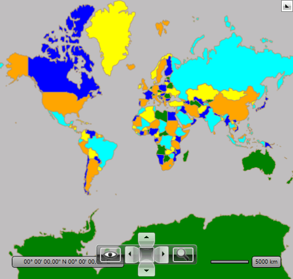

# Graph Colorizer

The __RadMap__ provides the __Graph Colorizer__ which set filling to the Map Shapes using the coloring of graph approach as its name implies. In short when any two shapes which have common border they will be colored differently.

## Graph Colorizer

The __Graph Colorizer__ has two major properties:        

* __ShapeFillCollection__ - it is of type MapShapeFillCollection and gets a collection of the MapShapeFill instances for the shape fillings.            

* __HighlightFillCollection__ - it is of type MapShapeFillCollection and gets a collection of the MapShapeFill instances for the shapes highlighting.            

The following example will demonstrate how you can color the RadMap using the Graph Colorizer


```XAML	
	<telerik:RadMap x:Name="radMap">
		<telerik:RadMap.Provider>
			<telerik:EmptyProvider />
		</telerik:RadMap.Provider>
		<telerik:VisualizationLayer x:Name="visualizationLayer">
			<telerik:VisualizationLayer.Reader>
				<telerik:AsyncShapeFileReader Source="/WorldMap;component/world.shp" DataSource="/WorldMap;component/world.dbf" />
			</telerik:VisualizationLayer.Reader>
			<telerik:VisualizationLayer.Colorizer>
				<telerik:GraphColoriser>
					<telerik:GraphColoriser.ShapeFillCollection>
						<telerik:MapShapeFill Fill="Green" Stroke="#B1946D" StrokeThickness="1" />
						<telerik:MapShapeFill Fill="Blue" Stroke="#B1946D" StrokeThickness="1" />
						<telerik:MapShapeFill Fill="Yellow" Stroke="#B1946D" StrokeThickness="1" />
						<telerik:MapShapeFill Fill="Orange" Stroke="#B1946D" StrokeThickness="1" />
						<telerik:MapShapeFill Fill="Aqua" Stroke="#B1946D" StrokeThickness="1" />
					</telerik:GraphColoriser.ShapeFillCollection>
					<telerik:GraphColoriser.HighlightFillCollection>
						<telerik:MapShapeFill Fill="Red" Stroke="#B1946D" StrokeThickness="1" />
					</telerik:GraphColoriser.HighlightFillCollection>
				</telerik:GraphColoriser>
			</telerik:VisualizationLayer.Colorizer>
		</telerik:VisualizationLayer>
	</telerik:RadMap>
```


```C#	
	GraphColoriser colorizer = new GraphColoriser();
	colorizer.ShapeFillCollection.Add(new MapShapeFill()
	{
	  Fill = new SolidColorBrush(Colors.Green),
	  Stroke = new SolidColorBrush(Color.FromArgb(0xFF, 0xB1, 0x94, 0x6D)),
	  StrokeThickness = 1
	});
	colorizer.ShapeFillCollection.Add(new MapShapeFill()
	{
	  Fill = new SolidColorBrush(Colors.Blue),
	  Stroke = new SolidColorBrush(Color.FromArgb(0xFF, 0xB1, 0x94, 0x6D)),
	  StrokeThickness = 1
	});
	colorizer.ShapeFillCollection.Add(new MapShapeFill()
	{
	  Fill = new SolidColorBrush(Colors.Yellow),
	  Stroke = new SolidColorBrush(Color.FromArgb(0xFF, 0xB1, 0x94, 0x6D)),
	  StrokeThickness = 1
	});
	colorizer.ShapeFillCollection.Add(new MapShapeFill()
	{
	  Fill = new SolidColorBrush(Colors.Orange),
	  Stroke = new SolidColorBrush(Color.FromArgb(0xFF, 0xB1, 0x94, 0x6D)),
	  StrokeThickness = 1
	});
	colorizer.ShapeFillCollection.Add(new MapShapeFill()
	{
	  Fill = new SolidColorBrush(Colors.Aqua),
	  Stroke = new SolidColorBrush(Color.FromArgb(0xFF, 0xB1, 0x94, 0x6D)),
	  StrokeThickness = 1
	});

	colorizer.HighlightFillCollection.Add(new MapShapeFill()
	{
	  Fill = new SolidColorBrush(Colors.Red),
	  Stroke = new SolidColorBrush(Color.FromArgb(0xFF, 0xB1, 0x94, 0x6D)),
	  StrokeThickness = 1
	});

	this.visualizationLayer.Colorizer = colorizer;
```

#### __VB__
```VB	
	Dim colorizer As New GraphColoriser()
	colorizer.ShapeFillCollection.Add(New MapShapeFill() With { 
	  Key .Fill = New SolidColorBrush(Colors.Green), 
	  Key .Stroke = New SolidColorBrush(Color.FromArgb(&Hff, &Hb1, &H94, &H6d)), 
	  Key .StrokeThickness = 1 
	})
	colorizer.ShapeFillCollection.Add(New MapShapeFill() With { 
	  Key .Fill = New SolidColorBrush(Colors.Blue), 
	  Key .Stroke = New SolidColorBrush(Color.FromArgb(&Hff, &Hb1, &H94, &H6d)), 
	  Key .StrokeThickness = 1 
	})
	colorizer.ShapeFillCollection.Add(New MapShapeFill() With { 
	  Key .Fill = New SolidColorBrush(Colors.Yellow), 
	  Key .Stroke = New SolidColorBrush(Color.FromArgb(&Hff, &Hb1, &H94, &H6d)), 
	  Key .StrokeThickness = 1 
	})
	colorizer.ShapeFillCollection.Add(New MapShapeFill() With { 
	  Key .Fill = New SolidColorBrush(Colors.Orange), 
	  Key .Stroke = New SolidColorBrush(Color.FromArgb(&Hff, &Hb1, &H94, &H6d)), 
	  Key .StrokeThickness = 1 
	})
	colorizer.ShapeFillCollection.Add(New MapShapeFill() With { 
	  Key .Fill = New SolidColorBrush(Colors.Aqua), 
	  Key .Stroke = New SolidColorBrush(Color.FromArgb(&Hff, &Hb1, &H94, &H6d)), 
	  Key .StrokeThickness = 1 
	})

	colorizer.HighlightFillCollection.Add(New MapShapeFill() With { 
	  Key .Fill = New SolidColorBrush(Colors.Red), 
	  Key .Stroke = New SolidColorBrush(Color.FromArgb(&Hff, &Hb1, &H94, &H6d)), 
	  Key .StrokeThickness = 1 
	})

	Me.visualizationLayer.Colorizer = colorizer
```

The result can be seen below:

