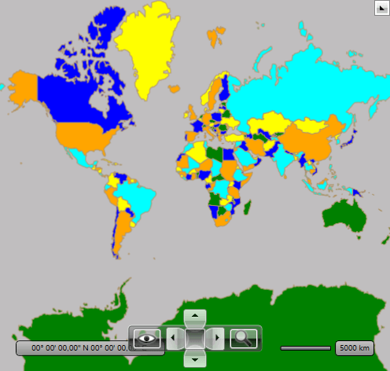

# Graph Colorizer

The __RadMap__ provides the __Graph Colorizer__ which set filling to the Map Shapes using the coloring of graph approach as its name implies. In short when any two shapes which have common border they will be colored differently.

## Graph Colorizer

The __Graph Colorizer__ has two major properties:        

* __ShapeFillCollection__ - it is of type MapShapeFillCollection and gets a collection of the MapShapeFill instances for the shape fillings.            

* __HighlightFillCollection__ - it is of type MapShapeFillCollection and gets a collection of the MapShapeFill instances for the shapes highlighting.            

The following example will demonstrate how you can color the RadMap using the Graph Colorizer

<snippet id='radmap-features-visualization-layer-graph-colorizer-block_1-xaml' />

<snippet id='radmap-features-visualization-layer-graph-colorizer-block_2-cs' />

#### __VB__
<snippet id='radmap-features-visualization-layer-graph-colorizer-block_3-vb' />

The result can be seen below:

