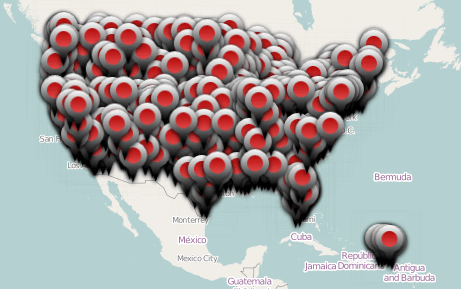
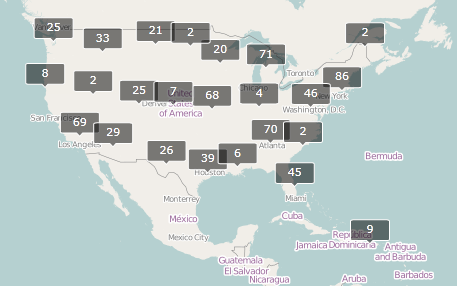
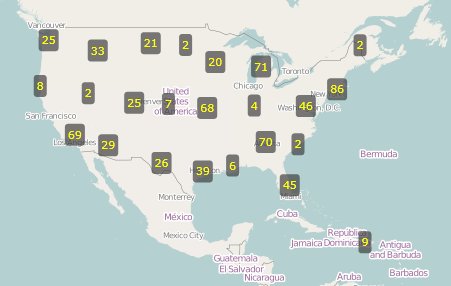
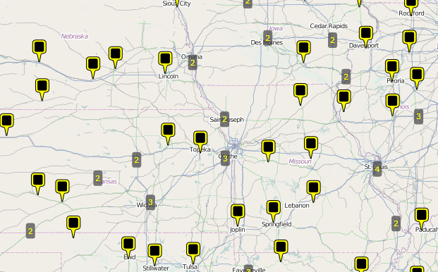
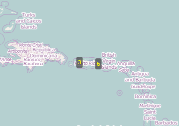
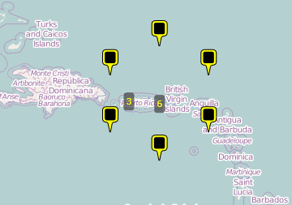
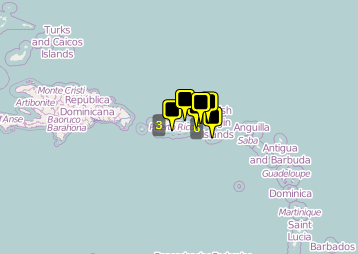

# Clustering

Many applications operate with collections of items which are placed close to others and it's uncomfortable to use them as separate objects for low zoom levels. The __VisualizationLayer__ supports the __Clustering__ feature. It allows grouping of items according to condition.      

* [Using of the clustering](#using-of-the-clustering)
* [Clustering Invalidated Event](#clustering-invalidated-event)
* [Items Grouping Example](#items-grouping-example)
* [DefaultClusterGenerator class](#defaultclustergenerator-class)
* [The ClusterData object](#the-clusterdata-object)

## Using of the clustering

The __VisualizationLayer__ exposes the following properties which are related to the __Clustering__ feature:        

* __ClusterGenerator__: Gets or sets an instance of the class which implements the __IClusterGenerator__ interface. It can be used when you want to define your own grouping algorithm. As default it uses the instance of the built-in __DefaultClusterGenerator__ class.            

* __ClusteringEnabled__: Gets or sets a __boolean__ value which indicates whether the clustering is enabled.            

* __ClusteringEnabledThreshold__: A property of type __int__ that gets or sets clustering enabled threshold. This value sets the max zoom level for clustering. If current zoom level of the control is greater than this value then clustering will be disabled.

>tipYou should set the __AutoCalculateClusteringThreshold__ to __False__ to allow the RadMap to respect the __ClusteringEnabledThreshold__. The default value of this property is __True__. This means that you need to explicitly set it to false in all cases when you need to predefine the clustering threshold.

* __ClusteringEnabledThresholdMinItems__: A property of type __int__ that gets or sets the minimum number of items in the cluster for auto calculated clustering threshold. The clustering threshold will be set if number of the items in every cluster is less than this value.            

* __ClusterItemTemplate__: Gets or sets the data template which represents the cluster item.            

* __ClusterTemplateSelector__: Gets or sets the custom logic for choosing a template used to display each cluster.            

* __DefaultClusterTemplate__: Gets or sets the default cluster data template. It’s used when the __ClusterTemplateSelector__ and __ClusterItemTemplate__ properties are not specified.            

* __GenerateClustersOnZoom__: A property of type __bool__ that gets or sets value which indicates whether clusters should be re-generated when the zoom level is changed. The default value of this property is __true__.            

In order to enable the __Clustering__ feature you can specify just the __ClusteringEnabled__ property to __true__. Also you can configure the __ItemTemplate__ and __ClusterItemTemplate__ properties for customizing the appearance of the item and of the cluster.          

More information about using of the __ItemTemplate__ property you can find in the [Data Binding]() article.        

## ClustersInvalidated Event

To get notified when the cluster elements are created, the __ClustersInvalidated__ event of the VisualizationLayer can be utilized.

__Example 1: Subscribe to ClustersInvalidated event__

```XAML
    <telerik:VisualizationLayer x:Name="VisualizationLayer1" ClustersInvalidated="VisualizationLayer_ClustersInvalidated"/>
```

__Example 2: ClustersInvalidated event handler__

```C#
    private void VisualizationLayer_ClustersInvalidated(object sender, System.EventArgs e)
	{
		// custom logic		
	}
```

## Items Grouping Example

The following example demonstrates how to use the __Clustering__ feature to display the airports of USA. The example displays the point type data which can be found in the “airports” shape-file of our [Virtualization and Grouping](https://demos.telerik.com/wpf/#Map/ClusterVirtualization)[Virtualization and Grouping](https://demos.telerik.com/silverlight/#Map/ClusterVirtualization) demo. The file contains 940 airports.        

If you try to load this file using the shape-file reader directly, like the sample XAML code below, then the performance of zooming and panning will be slow. Also the data items will be overlapped for low zoom levels (1-7).
        
__Example 3: Displaying Airports of USA__
```XAML
    <UserControl x:Class="ItemsGroupingExample.MainPage"
                 xmlns="http://schemas.microsoft.com/winfx/2006/xaml/presentation"
                 xmlns:x="http://schemas.microsoft.com/winfx/2006/xaml"
                 xmlns:d="http://schemas.microsoft.com/expression/blend/2008"
                 xmlns:mc="http://schemas.openxmlformats.org/markup-compatibility/2006"
                 xmlns:telerik="http://schemas.telerik.com/2008/xaml/presentation"
                 d:DesignHeight="300"
                 d:DesignWidth="400"
                 mc:Ignorable="d">
        <Grid x:Name="LayoutRoot">
            <telerik:RadMap x:Name="RadMap1"
                            Center="40, -100"
                            ZoomLevel="3">
                <telerik:RadMap.Provider>
                    <telerik:OpenStreetMapProvider />
                </telerik:RadMap.Provider>
                <telerik:VisualizationLayer x:Name="VisualizationLayer1">
                    <telerik:VisualizationLayer.Reader>
                        <telerik:AsyncShapeFileReader Source="/ItemsGroupingExample;component/Resources/airports.shp" ToolTipFormat="AIRPT_NAME" />
                    </telerik:VisualizationLayer.Reader>
                </telerik:VisualizationLayer>
            </telerik:RadMap>
        </Grid>
    </UserControl>
```

Here is a snapshot of the displayed items for zoom level 3:



Such performance is a reason to use the __Clustering__ feature to improve the performance of rendering. Also, it allows to avoid displaying the overlapped objects which are placed close to others.        

You can set the __ClusteringEnabled__ property to __true__ for enabling the feature.        

__Example 4: Enable clustering functionality__

```XAML
    <telerik:VisualizationLayer x:Name="VisualizationLayer1" ClusteringEnabled="True">
        <telerik:VisualizationLayer.Reader>
            <telerik:AsyncShapeFileReader Source="/ItemsGroupingExample;component/Resources/airports.shp" ToolTipFormat="AIRPT_NAME" />
        </telerik:VisualizationLayer.Reader>
    </telerik:VisualizationLayer>
```

Here is a snapshot of the displayed items for zoom level 3 when the grouping is used:



By default the cluster looks like above and it shows how many items it contains.

You can configure the __ItemTemplate__ and __ClusterItemTemplate__ properties to customize the appearance of the item and of the cluster.
        
__Example 5: Customizing the appearance of the cluster__
```XAML
    <UserControl x:Class="ItemsGroupingExample.MainPage"
                 xmlns="http://schemas.microsoft.com/winfx/2006/xaml/presentation"
                 xmlns:x="http://schemas.microsoft.com/winfx/2006/xaml"
                 xmlns:d="http://schemas.microsoft.com/expression/blend/2008"
                 xmlns:mc="http://schemas.openxmlformats.org/markup-compatibility/2006"
                 xmlns:telerik="http://schemas.telerik.com/2008/xaml/presentation"
                 d:DesignHeight="300"
                 d:DesignWidth="400"
                 mc:Ignorable="d">
        <UserControl.Resources>
            <DataTemplate x:Key="ItemTemplate">
                <Border>
                    <telerik:MapLayer.HotSpot>
                        <telerik:HotSpot ElementName="Pin"
                                         X="0.5"
                                         Y="1.0" />
                    </telerik:MapLayer.HotSpot>
                    <Canvas x:Name="Pin"
                            Width="20"
                            Height="32">
                        <Path Width="20.01"
                              Height="32.005"
                              Data="M1054.5088,458.105L1065.5188,458.105C1067.7278,458.105,1069.5188,459.896,1069.5188,462.105L1069.5188,473.084C1069.5188,475.293,1067.7278,477.084,1065.5188,477.084C1065.5188,477.084,1062.6868,476.831,1062.2128,479.103C1061.6608,481.751,1060.2208,489.11,1060.2208,489.11L1059.3548,489.11C1059.3548,489.11,1058.0138,482.546,1057.2888,479.106C1056.8538,477.041,1054.5088,477.084,1054.5088,477.084C1052.2998,477.084,1050.5088,475.293,1050.5088,473.084L1050.5088,462.105C1050.5088,459.896,1052.2998,458.105,1054.5088,458.105z"
                              Fill="Yellow"
                              Stretch="Fill"
                              Stroke="Black"
                              StrokeEndLineCap="Flat"
                              StrokeLineJoin="Miter"
                              StrokeMiterLimit="10"
                              StrokeStartLineCap="Flat"
                              StrokeThickness="1" />
                        <Path Canvas.Left="3.188"
                              Canvas.Top="2.989"
                              Width="13.42"
                              Height="14.219"
                              Data="M1066.6162,472.8125C1066.6212,473.9125,1065.7252,474.8125,1064.6252,474.8125L1055.2502,474.8125C1054.1502,474.8125,1053.2462,473.9125,1053.2412,472.8125L1053.1962,462.5935C1053.1912,461.4935,1054.0872,460.5935,1055.1872,460.5935L1064.5622,460.5935C1065.6622,460.5935,1066.5662,461.4935,1066.5712,462.5935z"
                              Fill="Black"
                              Stretch="Fill" />
                    </Canvas>
                </Border>
            </DataTemplate>

            <DataTemplate x:Key="ClusterTemplate">
                <Border Background="#af3f3f3f"
                        CornerRadius="3"
                        telerik:MapLayer.HotSpot="0.5,0.5">
                    <StackPanel x:Name="Text" Margin="3">
                        <TextBlock HorizontalAlignment="Center"
                                   Foreground="Yellow"
                                   Text="{Binding Path=Count}" />
                    </StackPanel>
                </Border>
            </DataTemplate>
        </UserControl.Resources>

        <Grid x:Name="LayoutRoot">
            <telerik:RadMap x:Name="RadMap1"
                            Center="40, -100"
                            ZoomLevel="3">
                <telerik:RadMap.Provider>
                    <telerik:OpenStreetMapProvider />
                </telerik:RadMap.Provider>
                <telerik:VisualizationLayer x:Name="VisualizationLayer1"
                                            ClusterItemTemplate="{StaticResource ClusterTemplate}"
                                            ClusteringEnabled="True"
                                            ItemTemplate="{StaticResource ItemTemplate}">
                    <telerik:VisualizationLayer.Reader>
                        <telerik:AsyncShapeFileReader Source="/ItemsGroupingExample;component/Resources/airports.shp" ToolTipFormat="AIRPT_NAME" />
                    </telerik:VisualizationLayer.Reader>
                </telerik:VisualizationLayer>
            </telerik:RadMap>
        </Grid>
    </UserControl>
```

There are the results of using custom templates for clusters and items:



## DefaultClusterGenerator class

The VisualizationLayer has an __IClusterGenerator__ instance member which is responsible for the clustering behavior. By default it uses an instance of the built-in __DefaultClusterGenerator class__. This class can be used to customize the default grouping algorithm. The __DefaultClusterGenerator class__ exposes the following properties:

* __AutoExpandWhenSingle:__ A property of type __Boolean__ that gets or sets the value which indicates whether cluster should be automatically expanded when it contains one data item only.
* __CloseDistance:__ A property of type __double[]__ that gets or sets an array of the doubles which every item define the max distance between the cluster center and the item for the corresponding ZoomLevel.
* __DeleteWhenEmpty:__ A property of type __Boolean__ that gets or sets the value which indicates whether cluster should be deleted if it is empty.
* __ExpandRadius:__ A property of type __double__ that gets or sets the radius (in pixels) which will be used to calculate coordinates of the items when a cluster is expanded to the polygon vertices. 
* __HideExpanded:__ A property of type __Boolean__ that gets or sets whether expanded cluster should be hidden or not.
* __Layer:__ A property of type __VisualizationLayer__ that gets or sets layer which the current map belongs to.

The __DefaultClusterGenerator__ class also provides several methods which can be overridden in order to further customize the clustering algorithm.

* __CreateCluster(Location center, object item):__ This method creates a cluster at the specified location. 
* __IsItemInClusterRegion(ClusterData cluster, MapObjectInfo info, int zoomLevel):__ This method checks if a data item belongs to a given cluster.
* __RegenerationNeeded(ClusterData cluster, int zoomLevel)__: This method can be overridden so you can customize if given cluster should be regenerated at a given zoom level. The default value is __true__.

## The ClusterData object

The __VisualizationLayer__ uses the __ClusterData__ object to visualize the cluster. The __ClusterData__ exposes the following properties which can be used in applications:        

* __AutoCalculateBounds__: Gets or sets value which indicates whether bounding box of the cluster should be calculated automatically.            

* __AutoExpandWhenSingle__: Gets or sets value which indicates whether cluster should be automatically expanded when it contains 1 data item only.            

* __Bounds__: Gets or sets bounding box of the cluster.            

* __Children__: Gets data items which belong to this cluster.            

* __ClusterState__: A property of type __ClusterState__ that gets or sets state of the cluster. It can be __Collapsed__, __Expanded__ and __ExpandedToPolygon__. The difference between expanded cluster and cluster expanded to polygon is as following: the expanded cluster uses original locations of the items to show them, the cluster which is expanded to polygon uses vertices of the regular polygon with center at the cluster’s center to show items.            

* __Count__: Gets number of the items in the cluster.            

* __Data__: Gets or sets additional cluster's data. This data can be used to pass extra information to the cluster's data template or by cluster generator when detecting belonging of the item to the particular cluster.            

* __DeleteWhenEmpty__: Gets or sets value which indicates whether cluster should be deleted if it is empty.            

* __ExpandRadius__: Gets or sets radius (in pixels) which will be used to calculate coordinates of the items when cluster is expanded to the polygon vertices.            

* __HideExpanded__: Gets or sets value which indicates whether the expanded cluster should be hidden.            

* __Hotspot__: Gets or sets hotspot of the cluster.            

* __Location__: Gets or sets center of the cluster.            

* __ZIndex__: Gets or sets the Z-Index of the cluster.            

Many of these properties are used by the cluster generator, only. It calculates them automatically during the process of generating clusters. Usually, applications use the __ClusterState__ property to expand the cluster’s items. The following example demonstrates how this can be achieved.        

## Expand Cluster Example

The __ClusterState__ property allows displaying the items of cluster without increasing of the zoom level. You can attach the mouse events in the cluster template like the XAML code below.
        
__Example 6: Subscribing to MouseLeftButtonDown and MouseRightButtonDown events__
```XAML
    <DataTemplate x:Key="ClusterTemplate">
        <Border Background="#af3f3f3f"
                CornerRadius="3"
                MouseLeftButtonDown="ExpandClusterToPolygon"
                MouseRightButtonDown="ExpandCluster"
                telerik:MapLayer.HotSpot="0.5,0.5">
            <StackPanel x:Name="Text" Margin="3">
                <TextBlock HorizontalAlignment="Center"
                           Foreground="Yellow"
                           Text="{Binding Path=Count}" />
            </StackPanel>
        </Border>
    </DataTemplate>
```

The following *MouseLeftButtonDown* event handler uses to expand the items of cluster to the polygon vertices:
        
__Example 8: MouseLeftButtonDown event handler__
```C#
	private void ExpandClusterToPolygon(object sender, MouseButtonEventArgs e)
	{
	    FrameworkElement element = sender as FrameworkElement;
	    if (element != null)
	    {
	        ClusterData data = element.DataContext as ClusterData;
	        if (data != null)
	        {
	            if (data.ClusterState != ClusterState.ExpandedToPolygon)
	            {
	                data.HideExpanded = false;
	                data.ClusterState = ClusterState.ExpandedToPolygon;
	            }
	            else
	            {
	                data.ClusterState = ClusterState.Collapsed;
	            }
	        }
	    }
	
	    e.Handled = true;
	}
```
```VB.NET
    Private Sub ExpandClusterToPolygon(sender As Object, e As MouseButtonEventArgs)
        Dim element As FrameworkElement = TryCast(sender, FrameworkElement)
        If element IsNot Nothing Then
            Dim data As ClusterData = TryCast(element.DataContext, ClusterData)
            If data IsNot Nothing Then
                If data.ClusterState <> ClusterState.ExpandedToPolygon Then
                    data.HideExpanded = False
                    data.ClusterState = ClusterState.ExpandedToPolygon
                Else
                    data.ClusterState = ClusterState.Collapsed
                End If
            End If
        End If

        e.Handled = True
    End Sub
```

The following *MouseRightButtonDown* event handler uses to expand the items of cluster to their original locations:
        
__Example 9: MouseRightButtonDown event handler__
```C#
	private void ExpandCluster(object sender, MouseButtonEventArgs e)
	{
	    FrameworkElement element = sender as FrameworkElement;
	    if (element != null)
	    {
	        ClusterData data = element.DataContext as ClusterData;
	        if (data != null)
	        {
	            if (data.ClusterState != ClusterState.Expanded)
	            {
	                data.HideExpanded = false;
	                data.ClusterState = ClusterState.Expanded;
	            }
	            else
	            {
	                data.ClusterState = ClusterState.Collapsed;
	            }
	        }
	    }
	
	    e.Handled = true;
	}
```
```VB.NET
    Private Sub ExpandCluster(sender As Object, e As MouseButtonEventArgs)
        Dim element As FrameworkElement = TryCast(sender, FrameworkElement)
        If element IsNot Nothing Then
            Dim data As ClusterData = TryCast(element.DataContext, ClusterData)
            If data IsNot Nothing Then
                If data.ClusterState <> ClusterState.Expanded Then
                    data.HideExpanded = False
                    data.ClusterState = ClusterState.Expanded
                Else
                    data.ClusterState = ClusterState.Collapsed
                End If
            End If
        End If

        e.Handled = True
    End Sub
```

In the snapshots below you can see how the above example will be displayed using different __ClusterState__ values. The __ClusterState__ of cluster which contains six items is __Collapsed__.


The __ClusterState__ value is __ExpandedToPolygon__.


The __ClusterState__ value is __Expanded__.


## See Also
 * [Reading Map Shapes]()
