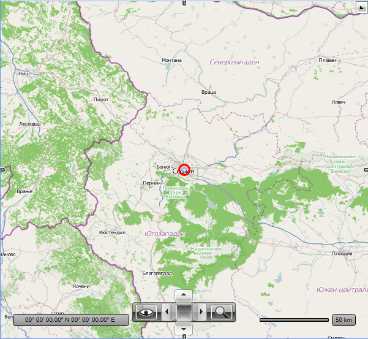

# Introduction

The __VisualizationLayer__ allows you to display additional data on top of the displayed map. This data can be in the form of simple framework elements, pin points or map shapes. The VisualizationLayer works like the [ItemsControl](http://msdn.microsoft.com/en-us/library/system.windows.controls.itemscontrol.aspx) class so you are able to display multiple items in a single VisualizationLayer. You can even data bind the VisualizationLayer to a collection of the geographically positioned data.
      

The VisualizationLayer provides several numerous and enhancements over the previously available layer:
      

* Improved overall performance of the visualization engine. More data points and map shapes can be used at the same time.
          

* Implemented asynchronous map shape readers for ESRI shape files, KML files and WKT/WKB formats (SQL Geospatial).
          

* The visualization layer is not geographically limited i.e. it covers the whole map surface. It speeds up initial items loading and adding of the items dynamically.Especially with collections with large number of items.
          

* Integrated support for the items clustering.
          

* Integrated support for the items virtualization. You need not to use Dynamic Layer or Virtualization Layer to load and display items when they are needed. The Visualization Layer supports this functionality “out of the box”.
          

* Items virtualization can be used in conjunction with items clustering without any additional efforts.
          

* New hierarchy of the map shape classes. The new map shapes aren’t visual elements but clean data elements. This allows map shapes to be created in a background thread.
          

* You can attach any event supported by ContentPresenter to the map shape object (supported in the code-behind only).
          

## Item Types

The VisualizationLayer allows you to display the following items:
        

* FrameworkElements - this means that you can display anything (charts, images, etc.) by wrapping it inside a framework element.
            

* Map shapes - this is a set of map shape data objects, created for usage with the RadMap. Among them you will find equivalents of the standard shape controls like Line, Rectangle, Ellipse, Polyline, Polygon and Path. Pay attention, the old map shapes (i.e. subclasses of the MapShape class) aren’t supported by VisualizationLayer. The new classes inherited from the MapShapeData object must be used.
            

* Pin points - the MapPinPoint object is usually used to display points from a KML file, but can be also used on its own.
            

## Adding and positioning a framework element

In order to add any framework element to the Visualization Layer you have to put it inside the VisualizationLayer's tag and set its geographical location. This is done by passing a Location object to the __MapLayer.Location__ attached property that contains the longitude and the latitude of the position to the element.  Here is an example:
        

#### __XAML__

{{region radmap_visualization_layer_introduction_0}}
	<telerik:RadMap x:Name="radMap">
		<telerik:RadMap.Provider>
			<telerik:OpenStreetMapProvider />
		</telerik:RadMap.Provider>
		<telerik:VisualizationLayer x:Name="visualizationLayer">
			<Ellipse x:Name="Ellipse"
	                 telerik:MapLayer.Location="42.6957539183824, 23.3327663758679"
	                 Width="20"
	                 Height="20"
	                 Stroke="Red"
	                 StrokeThickness="3"
	                 Fill="Transparent" />
		</telerik:VisualizationLayer>
	</telerik:RadMap>
	{{endregion}}

You can take advantage of the __UseLayoutRounding__ property when it is necessary to have fully readable framework elements (text for example). To take advantage of the layout rounding you should set the UseLayoutRounding property to true as it is false by default.
        

Additionally you can use these two attached properties provided by the MapLayer class:
        

* __BaseZoomLevel__ - represents the zoom level, for which the element should have its scale transformation equal to 1.
            

* __ZoomRange__ - represents the range of zoom levels for which the element should be visible.
            

* __MinScale__ – represents minimum scale factor which will be applied to the framework element when it has BaseZoomLevel property set and we zoom out map control.
            

* __MaxScale__ – represents maximum scale factor which will be applied to the framework element when it has BaseZoomLevel property set and we zoom in map control.
            

>If you are using a more complex composition of UI Elements, these properties should be set to the one that represents the root. For example, if you have a Grid, which layouts an Ellipse and a TextBlock, you have to set the attached properties to the Grid.
          

>Note that the location of the element on the map coincides with its top left corner, not with its center. To change the position of the element towards the location you can use its __HorizontalAlignment__ or __VerticalAlignment__ properties, or use the HotSpot feature. To learn how read [here]().
          

Here is an example for an Ellipse, positioned above Sofia, Bulgaria and visible only when the zoom level is grater or equal to 5 and less or equal to 12. The Ellipse will also have its normal size (100%) when the zoom level is 8. The maximum scale factor for the element is set to 8:
        

#### __XAML__

{{region radmap_visualization_layer_introduction_1}}
	<telerik:RadMap x:Name="radMap"
	                ZoomLevel="8"
	                Center="42.6957539183824, 23.3327663758679">
		<telerik:RadMap.Provider>
			<telerik:OpenStreetMapProvider />
		</telerik:RadMap.Provider>
		<telerik:VisualizationLayer x:Name="visualizationLayer">
			<Ellipse x:Name="Ellipse"
	                 telerik:MapLayer.Location="42.6957539183824, 23.3327663758679"
	                 telerik:MapLayer.BaseZoomLevel="8"
	                 telerik:MapLayer.ZoomRange="5,12"
	                 telerik:MapLayer.MaxScale="8"
	                 HorizontalAlignment="Center"
	                 VerticalAlignment="Center"
	                 Width="20"
	                 Height="20"
	                 Stroke="Red"
	                 StrokeThickness="3"
	                 Fill="Transparent" />
		</telerik:VisualizationLayer>
	</telerik:RadMap>
	{{endregion}}

Here is a snapshot of the result:

If you want to add more than one element, you just have to place it after the previous element. Here is an example:
        

#### __XAML__

{{region radmap_visualization_layer_introduction_2}}
	<telerik:RadMap x:Name="radMap"
	                ZoomLevel="8"
	                Center="42.6957539183824, 23.3327663758679">
		<telerik:RadMap.Provider>
			<telerik:OpenStreetMapProvider />
		</telerik:RadMap.Provider>
		<telerik:VisualizationLayer x:Name="visualizationLayer">
			<Ellipse x:Name="Ellipse"
	                 telerik:MapLayer.Location="42.6957539183824,23.3327663758679"
	                 telerik:MapLayer.BaseZoomLevel="8"
	                 telerik:MapLayer.ZoomRange="5,12"
	                 telerik:MapLayer.MaxScale="8"
	                 HorizontalAlignment="Center"
	                 VerticalAlignment="Center"
	                 Width="20"
	                 Height="20"
	                 Stroke="Red"
	                 StrokeThickness="3"
	                 Fill="Transparent" />
			<Ellipse x:Name="Ellipse2"
	                 telerik:MapLayer.Location="43.1957539183824,23.5427663758679"
	                 telerik:MapLayer.BaseZoomLevel="8"
	                 telerik:MapLayer.ZoomRange="5,12"
	                 telerik:MapLayer.MaxScale="8"
	                 HorizontalAlignment="Center"
	                 VerticalAlignment="Center"
	                 Width="20"
	                 Height="20"
	                 Stroke="Blue"
	                 StrokeThickness="3"
	                 Fill="Transparent" />
		</telerik:VisualizationLayer>
	</telerik:RadMap>
	{{endregion}}

## Binding Items
      

The VisualizationLayer simulates functionality of the ItemsControl, so it's able to display not only statically defined items, but also dynamic collections of data. To do this you have to simply use its ItemsSource and ItemTemplate properties. If you want to learn more and to see an example, please read the [Data Binding]() topic.
        

>By using the VisualizationLayer to display your collection of data, you have to provide the entire data to it. Assuming that your data comes from a service or/and contains a lot of entries, you might want to have a data virtualization. The VisualizationLayer control supports this scenario. It can request data upon region or zoom level change. To learn more and how to use it, please read the Items Virtualization article.

