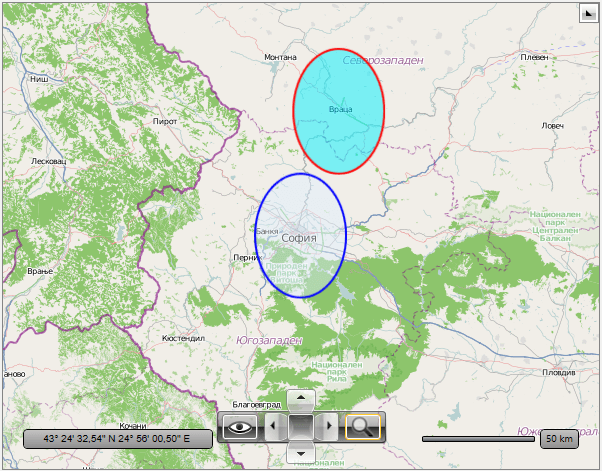
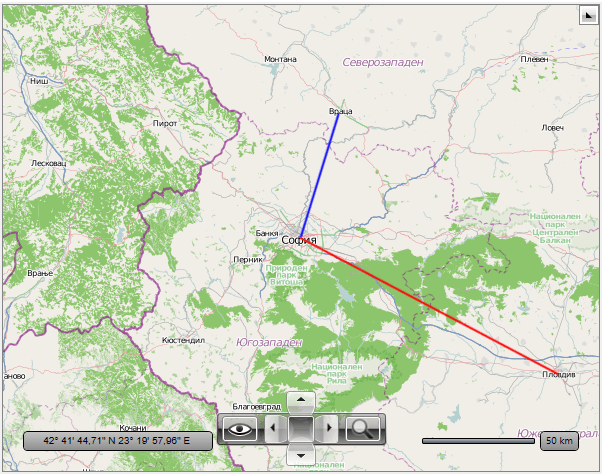
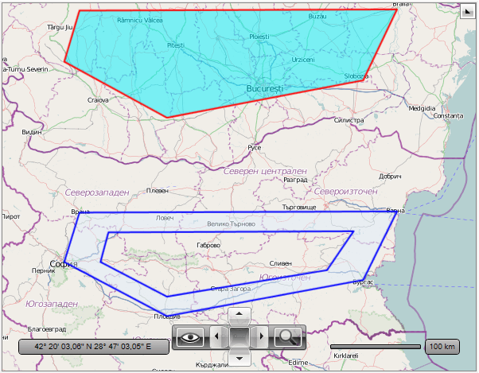
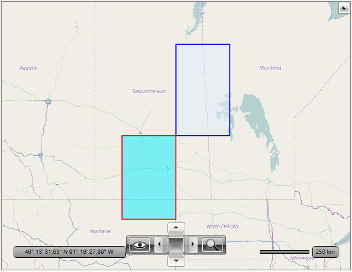
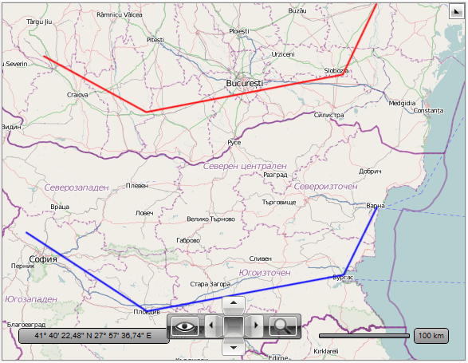
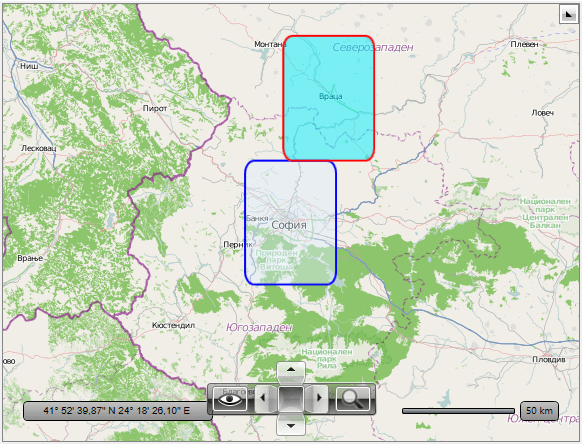

# Map Shape Data

The previous visualization engine based on the InformationLayer class
        provides you with a set of shape objects, which are specifically
        designed to work with the RadMap:  MapEllipse, MapLine, MapPolygon,
        MapPolyline, MapRectangle and MapPath. All these classes are combination
        of the geographical data and visualization objects. This approach has
        several problems. For example, it makes impossible to create map shapes
        in a background thread and has limited support for input events.
      

The visualization engine based on the VisualizationLayer class introduces a new
        approach that separates the geographical data and its visualization. The new map
        shape data classes are not dependency objects. This allows them to be created
        in the background thread. The unified map shape visualization engine allows
        attaching to any input event supported by the
        [ContentPresenter](http://msdn.microsoft.com/en-us/library/system.windows.controls.contentpresenter.aspx)
        class to the map shape visual presentation.
      

You will be able to find equivalents to most of the Shapes available in WPF/Silverlight.
      

>To learn more about the different ways of customizing the shape apperance, please check the
          [Shape Appearance]() topic.
        

The map shape data can be used identically to their visual element counterparts.
        This topic will focus briefly on showing you how to use the most
        important of them:
      

1. EllipseData
          

1. LineData
          

1. PathData
          

1. PolygonData
          

1. PolylineData
          

1. RectangleData
          

## EllipseData

>In contrast with MapEllipse which is used with InformationLayer the Width and Height of the
            EllipseData are given in the spatial reference units (degrees by default) instead of
            current distance unit (mile or kilometer).
          

To use the EllipseData in your visualization layer you have to set the
          following of its properties:
        

* Location - represents the location on the map on which the ellipse will be displayed.
            

* Width / Height - represent the width / height of the ellipse in spatial reference
              units (degrees by default).
            

>Note that the top left corner coincides with the given location.
          

Here it is an example:
        

#### __XAML__

{{region radmap_visualization_layer_map_shape_data_0}}
	<telerik:RadMap x:Name="radMap"
	                ZoomLevel="8"
	                Center="42.6957539183824, 23.3327663758679">
		<telerik:RadMap.Provider>
			<telerik:OpenStreetMapProvider />
		</telerik:RadMap.Provider>
		<telerik:VisualizationLayer x:Name="visualizationLayer">
			<telerik:EllipseData Location="42.9457539183824,23.0827663758679"
	                             Height="0.5"
	                             Width="0.5">
				<telerik:EllipseData.ShapeFill>
					<telerik:MapShapeFill Fill="#6FDFEFFF"
	                                      Stroke="Blue"
	                                      StrokeThickness="2" />
				</telerik:EllipseData.ShapeFill>
			</telerik:EllipseData>
		</telerik:VisualizationLayer>
	</telerik:RadMap>
	{{endregion}}

#### __C#__

{{region radmap_visualization_layer_map_shape_data_0}}
	EllipseData ellipse = new EllipseData()
	{
		Location = new Location(43.4457539183824, 23.2927663758679),
		Height = 0.5,
		Width = 0.5, 
		ShapeFill = new MapShapeFill()
		{
			Fill = new SolidColorBrush(Color.FromArgb(127, 0, 240, 255)),
			Stroke = new SolidColorBrush(Colors.Red),
			StrokeThickness = 2
		}
	};
	
	this.visualizationLayer.Items.Add(ellipse);
	{{endregion}}

#### __VB.NET__

{{region radmap_visualization_layer_map_shape_data_0}}
	Dim ellipse As New EllipseData() With { _
		.Location = New Location(43.4457539183824, 23.2927663758679), _
		.Height = 0.5, _
		.Width = 0.5, _
		.ShapeFill = New MapShapeFill() With { _
			.Fill = New SolidColorBrush(Color.FromArgb(127, 0, 240, 255)), _
			.Stroke = New SolidColorBrush(Colors.Red), _
			.StrokeThickness = 2 _
		} _
	}
	
	Me.visualizationLayer.Items.Add(ellipse)
	{{endregion}}

## LineData

The most important properties of the LineData class are the __Point1__
          and __Point2__ properties, which are of type Location.
          They define the start and the end points of the line.
          Here is an example:
        

#### __XAML__

{{region radmap_visualization_layer_map_shape_data_1}}
	<telerik:RadMap x:Name="radMap"
	                ZoomLevel="8"
	                Center="42.6957539183824, 23.3327663758679">
		<telerik:RadMap.Provider>
			<telerik:OpenStreetMapProvider />
		</telerik:RadMap.Provider>
		<telerik:VisualizationLayer x:Name="visualizationLayer">
			<telerik:LineData Point1="42.6957539183824,23.3327663758679"
	                          Point2="43.1957539183824,23.5427663758679">
				<telerik:LineData.ShapeFill>
					<telerik:MapShapeFill Stroke="Blue"
	                                      StrokeThickness="2" />
				</telerik:LineData.ShapeFill>
			</telerik:LineData>
		</telerik:VisualizationLayer>
	</telerik:RadMap>
	{{endregion}}

#### __C#__

{{region radmap_visualization_layer_map_shape_data_1}}
	LineData line = new LineData()
	{
		Point1 = new Location(42.6957539183824, 23.3327663758679),
		Point2 = new Location(42.1429369264591, 24.7498095849434),
		ShapeFill = new MapShapeFill()
		{
			Stroke = new SolidColorBrush(Colors.Red),
			StrokeThickness = 2
		}
	};
	
	this.visualizationLayer.Items.Add(line);
	{{endregion}}

#### __VB.NET__

{{region radmap_visualization_layer_map_shape_data_1}}
	Dim line As New LineData() With { _
		.Point1 = New Location(42.6957539183824, 23.3327663758679), _
		.Point2 = New Location(42.1429369264591, 24.7498095849434), _
		.ShapeFill = New MapShapeFill() With { _
			.Stroke = New SolidColorBrush(Colors.Red), _
			.StrokeThickness = 2 _
		} _
	}
	
	Me.visualizationLayer.Items.Add(line)
	{{endregion}}

## PathData

The PathData provides equivalents of the standard Geometry and Segment classes in WPF/Silverlight.
          Here is an example that uses LineSegmentData:
        

#### __XAML__

{{region radmap_visualization_layer_map_shape_data_2}}
	<telerik:RadMap x:Name="radMap"
	                ZoomLevel="7"
	                Center="42.6957539183824, 24.8327663758679">
		<telerik:RadMap.Provider>
			<telerik:OpenStreetMapProvider />
		</telerik:RadMap.Provider>
		<telerik:VisualizationLayer x:Name="visualizationLayer">
			<telerik:PathData>
				<telerik:PathData.Data>
					<telerik:PathGeometryData>
						<telerik:PathGeometryData.Figures>
							<telerik:PathFigureData IsClosed="True"
	                                                StartPoint="42.6957539183824, 23.3327663758679">
								<telerik:PathFigureData.Segments>
									<telerik:LineSegmentData Point="42.1429369264591, 24.7498095849434" />
									<telerik:LineSegmentData Point="42.5131732087098, 27.4611884843576" />
									<telerik:LineSegmentData Point="43.2073941930888, 27.9275176988258" />
									<telerik:LineSegmentData Point="43.1957539183824,23.5427663758679" />
								</telerik:PathFigureData.Segments>
							</telerik:PathFigureData>
							<telerik:PathFigureData IsClosed="True"
	                                                StartPoint="42.6957539183824, 23.8327663758679">
								<telerik:PathFigureData.Segments>
									<telerik:LineSegmentData Point="42.3429369264591, 24.7498095849434" />
									<telerik:LineSegmentData Point="42.6131732087098, 26.9611884843576" />
									<telerik:LineSegmentData Point="43.0073941930888, 27.3275176988258" />
									<telerik:LineSegmentData Point="42.9957539183824, 23.9427663758679" />
								</telerik:PathFigureData.Segments>
							</telerik:PathFigureData>
						</telerik:PathGeometryData.Figures>
					</telerik:PathGeometryData>
				</telerik:PathData.Data>
				<telerik:PathData.ShapeFill>
					<telerik:MapShapeFill Fill="#6FDFEFFF"
	                                      Stroke="Blue"
	                                      StrokeThickness="2" />
				</telerik:PathData.ShapeFill>
			</telerik:PathData>
		</telerik:VisualizationLayer>
	</telerik:RadMap>
	{{endregion}}

#### __C#__

{{region radmap_visualization_layer_map_shape_data_2}}
	PathData path = new PathData()
	{
		ShapeFill = new MapShapeFill()
		{
			Fill = new SolidColorBrush(Color.FromArgb(127, 0, 240, 255)),
			Stroke = new SolidColorBrush(Colors.Red),
			StrokeThickness = 2
		}
	};
	
	PathGeometryData geometry = new PathGeometryData();
	
	PathFigureData figure = new PathFigureData()
	{
		IsClosed = true,
		StartPoint = new Location(44.6957539183824, 23.3327663758679)
	};
	
	LineSegmentData segment = new LineSegmentData()
	{
		Point = new Location(44.1429369264591, 24.7498095849434)
	};
	figure.Segments.Add(segment);
	
	segment = new LineSegmentData()
	{
		Point = new Location(44.5131732087098, 27.4611884843576)
	};
	figure.Segments.Add(segment);
	
	segment = new LineSegmentData()
	{
		Point = new Location(45.2073941930888, 27.9275176988258)
	};
	figure.Segments.Add(segment);
	
	segment = new LineSegmentData()
	{
		Point = new Location(45.1957539183824,23.5427663758679)
	};
	figure.Segments.Add(segment);
	
	geometry.Figures.Add(figure);
	path.Data = geometry;
	
	this.visualizationLayer.Items.Add(path);
	{{endregion}}

#### __VB.NET__

{{region radmap_visualization_layer_map_shape_data_2}}
	Dim path As New PathData() With { _
		.ShapeFill = New MapShapeFill() With { _
			.Fill = New SolidColorBrush(Color.FromArgb(127, 0, 240, 255)), _
			.Stroke = New SolidColorBrush(Colors.Red), _
			.StrokeThickness = 2 _
		} _
	}
	
	Dim geometry As New PathGeometryData()
	
	Dim figure As New PathFigureData() With { _
		.IsClosed = True, _
		.StartPoint = New Location(44.6957539183824, 23.3327663758679) _
	}
	
	Dim segment As New LineSegmentData() With { _
		.Point = New Location(44.1429369264591, 24.7498095849434) _
	}
	figure.Segments.Add(segment)
	
	segment = New LineSegmentData() With { _
		.Point = New Location(44.5131732087098, 27.4611884843576) _
	}
	figure.Segments.Add(segment)
	
	segment = New LineSegmentData() With { _
		.Point = New Location(45.2073941930888, 27.9275176988258) _
	}
	figure.Segments.Add(segment)
	
	segment = New LineSegmentData() With { _
		.Point = New Location(45.1957539183824, 23.5427663758679) _
	}
	figure.Segments.Add(segment)
	
	geometry.Figures.Add(figure)
	path.Data = geometry
	
	Me.visualizationLayer.Items.Add(path)
	{{endregion}}

## PolygonData

The difference between the standard Polygon and the PolygonData is that the
          Points property of the PolygonData is a set of Locations. Here is an example:
        

#### __XAML__

{{region radmap_visualization_layer_map_shape_data_3}}
	<telerik:RadMap x:Name="radMap"
	                ZoomLevel="5"
	                Center="52,-104">
		<telerik:RadMap.Provider>
			<telerik:OpenStreetMapProvider />
		</telerik:RadMap.Provider>
		<telerik:VisualizationLayer x:Name="visualizationLayer">
			<telerik:PolygonData Points="56,-100 56,-104 52,-104 52,-100">
				<telerik:PolygonData.ShapeFill>
					<telerik:MapShapeFill Fill="#6FDFEFFF"
	                                      Stroke="Blue"
	                                      StrokeThickness="2" />
				</telerik:PolygonData.ShapeFill>
			</telerik:PolygonData>
		</telerik:VisualizationLayer>
	</telerik:RadMap>
	{{endregion}}

#### __C#__

{{region radmap_visualization_layer_map_shape_data_3}}
	PolygonData polygon = new PolygonData()
	{
		ShapeFill = new MapShapeFill()
		{
			Fill = new SolidColorBrush(Color.FromArgb(127, 0, 240, 255)),
			Stroke = new SolidColorBrush(Colors.Red),
			StrokeThickness = 2
		}
	};
	
	LocationCollection points = new LocationCollection();
	points.Add(new Location(48,-104));
	points.Add(new Location(48,-108));
	points.Add(new Location(52,-108));
	points.Add(new Location(52, -104));
	
	polygon.Points = points;
	
	this.visualizationLayer.Items.Add(polygon);
	{{endregion}}

#### __VB.NET__

{{region radmap_visualization_layer_map_shape_data_3}}
	Dim polygon As New PolygonData() With { _
		.ShapeFill = New MapShapeFill() With { _
			.Fill = New SolidColorBrush(Color.FromArgb(127, 0, 240, 255)), _
			.Stroke = New SolidColorBrush(Colors.Red), _
			.StrokeThickness = 2 _
		} _
	}
	
	Dim points As New LocationCollection()
	points.Add(New Location(48, -104))
	points.Add(New Location(48, -108))
	points.Add(New Location(52, -108))
	points.Add(New Location(52, -104))
	
	polygon.Points = points
	
	Me.visualizationLayer.Items.Add(polygon)
	{{endregion}}

## PolylineData

The difference between the standard Polyline and the PolylineData is that the Points
          property of the PolylineData is a set of Locations. Here is an example:
        

#### __XAML__

{{region radmap_visualization_layer_map_shape_data_4}}
	<telerik:RadMap x:Name="radMap"
	                ZoomLevel="7"
	                Center="42.6957539183824, 25.3327663758679">
		<telerik:RadMap.Provider>
			<telerik:OpenStreetMapProvider />
		</telerik:RadMap.Provider>
		<telerik:VisualizationLayer x:Name="visualizationLayer">
			<telerik:PolylineData Points="42.945,23.082 42.142, 24.749 42.513, 27.461 43.207, 27.927">
				<telerik:PolylineData.ShapeFill>
					<telerik:MapShapeFill Stroke="Blue"
	                                      StrokeThickness="2" />
				</telerik:PolylineData.ShapeFill>
			</telerik:PolylineData>
		</telerik:VisualizationLayer>
	</telerik:RadMap>
	{{endregion}}

#### __C#__

{{region radmap_visualization_layer_map_shape_data_4}}
	PolylineData polyline = new PolylineData()
	{
		ShapeFill = new MapShapeFill()
		{
			Stroke = new SolidColorBrush(Colors.Red),
			StrokeThickness = 2
		}
	};
	
	LocationCollection points = new LocationCollection();
	points.Add(new Location(44.6957539183824, 23.3327663758679));
	points.Add(new Location(44.1429369264591, 24.7498095849434));
	points.Add(new Location(44.5131732087098, 27.4611884843576));
	points.Add(new Location(45.2073941930888, 27.9275176988258));
	
	polyline.Points = points;
	
	this.visualizationLayer.Items.Add(polyline);
	{{endregion}}

#### __VB.NET__

{{region radmap_visualization_layer_map_shape_data_4}}
	Dim polyline As New PolylineData() With { _
		.ShapeFill = New MapShapeFill() With { _
			.Stroke = New SolidColorBrush(Colors.Red), _
			.StrokeThickness = 2 _
		} _
	}
	
	Dim points As New LocationCollection()
	points.Add(New Location(44.6957539183824, 23.3327663758679))
	points.Add(New Location(44.1429369264591, 24.7498095849434))
	points.Add(New Location(44.5131732087098, 27.4611884843576))
	points.Add(New Location(45.2073941930888, 27.9275176988258))
	
	polyline.Points = points
	
	Me.visualizationLayer.Items.Add(polyline)
	{{endregion}}

## RectangleData

To use the RectangleData in your visualization layer you have to set the
          following properties:
        

* Location - represents the location on the map, to which the ellipse is bound.
            

* Width / Height - represent the width / height of the ellipse. Just like the
              Width and Height properties of the EllipseData class, they are specified in
              spatial reference units (degrees by default).
            

* RadiusX / RadiusY - represent the radius of the rectangle corners. Measured in
              spatial reference units.
            

>Note that the top left corner coincides with the given location.
          

Here it is an example:
        

#### __XAML__

{{region radmap_visualization_layer_map_shape_data_5}}
	<telerik:RadMap x:Name="radMap"
	                ZoomLevel="8"
	                Center="42.6957539183824, 23.3327663758679">
		<telerik:RadMap.Provider>
			<telerik:OpenStreetMapProvider />
		</telerik:RadMap.Provider>
		<telerik:VisualizationLayer x:Name="visualizationLayer">
			<telerik:RectangleData Location="42.9457539183824,23.0827663758679"
	                               Height="0.5"
	                               Width="0.5"
	                               RadiusX="0.05"
	                               RadiusY="0.05">
				<telerik:RectangleData.ShapeFill>
					<telerik:MapShapeFill Fill="#6FDFEFFF"
	                                      Stroke="Blue"
	                                      StrokeThickness="2" />
				</telerik:RectangleData.ShapeFill>
			</telerik:RectangleData>
		</telerik:VisualizationLayer>
	</telerik:RadMap>
	{{endregion}}

#### __C#__

{{region radmap_visualization_layer_map_shape_data_5}}
	RectangleData rect = new RectangleData()
	{
		Location = new Location(43.4457539183824, 23.2927663758679),
		Height = 0.5,
		Width = 0.5,
		RadiusX = 0.05,
		RadiusY = 0.05,
		ShapeFill = new MapShapeFill()
		{
			Fill = new SolidColorBrush(Color.FromArgb(127, 0, 240, 255)),
			Stroke = new SolidColorBrush(Colors.Red),
			StrokeThickness = 2
		}
	};
	
	this.visualizationLayer.Items.Add(rect);
	{{endregion}}

#### __VB.NET__

{{region radmap_visualization_layer_map_shape_data_5}}
	Dim rect As New RectangleData() With { _
		.Location = New Location(43.4457539183824, 23.2927663758679), _
		.Height = 0.5, _
		.Width = 0.5, _
		.RadiusX = 0.05, _
		.RadiusY = 0.05, _
		.ShapeFill = New MapShapeFill() With { _
			.Fill = New SolidColorBrush(Color.FromArgb(127, 0, 240, 255)), _
			.Stroke = New SolidColorBrush(Colors.Red), _
			.StrokeThickness = 2 _
		} _
	}
	
	Me.visualizationLayer.Items.Add(rect)
	{{endregion}}

# See Also
