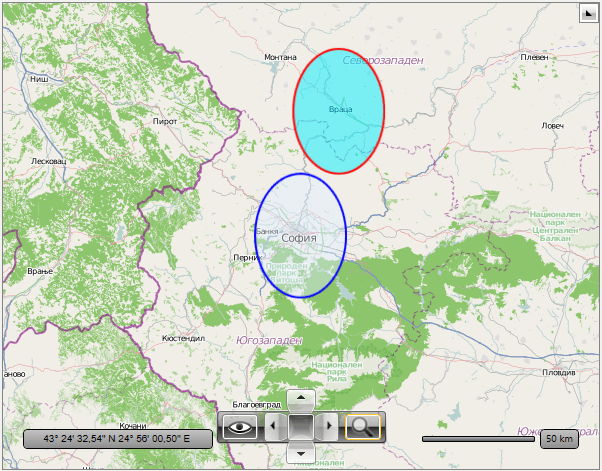
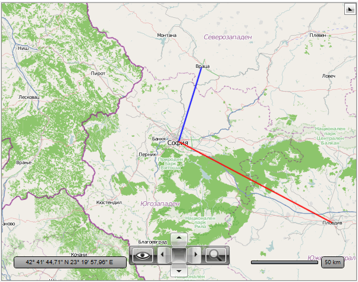
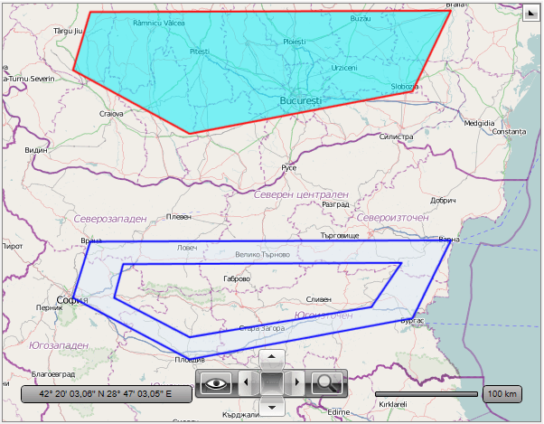
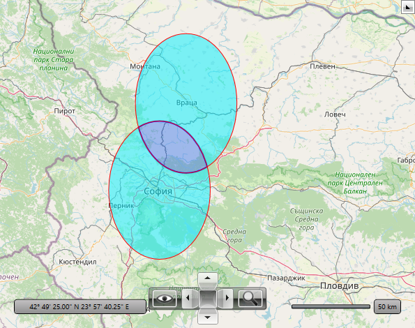
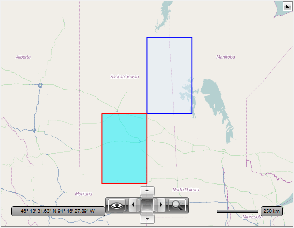
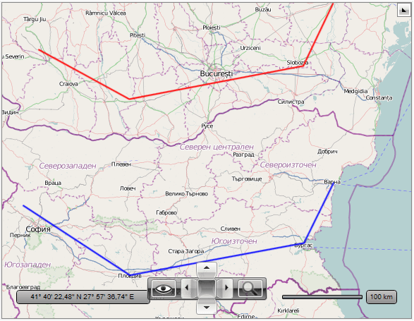
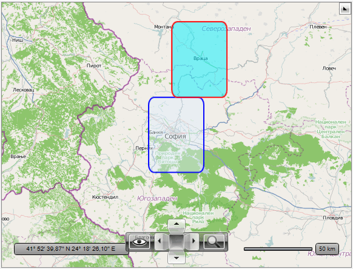

# Map Shape Data

The visualization engine based on the VisualizationLayer class introduces a new approach that separates the geographical data and its visualization. The new map shape data classes are not dependency objects. This allows them to be created in the background thread. The unified map shape visualization engine allows attaching to any input event supported by the [ContentPresenter](http://msdn.microsoft.com/en-us/library/system.windows.controls.contentpresenter.aspx) class to the map shape visual presentation.      

You will be able to find equivalents to most of the Shapes available in {{ site.framework_name }}.      

>To learn more about the different ways of customizing the shape appearance, please check the [Shape Appearance]() topic.        

The map shape data can be used identically to their visual element counterparts. This topic will focus briefly on showing you how to use the most important of them:      

1. EllipseData
2. LineData
3. PathData
4. PolygonData
5. PolylineData
6. RectangleData

>tip Adding map shape data objects in the ItemsSource of VisualizationLayer is not recommended. This is especially valid if the same source collection is shared between multiple VisualizationLayer instances.

## EllipseData

The EllipseData class represents an ellipse given in geographical coordinates.

In contrast with MapEllipse which is used with InformationLayer, the `Width` and `Height` of the `EllipseData` are given in the spatial reference units (degrees by default) instead of the current distance unit (mile or kilometer).          

To use the EllipseData in your visualization layer you have to set the following of its properties:
        
* **Location**: Represents the location on the map on which the ellipse will be displayed.
            
* **Width / Height**: Represent the width / height of the ellipse in spatial reference units (degrees by default).
            
>Note that the top left corner coincides with the given location.
          
Here it is an example:        

<snippet id='radmap-features-visualization-layer-map-shape-data-block_1-xaml' />

<snippet id='radmap-features-visualization-layer-map-shape-data-block_2-cs' />
<snippet id='radmap-features-visualization-layer-map-shape-data-block_2-vb' />

## LineData

The `LineData` class represents a line given in geographical coordinates.

The most important properties of the `LineData` class are the `Point1` and `Point2` properties, which are of type `Location`. They define the start and the end points of the line. Here is an example:        

<snippet id='radmap-features-visualization-layer-map-shape-data-block_3-xaml' />

<snippet id='radmap-features-visualization-layer-map-shape-data-block_4-cs' />
<snippet id='radmap-features-visualization-layer-map-shape-data-block_4-vb' />

## PathData

The `PathData` provides equivalents of the standard `Geometry` and `Segment` classes in {{ site.framework_name }}. It exposes a `Data` property of type `GeometryData` which can be set to an instance of the `PathGeometryData` which specifies the shape to be drawn.

Here is an example that uses a `PathGeometryData` which in turn holds a `PathFigureData` figure composed of `LineSegmentData` segments:

<snippet id='radmap-features-visualization-layer-map-shape-data-block_5-xaml' />

<snippet id='radmap-features-visualization-layer-map-shape-data-block_6-cs' />
<snippet id='radmap-features-visualization-layer-map-shape-data-block_6-vb' />

As of **R2 2022 SP1** you can also use an instance of `CombinedGeometryData` as the Data of the `PathGeometryData`. The CombinedGeometryData represents a composite geometry which is a combination of two GeometryData objects. They can be combined via 4 `GeometryCombineMode` types:

* **Union**: The two regions are combined by taking the union of both. The resulting geometry is geometry A + geometry B.
* **Intersect**: The two regions are combined by taking their intersection. The new area consists of the overlapping region between the two geometries.
* **Xor**: The two regions are combined by taking the area that exists in the first region but not the second and the area that exists in the second region but not the first. The new region consists of (A-B) + (B-A), where A and B are geometries.
* **Exclude**: The second region is excluded from the first. Given two geometries, A and B, the area of geometry B is removed from the area of geometry A, producing a region that is A-B.

<snippet id='radmap-features-visualization-layer-map-shape-data-block_7-xaml' />

<snippet id='radmap-features-visualization-layer-map-shape-data-block_8-cs' />
<snippet id='radmap-features-visualization-layer-map-shape-data-block_8-vb' />

## PolygonData

The `PolygonData` class represents polygon data in geographical coordinates.

The difference between the standard Polygon and the PolygonData is that the `Points` property of the `PolygonData` is a set of Locations. Here is an example:        

<snippet id='radmap-features-visualization-layer-map-shape-data-block_9-xaml' />

<snippet id='radmap-features-visualization-layer-map-shape-data-block_10-cs' />
<snippet id='radmap-features-visualization-layer-map-shape-data-block_10-vb' />

## PolylineData

The `PolylineData` class represents polyline data in geographical coordinates.

The difference between the standard Polyline and the PolylineData is that the `Points` property of the `PolylineData` is a set of Locations. Here is an example:        

<snippet id='radmap-features-visualization-layer-map-shape-data-block_11-xaml' />

<snippet id='radmap-features-visualization-layer-map-shape-data-block_12-cs' />
<snippet id='radmap-features-visualization-layer-map-shape-data-block_12-vb' />

## RectangleData

The `RectangleData` class represents a rectangle given in geographical coordinates.

To use the RectangleData in your visualization layer you have to set the following properties:       

* **Location**: Represents the location on the map, to which the ellipse is bound.            

* **Width / Height**: Represent the width / height of the ellipse. Just like the Width and Height properties of the EllipseData class, they are specified in spatial reference units (degrees by default).            

* **RadiusX / RadiusY**: Represent the radius of the rectangle corners. Measured in spatial reference units.            

>Note that the top left corner coincides with the given location.          

Here it is an example:        

<snippet id='radmap-features-visualization-layer-map-shape-data-block_13-xaml' />

<snippet id='radmap-features-visualization-layer-map-shape-data-block_14-cs' />
<snippet id='radmap-features-visualization-layer-map-shape-data-block_14-vb' />

## See Also

 * [Visualization Layer ]()
 * [Information Layer]()
 * [Map Shapes]()