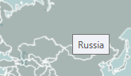
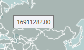
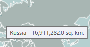
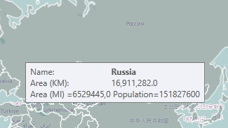
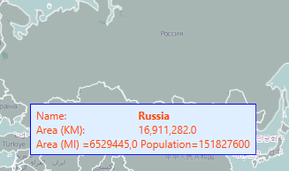

# Reading Map Shapes

The Visualization Layer allows you to read data from several geospatial data formats
        and wrap it in MapShapeData objects. The currently supported formats are:
      

* ESRI shape files.
          

* KML files.
          

* SQL Geospatial (WKT/WKB).
          

In contrast with InformationLayer the VisualizationLayer allows asynchronous
        processing of the geospatial data.
      

This topic covers the major concepts of the geospatial data reading:
      

1. Reading files
          

1. Specifying a tooltip
          

1. Clearing the layer
          

1. Styling the shapes
          

## Reading files

The Visualization Layer reads map shape data using asynchronous map shape
          data readers:
        

* __AsyncShapeFileReader__ – reads map shape geometry from the ESRI Shape
              file (.shp) and extended data from the data file (.dbf).
            

* __AsyncKmlReader__ – reads map shape geometry and extended data from the
              KML file.
            

>importantNot all KML elements are supported.
              

* __AsyncSqlGeospatialDataReader__ – reads map shape geometry from the
              WKT/WKB representation.
            

If your application loads comparatively small number of the map shape
          data then you can specify data source directly in XAML:
        

#### __XAML__

{{region radmap_visualization_layer_reading_map_shapes_0}}
	<telerik:RadMap x:Name="radMap"
	                ZoomLevel="5"
	                Center="36, -120">
		<telerik:RadMap.Provider>
			<telerik:OpenStreetMapProvider />
		</telerik:RadMap.Provider>
		<telerik:VisualizationLayer x:Name="visualizationLayer">
			<telerik:VisualizationLayer.ShapeFill>
				<telerik:MapShapeFill Fill="#6FDFEFFF"
	                                  Stroke="Blue"
	                                  StrokeThickness="2" />
			</telerik:VisualizationLayer.ShapeFill>
			<telerik:VisualizationLayer.Reader>
				<telerik:AsyncShapeFileReader x:Name="mapShapeDataReader"
	                                          Source="/TestMapFeatures;component/Resources/GeoData/zt06_d00.shp" />
			</telerik:VisualizationLayer.Reader>
		</telerik:VisualizationLayer>
	</telerik:RadMap>
	{{endregion}}

In this case reader starts reading immediately and loaded shapes will be
          visible even in the design time. But very often the data source contains
          numerous map shapes. In this case it is reasonable to perform loading
          in runtime only and show progress or busy indicator until the process
          is completed. Here it is the example:
        

#### __XAML__

{{region radmap_visualization_layer_reading_map_shapes_1}}
	<telerik:RadBusyIndicator Name="busyIndicator">
		<telerik:RadMap x:Name="radMap"
	                    ZoomLevel="6"
	                    Center="37, -120">
			<telerik:RadMap.Provider>
				<telerik:OpenStreetMapProvider />
			</telerik:RadMap.Provider>
			<telerik:VisualizationLayer x:Name="visualizationLayer">
				<telerik:VisualizationLayer.ShapeFill>
					<telerik:MapShapeFill Fill="#6FDFEFFF"
	                                      Stroke="Blue"
	                                      StrokeThickness="2" />
				</telerik:VisualizationLayer.ShapeFill>
				<telerik:VisualizationLayer.Reader>
					<telerik:AsyncShapeFileReader x:Name="mapShapeDataReader"
	                                              ProgressChanged="OnProgressChanged"
	                                              ReadShapeDataCompleted="OnReadShapeDataCompleted"/>
				</telerik:VisualizationLayer.Reader>
			</telerik:VisualizationLayer>
		</telerik:RadMap>
	</telerik:RadBusyIndicator>
	{{endregion}}

#### __C#__

{{region radmap_visualization_layer_reading_map_shapes_0}}
	public partial class EsriFileReader : UserControl
	{
		public EsriFileReader()
		{
			InitializeComponent();
	
			this.Loaded += this.ExampleLoaded;
		}
	
		private void ExampleLoaded(object sender, RoutedEventArgs e)
		{
			this.busyIndicator.IsIndeterminate = false;
			this.busyIndicator.IsBusy = true;
			this.mapShapeDataReader.Source =  new Uri("/TestMapFeatures;component/Resources/GeoData/zt06_d00.shp", UriKind.Relative);
		}
	
		private void OnProgressChanged(object sender, System.ComponentModel.ProgressChangedEventArgs e)
		{
			this.busyIndicator.ProgressValue = e.ProgressPercentage;
			if (e.ProgressPercentage >= 100)
			{
				this.busyIndicator.IsIndeterminate = true;
				this.busyIndicator.BusyContent = "Refresh layer";
			}
		}
	
		private void OnReadShapeDataCompleted(object sender, Telerik.Windows.Controls.Map.ReadShapeDataCompletedEventArgs e)
		{
			if (this.busyIndicator != null)
			{
				this.busyIndicator.IsBusy = false;
			}
		}
	}
	{{endregion}}

#### __VB.NET__

{{region radmap_visualization_layer_reading_map_shapes_0}}
	Partial Public Class EsriFileReader
		Inherits UserControl
		Public Sub New()
			InitializeComponent()
	
			AddHandler Me.Loaded, AddressOf Me.ExampleLoaded
		End Sub
	
		Private Sub ExampleLoaded(sender As Object, e As RoutedEventArgs)
			Me.busyIndicator.IsIndeterminate = False
			Me.busyIndicator.IsBusy = True
			Me.mapShapeDataReader.Source = New Uri("/TestMapFeatures;component/Resources/GeoData/zt06_d00.shp", UriKind.Relative)
		End Sub
	
		Private Sub OnProgressChanged(sender As Object, e As System.ComponentModel.ProgressChangedEventArgs)
			Me.busyIndicator.ProgressValue = e.ProgressPercentage
			If e.ProgressPercentage >= 100 Then
				Me.busyIndicator.IsIndeterminate = True
				Me.busyIndicator.BusyContent = "Refresh layer"
			End If
		End Sub
	
		Private Sub OnReadShapeDataCompleted(sender As Object, e As Telerik.Windows.Controls.Map.ReadShapeDataCompletedEventArgs)
			If Me.busyIndicator IsNot Nothing Then
				Me.busyIndicator.IsBusy = False
			End If
		End Sub
	End Class
	{{endregion}}

>Sometimes map shape data source can contain extremely large number of
            the items. In this case you can face with insufficient productivity of
            the WPF/Silverlight rendering engine. If your application is intended
            to show large number of map shapes, we strongly recommend using items
            virtualization, which is available out-of-the-box in the VisualizationLayer.
          

## Specifying a tooltip

The asynchronous map shape data readers can use the Extended Data associated
          with map shape to display it in a tooltip for the respective shape. In order
          to allow you to configure the tooltip's appearance and content, the readers
          expose the following properties:
        

* __ToolTipFormat__ - allows you to specify the format
              string for the tooltip. This is the simplest way to configure the tooltip,
              when having a one-line tooltip scenario.
            

* __ToolTipStyle__ - allows you to apply a Style that
              targets the ToolTip control.
            

* __ToolTipTemplate__ - allows you to define a
              DataTemplate for the tooltip. This one is used when more complex,
              multi-line and styled tooltip scenarios.
            

### ToolTipFormat

Using the ToolTipFormat property is the simplest way to create a
              single-line tooltip. The property is of type string and allows you
              to display both the value of a single property of the extended
              data and combination of the values of different extended data properties.
            

Here are the examples for different ToolTipFormat values:
            

__Single property value:__

#### __XAML__

{{region radmap_visualization_layer_reading_map_shapes_2}}
	<telerik:RadMap x:Name="radMap">
		<telerik:RadMap.Provider>
			<telerik:OpenStreetMapProvider />
		</telerik:RadMap.Provider>
		<telerik:VisualizationLayer x:Name="visualizationLayer">
			<telerik:VisualizationLayer.Reader>
				<telerik:AsyncShapeFileReader DataSource="/TestMapFeatures;component/Resources/GeoData/world.dbf"
	                                          Source="/TestMapFeatures;component/Resources/GeoData/world.shp"
	                                          ToolTipFormat="CNTRY_NAME" />
			</telerik:VisualizationLayer.Reader>
		</telerik:VisualizationLayer>
	</telerik:RadMap>
	{{endregion}}

#### __C#__

{{region radmap_visualization_layer_reading_map_shapes_1}}
	this.visualizationLayer.Reader.ToolTipFormat = "CNTRY_NAME";
	{{endregion}}

#### __VB.NET__

{{region radmap_visualization_layer_reading_map_shapes_1}}
	Me.visualizationLayer.Reader.ToolTipFormat = "CNTRY_NAME"
	{{endregion}}

Here is a snapshot of the result:
            

__Formatted property value:__

>Note that in this case the format string begins with "{}". This escapes
                the following {PropertyName} expressions. In code behind you don't need to
                add it to the actual format string.
              

#### __XAML__

{{region radmap_visualization_layer_reading_map_shapes_3}}
	<telerik:RadMap x:Name="radMap">
		<telerik:RadMap.Provider>
			<telerik:OpenStreetMapProvider />
		</telerik:RadMap.Provider>
		<telerik:VisualizationLayer x:Name="visualizationLayer">
			<telerik:VisualizationLayer.Reader>
				<telerik:AsyncShapeFileReader DataSource="/TestMapFeatures;component/Resources/GeoData/world.dbf"
	                                          Source="/TestMapFeatures;component/Resources/GeoData/world.shp"
	                                          ToolTipFormat="{}{SQKM|F2}" />
			</telerik:VisualizationLayer.Reader>
		</telerik:VisualizationLayer>
	</telerik:RadMap>
	{{endregion}}

#### __C#__

{{region radmap_visualization_layer_reading_map_shapes_2}}
	this.visualizationLayer.Reader.ToolTipFormat = "{SQKM|F2}";
	{{endregion}}

#### __VB.NET__

{{region radmap_visualization_layer_reading_map_shapes_2}}
	Me.visualizationLayer.Reader.ToolTipFormat = "{SQKM|F2}"
	{{endregion}}

Here is a snapshot of the result:
            

__Multiple formatted property values:__

#### __XAML__

{{region radmap_visualization_layer_reading_map_shapes_4}}
	<telerik:RadMap x:Name="radMap">
		<telerik:RadMap.Provider>
			<telerik:OpenStreetMapProvider />
		</telerik:RadMap.Provider>
		<telerik:VisualizationLayer x:Name="visualizationLayer">
			<telerik:VisualizationLayer.Reader>
				<telerik:AsyncShapeFileReader DataSource="/TestMapFeatures;component/Resources/GeoData/world.dbf"
	                                          Source="/TestMapFeatures;component/Resources/GeoData/world.shp"
	                                          ToolTipFormat="{}{CNTRY_NAME} - {SQKM|#,#.0} sq. km." />
			</telerik:VisualizationLayer.Reader>
		</telerik:VisualizationLayer>
	</telerik:RadMap>
	{{endregion}}

#### __C#__

{{region radmap_visualization_layer_reading_map_shapes_3}}
	this.visualizationLayer.Reader.ToolTipFormat = "{CNTRY_NAME} - {SQKM|#,#.0} sq. km.";
	{{endregion}}

#### __VB.NET__

{{region radmap_visualization_layer_reading_map_shapes_3}}
	Me.visualizationLayer.Reader.ToolTipFormat = "{CNTRY_NAME} - {SQKM|#,#.0} sq. km."
	{{endregion}}

Here is a snapshot of the result:
            

### ToolTipTemplate

The ToolTipTemplate property allows you to define a DataTemplate for the
              tooltip. This way you are able to create more complex layouts like
              multiline content or content containing different visual elements
              like Borders, Images etc.
            

__In this case the DataTemplate takes as DataContext the entire Extended
                Data Set.__ To get a specific value you have to bind to the Data property
              and use an indexer or converter to access the desired attribute. The
              RadMap provides such converter out of the box. It is represented by
              the ExtendedDataConverter. To use it just bind to the extended data
              set and pass the desired attribute name as parameter. Here is an example.
            

>The ToolTipTemplate property will take precedence over the
                ToolTipFormat one.
              

#### __XAML__

{{region radmap_visualization_layer_reading_map_shapes_5}}
	<UserControl x:Class="TestMapFeatures.Views.VisualizationLayer.Readers.SpecifyTooltipTemplate"
	             xmlns="http://schemas.microsoft.com/winfx/2006/xaml/presentation"
	             xmlns:x="http://schemas.microsoft.com/winfx/2006/xaml"
				 xmlns:telerik="http://schemas.telerik.com/2008/xaml/presentation"
	             xmlns:mc="http://schemas.openxmlformats.org/markup-compatibility/2006" 
	             xmlns:d="http://schemas.microsoft.com/expression/blend/2008" 
	             mc:Ignorable="d" 
	             d:DesignHeight="600" d:DesignWidth="600">
		<UserControl.Resources>
			<telerik:ExtendedDataConverter x:Key="ExtendedDataConverter" />
			
			<DataTemplate x:Key="TooltipTemplate">
				<Grid>
					<Grid.ColumnDefinitions>
						<ColumnDefinition Width="Auto" />
						<ColumnDefinition Width="Auto" />
					</Grid.ColumnDefinitions>
					<Grid.RowDefinitions>
						<RowDefinition Height="Auto" />
						<RowDefinition Height="Auto" />
						<RowDefinition Height="Auto" />
					</Grid.RowDefinitions>
	
					<TextBlock Grid.Column="0" Grid.Row="0" Text="Name:" />
					<TextBlock Grid.Column="1" Grid.Row="0"
							   FontWeight="Bold"
							   Text="{Binding Path=Data[CNTRY_NAME]}" />
	
					<TextBlock Grid.Column="0" Grid.Row="1" Text="Area (KM):" />
					<TextBlock Grid.Column="1" Grid.Row="1"
							   Text="{Binding Path=Data, Converter={StaticResource ExtendedDataConverter}, ConverterParameter='\{SQKM|#,#.0\}'}" />
	
					<TextBlock Grid.Column="0" Grid.Row="2" Grid.ColumnSpan="2"
							   Text="{Binding Path=Data[Area (MI) \=\{SQMI|F1\} Population\=\{POP_CNTRY|F0\}]}" />
				</Grid>
			</DataTemplate>
		</UserControl.Resources>
		<Grid>
			<telerik:RadBusyIndicator Name="busyIndicator">
				<telerik:RadMap x:Name="radMap"
	                            ZoomLevel="2"
	                            Center="0, 0">
					<telerik:RadMap.Provider>
						<telerik:OpenStreetMapProvider />
					</telerik:RadMap.Provider>
					<telerik:VisualizationLayer x:Name="visualizationLayer">
						<telerik:VisualizationLayer.Reader>
							<telerik:AsyncShapeFileReader DataSource="/TestMapFeatures;component/Resources/GeoData/world.dbf"
	                                                      Source="/TestMapFeatures;component/Resources/GeoData/world.shp"
	                                                      ToolTipTemplate="{StaticResource TooltipTemplate}">
							</telerik:AsyncShapeFileReader>
						</telerik:VisualizationLayer.Reader>
					</telerik:VisualizationLayer>
				</telerik:RadMap>
			</telerik:RadBusyIndicator>
		</Grid>
	</UserControl>
	{{endregion}}

Here is a snapshot of the result:
            

### ToolTipStyle

The ToolTipStyle property allows you to specify a Style of the tooltip
              that gets displayed. The Style should target the ToolTip control.
              Here is an example:
            

#### __XAML__

{{region radmap_visualization_layer_reading_map_shapes_6}}
	<UserControl x:Class="TestMapFeatures.Views.VisualizationLayer.Readers.SpecifyTooltipTemplate"
	             xmlns="http://schemas.microsoft.com/winfx/2006/xaml/presentation"
	             xmlns:x="http://schemas.microsoft.com/winfx/2006/xaml"
				 xmlns:telerik="http://schemas.telerik.com/2008/xaml/presentation"
	             xmlns:mc="http://schemas.openxmlformats.org/markup-compatibility/2006" 
	             xmlns:d="http://schemas.microsoft.com/expression/blend/2008" 
	             mc:Ignorable="d" 
	             d:DesignHeight="600" d:DesignWidth="600">
		<UserControl.Resources>
			<telerik:ExtendedDataConverter x:Key="ExtendedDataConverter" />
			
			<DataTemplate x:Key="TooltipTemplate">
				<Grid>
					<Grid.ColumnDefinitions>
						<ColumnDefinition Width="Auto" />
						<ColumnDefinition Width="Auto" />
					</Grid.ColumnDefinitions>
					<Grid.RowDefinitions>
						<RowDefinition Height="Auto" />
						<RowDefinition Height="Auto" />
						<RowDefinition Height="Auto" />
					</Grid.RowDefinitions>
	
					<TextBlock Grid.Column="0" Grid.Row="0" Text="Name:" />
					<TextBlock Grid.Column="1" Grid.Row="0"
							   FontWeight="Bold"
							   Text="{Binding Path=Data[CNTRY_NAME]}" />
	
					<TextBlock Grid.Column="0" Grid.Row="1" Text="Area (KM):" />
					<TextBlock Grid.Column="1" Grid.Row="1"
							   Text="{Binding Path=Data, Converter={StaticResource ExtendedDataConverter}, ConverterParameter='\{SQKM|#,#.0\}'}" />
	
					<TextBlock Grid.Column="0" Grid.Row="2" Grid.ColumnSpan="2"
							   Text="{Binding Path=Data[Area (MI) \=\{SQMI|F1\} Population\=\{POP_CNTRY|F0\}]}" />
				</Grid>
			</DataTemplate>
	
			
	
		</UserControl.Resources>
		<Grid>
			<telerik:RadBusyIndicator Name="busyIndicator">
				<telerik:RadMap x:Name="radMap"
	                            ZoomLevel="2"
	                            Center="0, 0">
					<telerik:RadMap.Provider>
						<telerik:OpenStreetMapProvider />
					</telerik:RadMap.Provider>
					<telerik:VisualizationLayer x:Name="visualizationLayer">
						<telerik:VisualizationLayer.Reader>
							<telerik:AsyncShapeFileReader DataSource="/TestMapFeatures;component/Resources/GeoData/world.dbf"
	                                                      Source="/TestMapFeatures;component/Resources/GeoData/world.shp"
	                                                      ToolTipTemplate="{StaticResource TooltipTemplate}"
	                                                      ToolTipStyle="{StaticResource ShapeTooltipStyle}">
							</telerik:AsyncShapeFileReader>
						</telerik:VisualizationLayer.Reader>
					</telerik:VisualizationLayer>
				</telerik:RadMap>
			</telerik:RadBusyIndicator>
		</Grid>
	</UserControl>
	{{endregion}}

Here is a snapshot of the result:
            

## Reading multiple files

There are many scenarios when it is necessary to read multiple shape files into the one layer.
          The AsyncShapeFileReader and AsyncKmlReader have an ability to specify several sources to
          read in one process. To specify every single file to read you should use AsyncReaderSourceobject.
        

Here's an example:
        

#### __XAML__

{{region radmap_visualization_layer_reading_map_shapes_7}}
	<telerik:RadMap x:Name="radMap"
	                ZoomLevel="6"
	                Center="37, -120">
		<telerik:RadMap.Provider>
			<telerik:EmptyProvider />
		</telerik:RadMap.Provider>
		<telerik:VisualizationLayer x:Name="visualizationLayer">
			<telerik:VisualizationLayer.ShapeFill>
				<telerik:MapShapeFill Fill="#6FDFEFFF"
	                                  Stroke="Blue"
	                                  StrokeThickness="2" />
			</telerik:VisualizationLayer.ShapeFill>
			<telerik:VisualizationLayer.Reader>
				<telerik:AsyncShapeFileReader x:Name="mapShapeDataReader">
					<telerik:AsyncReaderSource Source="/TestMapFeatures;component/Resources/GeoData/Hotel/Hotel_base.shp" />
					<telerik:AsyncReaderSource Source="/TestMapFeatures;component/Resources/GeoData/Hotel/Hotel_Corridors.shp" />
					<telerik:AsyncReaderSource Source="/TestMapFeatures;component/Resources/GeoData/Hotel/Hotel_ServiceRooms.shp" />
					<telerik:AsyncReaderSource Source="/TestMapFeatures;component/Resources/GeoData/Hotel/Hotel_LiftsAndLadders.shp" />
					<telerik:AsyncReaderSource Source="/TestMapFeatures;component/Resources/GeoData/Hotel/Hotel_Rooms.shp" />
				</telerik:AsyncShapeFileReader>
			</telerik:VisualizationLayer.Reader>
		</telerik:VisualizationLayer>
	</telerik:RadMap>
	{{endregion}}

#### __C#__

{{region radmap_visualization_layer_reading_map_shapes_4}}
	this.mapShapeDataReader.SourceCollection.Add(
		new AsyncReaderSource()
		{
			Source = new Uri("/TestMapFeatures;component/Resources/GeoData/Hotel/Hotel_base.shp", UriKind.RelativeOrAbsolute)
		});
	this.mapShapeDataReader.SourceCollection.Add(
		new AsyncReaderSource()
		{
			Source = new Uri("/TestMapFeatures;component/Resources/GeoData/Hotel/Hotel_Corridors.shp", UriKind.RelativeOrAbsolute)
		});
	this.mapShapeDataReader.SourceCollection.Add(
		new AsyncReaderSource()
		{
			Source = new Uri("/TestMapFeatures;component/Resources/GeoData/Hotel/Hotel_ServiceRooms.shp", UriKind.RelativeOrAbsolute)
		});
	this.mapShapeDataReader.SourceCollection.Add(
		new AsyncReaderSource()
		{
			Source = new Uri("/TestMapFeatures;component/Resources/GeoData/Hotel/Hotel_LiftsAndLadders.shp", UriKind.RelativeOrAbsolute)
		});
	this.mapShapeDataReader.SourceCollection.Add(
		new AsyncReaderSource()
		{
			Source = new Uri("/TestMapFeatures;component/Resources/GeoData/Hotel/Hotel_Rooms.shp", UriKind.RelativeOrAbsolute)
		});
	
	this.mapShapeDataReader.ReadAsync();
	{{endregion}}

#### __VB.NET__

{{region radmap_visualization_layer_reading_map_shapes_4}}
	Me.mapShapeDataReader.SourceCollection.Add( _
		New AsyncReaderSource() With _
		{
			.Source = New Uri("/TestMapFeatures;component/Resources/GeoData/Hotel/Hotel_base.shp", UriKind.RelativeOrAbsolute) _
		})
	Me.mapShapeDataReader.SourceCollection.Add( _
		New AsyncReaderSource() With _
		{
			.Source = New Uri("/TestMapFeatures;component/Resources/GeoData/Hotel/Hotel_Corridors.shp", UriKind.RelativeOrAbsolute) _
		})
	Me.mapShapeDataReader.SourceCollection.Add( _
		New AsyncReaderSource() With _
		{
			.Source = New Uri("/TestMapFeatures;component/Resources/GeoData/Hotel/Hotel_ServiceRooms.shp", UriKind.RelativeOrAbsolute) _
		})
	Me.mapShapeDataReader.SourceCollection.Add( _
		New AsyncReaderSource() With _
		{
			.Source = New Uri("/TestMapFeatures;component/Resources/GeoData/Hotel/Hotel_LiftsAndLadders.shp", UriKind.RelativeOrAbsolute) _
		})
	Me.mapShapeDataReader.SourceCollection.Add( _
		New AsyncReaderSource() With _
		{
			.Source = New Uri("/TestMapFeatures;component/Resources/GeoData/Hotel/Hotel_Rooms.shp", UriKind.RelativeOrAbsolute) _
		})
	
	Me.mapShapeDataReader.ReadAsync()
	{{endregion}}

## Clearing the Layer

When adding the read shapes to the layer, the reader is able to clear it first.
          This means that all previously added shapes will get removed and the new ones
          will be added. This behavior is controlled by the ClearLayer property of the
          reader. Its default value is “True”. This means that the described behavior
          will be active by default. To disable it set the property to “False”.
        

## Styling the Shapes

To modify the appearance of the shapes in terms of Fill, Stroke etc.
          You can either use the HighlightFill, ShapeFill or SelectedFill properties of the
          VisualizationLayer or use the __Colorizer__
          property of the VisualizationLayer.
        

# See Also
