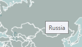
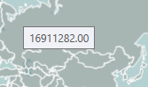
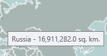
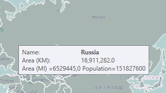
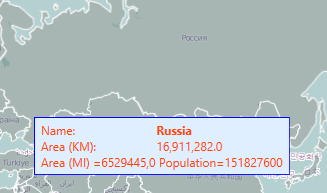

# Reading Map Shapes

The Visualization Layer allows you to read data from several geospatial data formats and wrap it in MapShapeData objects. The currently supported formats are:      

* ESRI shape files.          

* KML files.          

* SQL Geospatial (WKT/WKB).          

In contrast with InformationLayer, the VisualizationLayer allows asynchronous processing of the geospatial data.      

This topic covers the major concepts of the geospatial data reading:      

1. Reading files
1. Specifying a tooltip
1. Clearing the layer
1. Styling the shapes          

## Reading Files

The Visualization Layer reads map shape data using asynchronous map shape data readers:        

* __AsyncShapeFileReader__: Reads map shape geometry from the ESRI Shape file (.shp) and extended data from the data file (.dbf).            

* __AsyncKmlReader__: Reads map shape geometry and extended data from the KML file.            

	>important Not all KML elements are supported.

* __AsyncSqlGeospatialDataReader__: Reads map shape geometry from the WKT/WKB representation.         

> The __AsyncShapeFileReader__ and __AsyncKmlReader__ inherit the [AsyncFileReaderBase](https://docs.telerik.com/devtools/wpf/api/telerik.windows.controls.map.asyncfilereaderbase) abstract class which in turn inherits the [AsyncReaderBase](https://docs.telerik.com/devtools/wpf/api/telerik.windows.controls.map.asyncreaderbase) abstract class, which is the base class for all of the readers mentioned above.

If your application loads a comparatively small number of map shape data, then you can specify the data source directly in XAML as demonstrated in __Example 1__.        

__Example 1: AsyncShapeFileReader with its source set in xaml__
<snippet id='radmap-features-visualization-layer-reading-map-shapes-block_1-xaml' />

In this case the reader starts reading immediately and the loaded shapes will be visible even in the design time. But very often the data source contains numerous map shapes. In this case it is reasonable to perform loading in runtime only and show progress or busy indicator until the process is completed. This is demonstrated in __Examples 2 and 3__.       

__Example 2: AsyncShapeFileReader with the ProgressChanged and ReadShapeDataCompleted events__
<snippet id='radmap-features-visualization-layer-reading-map-shapes-block_2-xaml' />

__Example 3: Showing a BusyIndicator while the AsyncShapeFileReader is loading shapes__
<snippet id='radmap-features-visualization-layer-reading-map-shapes-block_3-cs' />
<snippet id='radmap-features-visualization-layer-reading-map-shapes-block_3-vb' />

>Sometimes map shape data source can contain extremely large number of the items. In this case you can be faced with insufficient productivity of the WPF/Silverlight rendering engine. If your application is intended to show large number of map shapes, we strongly recommend using items virtualization, which is available out-of-the-box in the VisualizationLayer.   

## AsyncReaderBase events

The events described in this section are available for the AsyncShapeFileReader, AsyncKmlReader and AsyncSqlGeospatialDataReader since they are defined in the AsyncReaderBase class which is inherited by all of them. The example in this section uses the AsyncShapeFileReader for demonstration purposes. 

* __PreviewReadShapeDataCompleted__: Occurs when the reader completes to read shapes.

* __ReadShapeDataCompleted__:  Occurs when the reader completes to read shapes and pass them to target information layer.

* __PreviewReadShapeData__: Occurs each time when a shape data is read. __Example 5__ demonstrates how you can use the PreviewReadShapeData event in order to cancel the loading of the shapes.

	__Example 4: AsyncShapeFileReader with PreviewReadShapeData event__
	<snippet id='radmap-features-visualization-layer-reading-map-shapes-block_4-xaml' />

	__Example 5: Cancel shape loading__
	<snippet id='radmap-features-visualization-layer-reading-map-shapes-block_5-cs' />
	<snippet id='radmap-features-visualization-layer-reading-map-shapes-block_5-vb' />

* __ProgressChanged__:  Occurs when part of data is read.

## Specifying a tooltip

The asynchronous map shape data readers can use the Extended Data associated with map shape to display it in a tooltip for the respective shape. In order to allow you to configure the tooltip's appearance and content, the readers expose the following properties:        

* __ToolTipFormat__: Allows you to specify the format string for the tooltip. This is the simplest way to configure the tooltip, when having a one-line tooltip scenario.            

* __ToolTipStyle__: Allows you to apply a Style that targets the ToolTip control.            

* __ToolTipTemplate__: Allows you to define a DataTemplate for the tooltip. This one is used when more complex, multi-line and styled tooltip scenarios.            

### ToolTipFormat

Using the ToolTipFormat property is the simplest way to create a single-line tooltip. The property is of type string and allows you to display both the value of a single property of the extended data and combination of the values of different extended data properties.                        

* __Single property value:__

	__Example 6: Setting the ToolTipFormat of the AsyncShapeFileReader in xaml__
	<snippet id='radmap-features-visualization-layer-reading-map-shapes-block_6-xaml' />

	__Example 7: Setting the ToolTipFormat of the AsyncShapeFileReader in code__
	<snippet id='radmap-features-visualization-layer-reading-map-shapes-block_7-cs' />
	<snippet id='radmap-features-visualization-layer-reading-map-shapes-block_7-vb' />

	
	#### Figure 1: Result from Example 6
	

* __Formatted property value:__

	>Note that in this case the format string begins with "{}". This escapes the following {PropertyName} expressions. In code behind you don't need to add it to the actual format string.              

	__Example 8: Setting the ToolTipFormat of the AsyncShapeFileReader to a formatted property in xaml__
	<snippet id='radmap-features-visualization-layer-reading-map-shapes-block_8-xaml' />

	__Example 9: Setting the ToolTipFormat of the AsyncShapeFileReader to a formatted property in code__
	<snippet id='radmap-features-visualization-layer-reading-map-shapes-block_9-cs' />
	<snippet id='radmap-features-visualization-layer-reading-map-shapes-block_9-vb' />

	#### Figure 2: Result from Example 8
	

* __Multiple formatted property values:__

	__Example 10: Setting the ToolTipFormat of the AsyncShapeFileReader to a complex format in xaml__
	<snippet id='radmap-features-visualization-layer-reading-map-shapes-block_10-xaml' />

	__Example 11: Setting the ToolTipFormat of the AsyncShapeFileReader to a complex format in code__
	<snippet id='radmap-features-visualization-layer-reading-map-shapes-block_11-cs' />
	<snippet id='radmap-features-visualization-layer-reading-map-shapes-block_11-vb' />

	#### Figure 3: Result from Example 10
	

### ToolTipTemplate

The ToolTipTemplate property allows you to define a DataTemplate for the tooltip. This way you are able to create more complex layouts like multiline content or content containing different visual elements like Borders, Images etc.            

__In this case the DataTemplate takes as DataContext the entire Extended Data Set.__ To get a specific value you have to bind to the Data property and use an indexer or converter to access the desired attribute. The RadMap provides such converter out of the box. It is represented by the ExtendedDataConverter. To use it just bind to the extended data set and pass the desired attribute name as parameter. This is demonstrated in __Example 12__.            

>The ToolTipTemplate property will take precedence over the ToolTipFormat one.              

__Example 12: AsyncShapeFileReader with ToolTipTemplate__
<snippet id='radmap-features-visualization-layer-reading-map-shapes-block_12-xaml' />

#### Figure 4: Result from Example 12

### ToolTipStyle

The ToolTipStyle property allows you to specify a Style of the tooltip that gets displayed. The Style should target the ToolTip control.   

__Example 13: AsyncShapeFileReader with ToolTipTemplate and ToolTipStyle__
<snippet id='radmap-features-visualization-layer-reading-map-shapes-block_13-xaml' />

#### Figure 5: Result from Example 13

## Reading multiple files

There are many scenarios when it is necessary to read multiple shape files into one layer. The AsyncShapeFileReader and AsyncKmlReader have an ability to specify several sources to read in one process. To specify every single file to read you should use AsyncReaderSourceobject as demonstrated in __Example 14__.   

__Example 14: Reading multiple shape files with AsyncShapeFileReader in xaml__
<snippet id='radmap-features-visualization-layer-reading-map-shapes-block_14-xaml' />

__Example 15: Reading multiple shape files with AsyncShapeFileReader in code__
<snippet id='radmap-features-visualization-layer-reading-map-shapes-block_15-cs' />
<snippet id='radmap-features-visualization-layer-reading-map-shapes-block_15-vb' />

## Clearing the Layer

When adding the read shapes to the layer, the reader is able to clear it first. This means that all previously added shapes will get removed and the new ones will be added. This behavior is controlled by the ClearLayer property of the reader. Its default value is “True”. This means that the described behavior will be active by default. To disable it set the property to “False”.        

## Styling the Shapes

To modify the appearance of the shapes in terms of Fill, Stroke etc. You can either use the HighlightFill, ShapeFill or SelectedFill properties of the VisualizationLayer or use the __Colorizer__ property of the VisualizationLayer.