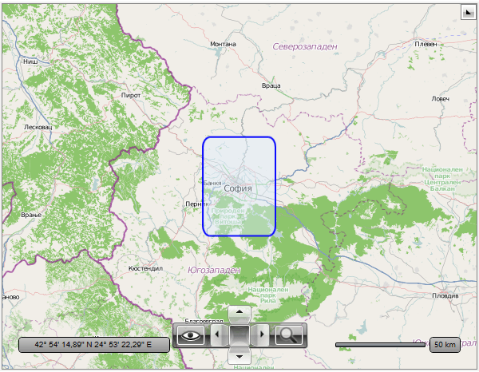
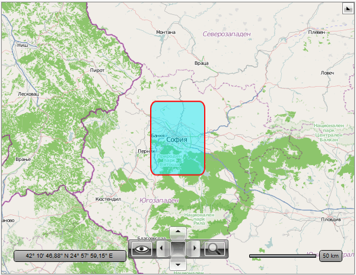
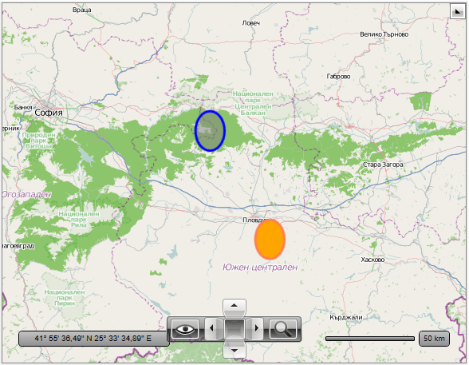

# Shape Appearance

When using map shape data objects (EllipseData, LineData, PathData and so on) there are 2 ways to control their appearance:      

1. Using the MapShapeFill object on shape level.
1. Using the MapShapeFill object on layer level.          

## Using the MapShapeFill object on shape level

The map shape data objects expose three specific properties - __ShapeFill__, __HightlightFill__ and __SelectedFill__.        

The first one is applied to the shapes, when they are in their normal state. The HighlightFill gets applied when the shape is highlighted. The SelectedFill gets applied when the shape is selected. You can apply regular, highlight or selected filling using __UseRegularFill()__, __UseHighlightFill()__ and  __UseSelectedFill()__ methods of the map shape data object.        

The three properties are of type MapShapeFill. The MapShapeFill object allows you not only to specify the Fill color, but also to modify the stroke as well.        

In the following example, the MouseLeftButtonDown event on the shape visualization is used to switch between regular and highlighted fill.        

<snippet id='radmap-features-visualization-layer-shape-appearance-block_1-xaml' />

<snippet id='radmap-features-visualization-layer-shape-appearance-block_2-cs' />
<snippet id='radmap-features-visualization-layer-shape-appearance-block_2-vb' />

Here is a snapshot of the result:

## Using the MapShapeFill object on layer level

You are also able to define the appearance of the shapes on the Visualization Layer level. This way every shape, that doesn't have its respective properties explicitly set, will inherit the appearance specified for the layer. For this purpose use the __ShapeFill__, __HighlightFill__ and __SelectedFill__ properties of the __VisualizationLayer__ class. The first one is applied to the shapes, when they are in their normal state. The HighlightFill gets applied when the shape is highlighted.The SelectedFill gets applied when the shape is selected.        

>These values will get applied also on the shapes that are created from KML, ESRI Shapefile or WKT/WKB data and don’t have their appearance explicitly set.          

The three properties are of type MapShapeFill. The MapShapeFill object allows you not only to specify the Fill color, but to modify the stroke as well.        

Here is an example:        

<snippet id='radmap-features-visualization-layer-shape-appearance-block_3-xaml' />

## Using the AutoHighlightMapShape property      

The VisualizationLayer can highlight a map shape automatically when the mouse pointer is over it and set regular shape fill back when mouse pointer leaves the shape. You can turn on/off this feature using AutoHighlightMapShape property of the VisualizationLayer.