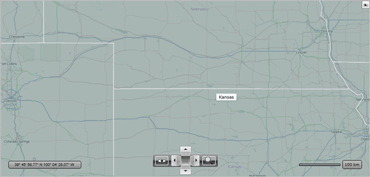
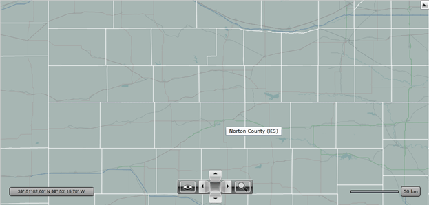

# Map Shapes Virtualization

## Purposes of Map Shapes Virtualization

Many applications operate with collections of the map shapes. The shapes can be retrieved from different sources like ESRI shape-file, KML file or Data Base which contains a geospatial data. Using large data source within the visualization layer can decrease the overall performance of the map control, especially the initial loading and the performance during zooming or panning.

The __RadMap__ control uses standard WPF/Silverlight shapes to render all __Map Shape__ objects. There are two things which affect the WPF/Silverlight rendering engine:        

1. The number of the objects visible in the viewport at the same time.

1. Complexity of the shapes which should be rendered. For example this is a number of points for the polylines and polygons. The WPF/Silverlight rendering engine is very sensitive for the number of points it should render. The solution would be in simplifying the initial shape files (if it is applicable).

To improve the performance with large data sets, you can use the __UI Virtualization__ feature.        

## Using Map Shapes Virtualization

In order to enable the __UI Virtualization__ feature you should configure the __ZoomLevelGridList__ and you should specify the __VirtualizationSource__ property of the Visualization Layer. The __ZoomLevelGridList__ property allows dividing the map to regions. And the __VirtualizationSource__ property allows specifying your own custom class which handles the requests by configured regions and which returns the __Map Shapes__ which will be displayed on the map. The custom class which can be used as the virtualization source must implement the __IMapVirtualizationSource__ interface.


>important If you use the WPF version of RadMap to display Map Shapes, then you must disable the __UseBitmapCache__ property for better performance.


More information about configuring the __ZoomLevelGridList__ you can find in the [Items Virtualization]() article.        

The __RadMap__ contains the __MapShapeDataVirtualizationSource__ class which implements the __IMapVirtualizationSource__ interface. This class can be used in most cases to enable the __UI Virtualization__ feature for the data sources like ESRI shape-file, KML file or SQL geospatial data.        

The __MapShapeDataVirtualizationSource__ exposes the following properties:        

* __BusyIndicator__ - a property of type __RadBusyIndicator__ that gets or sets the busy indicator which changes its state to busy while loading data.            

* __ClearCache__ - a property of type __bool__ that gets or sets a value indicating whether internal cache should be cleaned before reading the new items.            

* __Reader__ - a property of type __AsyncReaderBase__ that gets or sets the reader for loading map shapes.            

* __Resolution__ - a property of type __double__ that gets or sets minimal pixel size of the object. If pixel size of the object is less than this value then object will not be passed to the visualization layer.            

Also the __MapShapeDataVirtualizationSource__ contains the following events:        

* __PreviewReadShapeDataCompleted__ - occurs when the reader completes to read shapes.            

* __ProgressChanged__ - occurs when part of data is read. It can be used for displaying the loading progress percentage.            

* __ReadShapeDataCompleted__ - occurs when the reader completes to read shapes and pass them to target visualization layer.            

## Map Shapes Virtualization Example

The following example demonstrates how to use the __UI Virtualization__ feature for displaying the counties of USA. The example will display the polygons which are contained in the “County” shape-file. You can find it in our [Async Shape File](https://demos.telerik.com/silverlight/#Map/AsyncReadWithVirtualization) demo  application. The file contains over 6000 polygons which contain about 800000 points.        

When you will try to load this file using the shape-file reader directly like the code below then the performance of zooming and panning will be very low.

<snippet id='radmap-features-visualization-layer-shapes-virtualization-block_1-xaml' />
	
Such performance is a reason to use the __Map Shapes Virtualization__ to improve the performance of rendering.        

If it is acceptable for your application just to restrict the zoom level, then it is possible to use built-in __MapShapeDataVirtualizationSource__. First you need to configure the __ZoomLevelGridList__ property. It can be configured to show counties from the zoom level 8 when the rendering is quite fast. It could be done with the following XAML code:
        

<snippet id='radmap-features-visualization-layer-shapes-virtualization-block_2-xaml' />

To start loading the shape-file you should invoke the __MapShapeDataVirtualizationSource.ReadAsync__ method:
        

<snippet id='radmap-features-visualization-layer-shapes-virtualization-block_3-cs' />
<snippet id='radmap-features-visualization-layer-shapes-virtualization-block_3-vb' />

If your application cannot limit zoom level and it requires that some data still be visible on the low zoom levels (1 – 7) then you can use approach which show different sets of shapes for different zoom levels. For example, you can show the map of USA states for lower zoom levels (1-7). In this case you should design your own custom virtualization source class which will show data depend on the zoom level. The sample code below uses the “usa_states” shape-file which is also used in the [United States](https://demos.telerik.com/silverlight/#Map/Shapefile/UnitedStates) demo.
        

<snippet id='radmap-features-visualization-layer-shapes-virtualization-block_4-cs' />
<snippet id='radmap-features-visualization-layer-shapes-virtualization-block_4-vb' />

The sample code of the custom virtualization source class is below.

This class can be used in the XAML code like the following way:

<snippet id='radmap-features-visualization-layer-shapes-virtualization-block_5-xaml' />

In the snapshots below you can see how the above example will be displayed with different ZoomLevel settings.

The result at ZoomLevel 7:

The result at ZoomLevel 8:

## See Also
 * [Items Virtualization]()