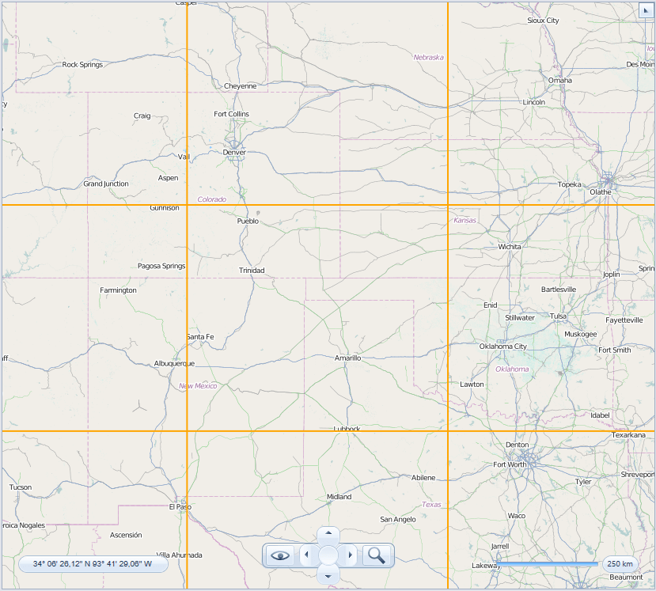
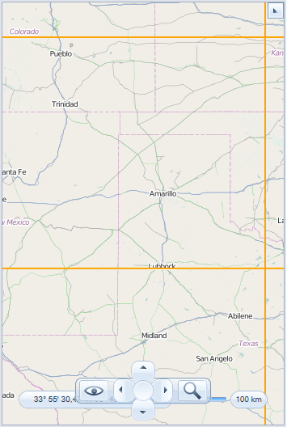
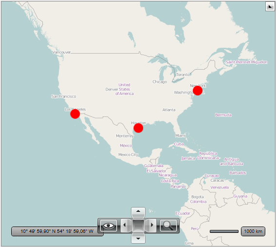
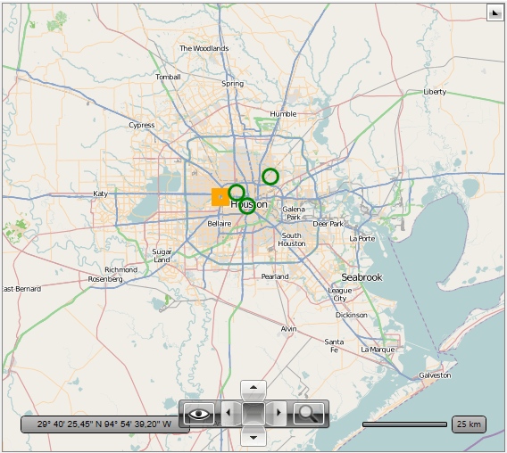

# Items Virtualization

There are numerous scenarios where large number of items should be visualized on the map surface. Using large data source within the visualization layer can decrease the overall performance of the map control, especially the initial loading and the performance during zooming or panning. This is why the visualization layer API supports __UI Virtualization__, which processes information only inside the current viewport of the RadMap thus boosting the initial loading and the overall performance of the control.      

## Properties

The __VisualizationLayer__ exposes the following properties:        

* __RenderWhileMotion__: А property of type bool that gets or sets a value indicating whether the layer should request and render items while the user is zooming or panning.            

* __VirtualizationSource__: А property of type __IMapVirtualizationSource__ that gets or sets the item source of the layer.            

* __ZoomLevelGridList__: А property of type __ZoomLevelGridCollection__ that gets the collection of __ZoomLevelGrids__ used to specify the map division.            

If both __VirtualizationSource__ and __ZoomLevelGridList__ properties are set then the __VisualizationLayer__ switches to use UI Virtualization. When this feature is enabled the layer doesn’t take its items from the __ItemsSource__ property. Instead, it raises an items request event when the __ZoomLevel__ or __Center__ properties of the __RadMap__ control are changed.        

## Map Division

The __VisualizationLayer__ needs the map surface to be divided into regions. The division can be defined using the __VisualizationLayer.ZoomLevelGridList__ collection. Each __ZoomLevelGrid__ should define a minimum zoom level for its division. The maximum zoom level for a grid is the minimum zoom level of the next grid in the list.        

The __ZoomLevelGrid__ exposes the following properties:        

* __CellWidth__: A property of type __int__ that gets or sets the width of the cell in pixels.            

* __CellHeight__: A property of type __int__ that gets or sets the height of the cell in pixels.            

* __MinZoom__: A property of type __int__ that gets or sets the minimum zoom.            

By default the cell has a size which equals the size of tile (256x256) which is usually used by the map providers like AzureMapProvider and OpenStreetMapProvider. Specifying the size of а cell for the zoom level affects a number of requests to a __Virtualization Source__ which is depended on the viewport size of the map.        

>important If the requests are performed slowly (for example they use a service which has low performance) you can increase the cell size to lower the number of requests.          
    
__Example 1: Virtualization Layer declaration__
```XAML
	<telerik:RadMap x:Name="radMap">
	    <telerik:VisualizationLayer x:Name="visualizationLayer">
			<telerik:VisualizationLayer.ZoomLevelGridList>
				<telerik:ZoomLevelGrid MinZoom="3" />
				<telerik:ZoomLevelGrid MinZoom="9" />
			</telerik:VisualizationLayer.ZoomLevelGridList>
		</telerik:VisualizationLayer>
	</telerik:RadMap>
```

## Virtualization Source

The data provided to the __VisualizationLayer__ should be wrapped in a class that implements the __IMapItemsVirtualizationSource__ interface. This interface contains a __MapItemsRequest__ method, which is used by the __VisualizationLayer__ to request new data whenever the __ZoomLevel__ or __Center__ properties of the __RadMap__ control are changed. The number of requests depends on the number of the grid cells visualized in the current viewport of the control. Below you can see examples of different viewports.        

If the cell size is 256x256 pixels (the default one) and there are 9 cells in the viewport of the control - 9 requests will be sent to the virtualization source whenever this geographical region comes into the view.


In this case only 6 requests will be sent to the virtualization source whenever this geographical region comes into the view.


__Example 2__ desmonstrate how to implement simple virtualization source.

__Example 2: Create custom IMapItemsVirtualizationSource__
```C#
	public class MyVirtualizationSource : IMapItemsVirtualizationSource
	{
		private XmlDocument document;
	
		public MyVirtualizationSource()
		{
			StreamResourceInfo streamInfo = Application.GetResourceStream(
				new Uri(
					"/TestMapFeatures;component/Resources/GeoData/StoresLocation.xml", 
					UriKind.Relative));
	
			this.document = new XmlDocument();
			this.document.Load(streamInfo.Stream);
		}
	
		public void MapItemsRequest(object sender, MapItemsRequestEventArgs eventArgs)
		{
			double minZoom = eventArgs.MinZoom;
			Location upperLeft = eventArgs.UpperLeft;
			Location lowerRight = eventArgs.LowerRight;
	
			if (this.document == null)
				return;
	
			if (minZoom == 3)
			{
				// request areas
				List<StoreLocation> list = this.GetStores(
					upperLeft.Latitude,
					upperLeft.Longitude,
					lowerRight.Latitude,
					lowerRight.Longitude,
					StoreType.Area);
	
				eventArgs.CompleteItemsRequest(list);
			}
	
			if (minZoom == 9)
			{
				// request areas
				List<StoreLocation> list = this.GetStores(
					upperLeft.Latitude,
					upperLeft.Longitude,
					lowerRight.Latitude,
					lowerRight.Longitude,
					StoreType.Store);
	
				eventArgs.CompleteItemsRequest(list);
			}
		}
	
		internal List<StoreLocation> GetStores(
			double upperLeftLat,
			double upperLeftLong,
			double lowerRightLat,
			double lowerRightLong,
			StoreType storeType)
		{
			List<StoreLocation> locations = new List<StoreLocation>();
	
			string latLonCondition = "[number(@Latitude) < " 
				+ upperLeftLat.ToString(CultureInfo.InvariantCulture) 
				+ " and number(@Latitude) > " 
				+ lowerRightLat.ToString(CultureInfo.InvariantCulture) 
				+ " and number(@Longitude) > " 
				+ upperLeftLong.ToString(CultureInfo.InvariantCulture) 
				+ " and number(@Longitude) < " 
				+ lowerRightLong.ToString(CultureInfo.InvariantCulture) 
				+ "]";
	
			switch (storeType)
			{
				case StoreType.Area:
					{
						XmlNodeList nodeList = document.SelectNodes(
							"/StoresLocation/Area" + latLonCondition);
						foreach (XmlNode node in nodeList)
						{
							XmlElement element = (XmlElement)node;
	
							locations.Add(new StoreLocation(
								Convert.ToDouble(
									element.GetAttribute("Latitude"), 
									CultureInfo.InvariantCulture),
								Convert.ToDouble(
									element.GetAttribute("Longitude"), 
									CultureInfo.InvariantCulture),
								element.GetAttribute("Name"), StoreType.Area));
						}
					}
					break;
	
				case StoreType.Store:
					{
						XmlNodeList nodeList = document.SelectNodes(
							"/StoresLocation/Area/*" + latLonCondition);
						foreach (XmlNode node in nodeList)
						{
							XmlElement element = (XmlElement)node;
	
							locations.Add(new StoreLocation(
								Convert.ToDouble(
									element.GetAttribute("Latitude"), 
									CultureInfo.InvariantCulture),
								Convert.ToDouble(
									element.GetAttribute("Longitude"), 
									CultureInfo.InvariantCulture),
								element.GetAttribute("Name"),
								element.LocalName == "Market" ? StoreType.Market : StoreType.Store));
						}
					}
					break;
			}
	
			return locations;
		}
	}	
```
```VB.NET
	Public Class MyVirtualizationSource
		Implements IMapItemsVirtualizationSource
		Private document As XmlDocument

		Public Sub New()
			Dim streamInfo As StreamResourceInfo =
				Application.GetResourceStream(
					New Uri("/TestMapFeatures;component/Resources/GeoData/StoresLocation.xml",
							UriKind.Relative))

			Me.document = New XmlDocument()
			Me.document.Load(streamInfo.Stream)
		End Sub

		Public Sub MapItemsRequest(sender As Object, eventArgs As MapItemsRequestEventArgs)
			Dim minZoom As Double = eventArgs.MinZoom
			Dim upperLeft As Location = eventArgs.UpperLeft
			Dim lowerRight As Location = eventArgs.LowerRight

			If Me.document Is Nothing Then
				Return
			End If

			If minZoom = 3 Then
				' request areas '
				Dim list As List(Of StoreLocation) =
					Me.GetStores(upperLeft.Latitude,
								 upperLeft.Longitude,
								 lowerRight.Latitude,
								 lowerRight.Longitude,
								 StoreType.Area)

				eventArgs.CompleteItemsRequest(list)
			End If

			If minZoom = 9 Then
				' request areas'
				Dim list As List(Of StoreLocation) =
					Me.GetStores(upperLeft.Latitude,
								 upperLeft.Longitude,
								 lowerRight.Latitude,
								 lowerRight.Longitude,
								 StoreType.Store)

				eventArgs.CompleteItemsRequest(list)
			End If
		End Sub

		Friend Function GetStores(upperLeftLat As Double,
								  upperLeftLong As Double,
								  lowerRightLat As Double,
								  lowerRightLong As Double,
								  storeType__1 As StoreType) As List(Of StoreLocation)
			Dim locations As New List(Of StoreLocation)()

			Dim latLonCondition As String =
				"[number(@Latitude) < "
				& upperLeftLat.ToString(CultureInfo.InvariantCulture) 
				& " and number(@Latitude) > " 
				& lowerRightLat.ToString(CultureInfo.InvariantCulture) 
				& " and number(@Longitude) > " 
				& upperLeftLong.ToString(CultureInfo.InvariantCulture) 
				& " and number(@Longitude) < " 
				& lowerRightLong.ToString(CultureInfo.InvariantCulture) 
				& "]"

			Select Case storeType__1
				Case StoreType.Area
					If True Then
						Dim nodeList As XmlNodeList = document.SelectNodes(
							"/StoresLocation/Area" & latLonCondition)
						For Each node As XmlNode In nodeList
							Dim element As XmlElement = DirectCast(node, XmlElement)

							locations.Add(New StoreLocation(
										  Convert.ToDouble(
											  element.GetAttribute("Latitude"),
											  CultureInfo.InvariantCulture),
										  Convert.ToDouble(
											  element.GetAttribute("Longitude"),
											  CultureInfo.InvariantCulture),
										  element.GetAttribute("Name"),
										  StoreType.Area))
						Next
					End If
					Exit Select

				Case StoreType.Store
					If True Then
						Dim nodeList As XmlNodeList = document.SelectNodes(
							"/StoresLocation/Area/*" & latLonCondition)
						For Each node As XmlNode In nodeList
							Dim element As XmlElement = DirectCast(node, XmlElement)

							locations.Add(New StoreLocation(
										  Convert.ToDouble(
											  element.GetAttribute("Latitude"),
											  CultureInfo.InvariantCulture),
										  Convert.ToDouble(
											  element.GetAttribute("Longitude"),
											  CultureInfo.InvariantCulture),
										  element.GetAttribute("Name"),
										  If(element.LocalName = "Market", StoreType.Market, StoreType.Store)))
						Next
					End If
					Exit Select
			End Select

			Return locations
		End Function
	End Class
```

Here is a sample of the __VisualizationLayer__ declaration with UI Virtualization enabled:        

__Example 3: Setting custom IMapItemsVirtualizationSource in XAML__
```XAML
    <UserControl x:Class="TestMapFeatures.Views.VisualizationLayer.Virtualization.ItemsVirtualization"
         xmlns="http://schemas.microsoft.com/winfx/2006/xaml/presentation"
         xmlns:x="http://schemas.microsoft.com/winfx/2006/xaml"
         xmlns:telerik="http://schemas.telerik.com/2008/xaml/presentation"
         xmlns:mc="http://schemas.openxmlformats.org/markup-compatibility/2006" 
         xmlns:local="clr-namespace:TestMapFeatures.Views.VisualizationLayer.Virtualization"
         xmlns:d="http://schemas.microsoft.com/expression/blend/2008" 
         mc:Ignorable="d" 
         d:DesignHeight="300" d:DesignWidth="300">
        <UserControl.Resources>
            <DataTemplate x:Key="AreaTemplate">
                <Ellipse telerik:MapLayer.Location="{Binding Location}"
                 Width="20" Height="20"
                 VerticalAlignment="Stretch"
                 HorizontalAlignment="Center"
                 Fill="Red" />
            </DataTemplate>

            <DataTemplate x:Key="MarketTemplate">
                <Rectangle telerik:MapLayer.Location="{Binding Location}"
                   Width="20" Height="20"
                   VerticalAlignment="Stretch"
                   HorizontalAlignment="Center"
                   Stroke="Orange"
                   StrokeThickness="8"
                   Fill="#01000000" />
            </DataTemplate>

            <DataTemplate x:Key="StoreTemplate">
                <Ellipse telerik:MapLayer.Location="{Binding Location}"
                 Width="20" Height="20"
                 VerticalAlignment="Stretch"
                 HorizontalAlignment="Center"
                 Stroke="Green"
                 StrokeThickness="3"
                 Fill="#01000000" />
            </DataTemplate>

            <local:StoreTemplateSelector x:Key="StoreTemplateSelector"
                                 AreaTemplate="{StaticResource AreaTemplate}"
                                 MarketTemplate="{StaticResource MarketTemplate}"
                                 StoreTemplate="{StaticResource StoreTemplate}"/>

            <local:MyVirtualizationSource x:Key="MyVirtualizationSource" />
        </UserControl.Resources>
        <Grid>
            <telerik:RadMap x:Name="radMap"
                    ZoomLevel="4"
                    Center="37.684297,-99.06924">
                <telerik:RadMap.Provider>
                    <telerik:OpenStreetMapProvider />
                </telerik:RadMap.Provider>
                <telerik:VisualizationLayer x:Name="visualizationLayer"
                                    ItemTemplateSelector="{StaticResource StoreTemplateSelector}"
                                    VirtualizationSource="{StaticResource MyVirtualizationSource}">
                    <telerik:VisualizationLayer.ZoomLevelGridList>
                        <telerik:ZoomLevelGrid MinZoom="3" />
                        <telerik:ZoomLevelGrid MinZoom="9" />
                    </telerik:VisualizationLayer.ZoomLevelGridList>
                </telerik:VisualizationLayer>
            </telerik:RadMap>

        </Grid>
    </UserControl>
```

>When there are no __ZoomLevelGrids__ that satisfy the current zoom level, no request will be made. Also, when the changed value of the zoom level or the region stays in the range of a __ZoomLevelGrid__ or one of its cells, no request is made.          

In the above sample, for example, when the __ZoomLevel__ is 1 or 2, no requests will be made, because there is no grid which represents this range. When the value is bigger than 9, requests will be made only when the grid cell changes, because the grid is defined for the range from 9 to the maximum zoom level.        

In the snapshots below you can see how the above example will be displayed with different __ZoomLevel__ settings        

The result at ZoomLevel 3:


The result at ZoomLevel 9:


## See Also
 * [Shape Appearance]()
 * [Map Shape Data]()