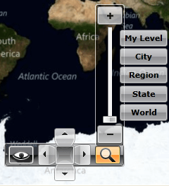
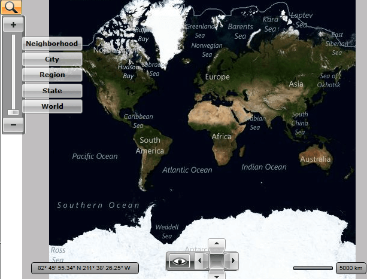

# Zoom Modes

## 

The __RadMap__ allows the user to zoom in and zoom out the content of the map. This is done via the Zoom Bar control in the Commands Bar panel. By clicking on the button with an icon representing a magnifier, the user is provided with different options to zoom in and zoom out. The main tool is the slider which allows the user to slide between the maximum and minimum zoom level. Together with the slider there are several zoom presets, which represent different ranges from the slider.

>tipTo change the zoom level programmatically you can change the value of the __ZoomLevel__ property of the __RadMap__.

>tipTo disable the mouse wheel zooming just set the __IsMouseWheelZoomEnabled__ property to __False__.

You are able to modify the preset Labels like this:

#### __C#__

{{region radmap-features-zoom-modes_0}}
	public MainPage()
    {
        InitializeComponent();
        this.radMap.InitializeCompleted += new EventHandler(radMap_InitializeCompleted);
    }
    private void radMap_InitializeCompleted(object sender, EventArgs e)
    {
        this.SetCustomZoomLevelLabel(18, "My Level");
    }

    private void SetCustomZoomLevelLabel(int zoomLevel, string label)
    {
        CommandDescription description = (from cmd in this.radMap.MapZoomBar.Commands
                                          where (int)cmd.CommandParameter == zoomLevel
                                          select cmd).FirstOrDefault();
        if (description != null)
        {
            RoutedUICommand command = description.Command as RoutedUICommand;
            if (command != null)
            {
                command.Text = label;
            }
        }
    }
	{{endregion}}

#### __VB.NET__

{{region radmap-features-zoom-modes_1}}
	Public Sub New()
	                  InitializeComponent()
	                  AddHandler radMap.InitializeCompleted, AddressOf radMap_InitializeCompleted
	   End Sub
	            Private Sub radMap_InitializeCompleted(ByVal sender As Object, ByVal e As EventArgs)
	                  Me.SetCustomZoomLevelLabel(18, "My Level")
	            End Sub
	
	            Private Sub SetCustomZoomLevelLabel(ByVal zoomLevel As Integer, ByVal label As String)
	                  Dim description As CommandDescription = (
	                      From cmd In Me.radMap.MapZoomBar.Commands
	                      Where CInt(Fix(cmd.CommandParameter)) = zoomLevel
	                      Select cmd).FirstOrDefault()
	                  If description IsNot Nothing Then
	                        Dim command As RoutedUICommand = TryCast(description.Command, RoutedUICommand)
	                        If command IsNot Nothing Then
	                              command.Text = label
	                        End If
	                  End If
	            End Sub
	{{endregion}}

Here is a snapshot of the result.

To disable the user from zooming, set the __ZoomBarVisibility__ property of the __RadMap__ to __Collapsed__. Additionally you have to disable the default zooming performed on double click or mouse wheel. To do this, set he __MouseDoubleClickMode__ to __None__ and the __IsMouseWheelZoomEnabled__ to __False__.

#### __XAML__

{{region radmap-features-zoom-modes_2}}
	<telerik:RadMap x:Name="radMap"
					ZoomBarVisibility="Collapsed"
	                IsMouseWheelZoomEnabled="False"
	                MouseDoubleClickMode="None">
	</telerik:RadMap>
	{{endregion}}

Note that the UI control is represented by the __MapZoomBar__ control. You are able to use it outside the __RadMap__ and place it somewhere around it. In this case you have to either hide the original one by using the __ZoomBarVisibility__ property of the __RadMap__ or the __UseDefaultLayout__ one.

>tipSetting the __UseDefaultLayout__ property to __False__ will hide all of the UI controls inside the __RadMap__. To learn more read [here]().

In order to use the __MapZoomBar__ outside the __RadMap__ you have to set its __MapControl__ property to the respective __RadMap__ instance. Here is an example:

#### __XAML__

{{region radmap-features-zoom-modes_3}}
	<StackPanel Orientation="Horizontal">
	    <telerik:MapZoomBar MapControl="{Binding ElementName=radMap}"
	                        VerticalAlignment="Top" />
	    <telerik:RadMap x:Name="radMap"
	                    Width="600"
	                    Height="480" VerticalAlignment="Top"
						ZoomBarVisibility="Collapsed">
	    </telerik:RadMap>
	</StackPanel>
	{{endregion}}

The snapshot of the result:

# See Also

 * [Navigation]()

 * [Click Modes]()

 * [Mouse Location]()

 * [Default Layout]()
