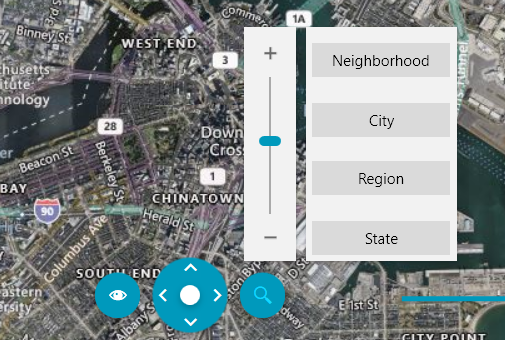
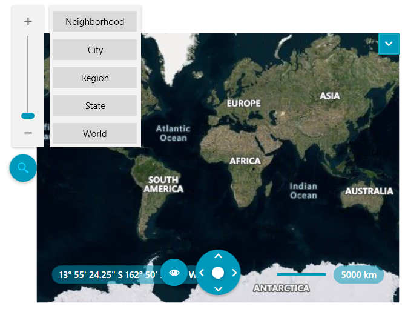
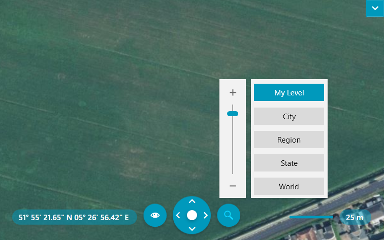

# {{ site.framework_name }} RadMap Zooming

The __RadMap__ allows the user to zoom in and zoom out the content of the map. 

This can be done via the **mouse wheel** or through the **Zoom Bar** control in the Commands Bar panel. 

## ZoomBar Control

By hovering on the button with an icon representing a **magnifier**, the user is provided with different options to zoom in and zoom out. The main tool is the **zoom slider** which allows the user to slide between the maximum and minimum zoom level. Together with the slider there are several **zoom presets**, which represent different ranges from the slider.

#### Figure 1: The ZoomBar control

## Zoom and ZoomLevel

You can also zoom in and out programmatically by using the **Zoom** and **ZoomLevel** properties.

The zoom level determines how much of the world is visible on a map. At low zoom levels, a small set of map tiles covers a large geographical area and vice versa. You can use the **ZoomLevel** property to set an **integer** value corresponding to the desired zoom level. If you want more precise zooming, you can set the **Zoom** property and assign a **double** value to it.

#### __[XAML] Example 1: Setting Zoom declaratively__
{{region xaml-radmap-features-zoom-modes_1}}
	<telerik:RadMap Zoom="8.2" />
{{endregion}}

## ZoomStep

By default, the control will zoom in and out by **one level**. You can enable smoother zooming by defining a smaller value as the **ZoomStep** property of the control. This will affect both the zooming initiated by the mouse wheel and the buttons of the zoom slider.

#### __[XAML] Example 2: Setting ZoomStep__
{{region radmap-features-zoom-modes_2}}
	<telerik:RadMap ZoomStep="0.2" />
{{endregion}}

## MinZoomLevel and MaxZoomLevel

Via the **MinZoomLevel** and **MaxZoomLevel** you can limit the zoom level between a certain interval.

#### __[XAML] Example 3: Setting MinZoomLevel and MaxZoomLevel__
{{region xaml-radmap-features-zoom-modes_3}}
	<telerik:RadMap MinZoomLevel="3" ZoomLevel="6" MaxZoomLevel="13" />
{{endregion}}

## MouseWheelMode

The MouseWheelMode property controls the behavior of the mouse wheel. It has three possible values:

* **ZoomToPoint**: Zooms to the location over the mouse pointer.
* **ZoomToCenter**: Zooms to the center of the current visible area.
* **None**: Disables zooming via the mouse wheel.

#### __[XAML] Example 4: Setting MouseWheelMode__
{{region xaml-radmap-features-zoom-modes_4}}
	<telerik:RadMap MouseWheelMode="None" />
{{endregion}}

## Disable Zooming

To disable the user from zooming, set the __ZoomBarVisibility__ property of the __RadMap__ to __Collapsed__. Additionally you have to disable the default zooming performed on double click or mouse wheel. To do this, set he __MouseDoubleClickMode__ and **MouseWheelMode** properties to __None__.

#### __[XAML] Example 5: Disabling zooming__
{{region radmap-features-zoom-modes_5}}
	<telerik:RadMap ZoomBarVisibility="Collapsed"
	                MouseWheelMode="None"
	                MouseDoubleClickMode="None" />
{{endregion}}

## ZoomBar outside of RadMap

Note that the UI control is represented by the __MapZoomBar__ control. You are able to use it outside the __RadMap__ and place it somewhere around it. In this case you have to either hide the original zoom bar by using the __ZoomBarVisibility__ property of the __RadMap__ or the __UseDefaultLayout__ one.

>tip Setting the __UseDefaultLayout__ property to __False__ will hide all of the UI controls inside the __RadMap__. To learn more read [here]().

In order to use the __MapZoomBar__ outside the __RadMap__ you have to also set its __MapControl__ property to the respective __RadMap__ instance. Here is an example:

#### __[XAML] Example 6: Placing the ZoomBar outside of the RadMap__
{{region xaml-radmap-features-zoom-modes_6}}
    <Grid>
        <Grid.ColumnDefinitions>
            <ColumnDefinition Width="Auto" />
            <ColumnDefinition Width="*" />
        </Grid.ColumnDefinitions>
        <telerik:MapZoomBar MapControl="{Binding ElementName=map}" />
        <telerik:RadMap Grid.Column="1" ZoomBarVisibility="Collapsed" />
    </Grid>
{{endregion}}

#### Figure 2: ZoomBar outside of RadMap

>Note that if you're using the StyleManager approach for theming the controls, you need to explicitly set the **StyleManager.Theme** property of the MapZoomBar as it cannot be inferred automatically with this setup.

## Hide Presets

You can hide the panel which holds the zoom presets by setting the **ZoomBarPresetsVisibility**.

#### __[XAML] Example 7: Placing the ZoomBar outside of the RadMap__
{{region xaml-radmap-features-zoom-modes_7}}
	<telerik:RadMap ZoomBarPresetsVisibility="Collapsed" />
{{endregion}}

## Change Default Presets

If you want to modify the default preset labels, you can get ahold of the respective **commands** of the MapZoomBar and change their **Text** as demonstrated in **Example 5**.

#### __[C#] Example 8: Changing the default preset labels__
{{region cs-radmap-features-zoom-modes_8}}
	public MainWindow()
    {
        InitializeComponent();
        this.map.InitializeCompleted += map_InitializeCompleted;
    }

    private void map_InitializeCompleted(object sender, EventArgs e)
    {
        this.SetCustomZoomLevelLabel(18, "My Level");
    }

    private void SetCustomZoomLevelLabel(int zoomLevel, string label)
    {
        CommandDescription description = (from cmd in this.map.MapZoomBar.Commands
                                          where (int)cmd.CommandParameter == zoomLevel
                                          select cmd).FirstOrDefault();
        if (description != null)
        {
            RoutedUICommand command = description.Command as RoutedUICommand;
            if (command != null)
            {
                command.Text = label;
            }
        }
    }
{{endregion}}

#### __[VB.NET] Example 8: Changing the default preset labels__
{{region vb-radmap-features-zoom-modes_8}}
	Public Sub New()
		InitializeComponent()
		AddHandler map.InitializeCompleted, AddressOf map_InitializeCompleted
	End Sub
	
	Private Sub map_InitializeCompleted(ByVal sender As Object, ByVal e As EventArgs)
		  Me.SetCustomZoomLevelLabel(18, "My Level")
	End Sub
	
	Private Sub SetCustomZoomLevelLabel(ByVal zoomLevel As Integer, ByVal label As String)
		  Dim description As CommandDescription = (
			  From cmd In Me.map.MapZoomBar.Commands
			  Where CInt(Fix(cmd.CommandParameter)) = zoomLevel
			  Select cmd).FirstOrDefault()
		  If description IsNot Nothing Then
				Dim command As RoutedUICommand = TryCast(description.Command, RoutedUICommand)
				If command IsNot Nothing Then
					  command.Text = label
				End If
		  End If
	End Sub
{{endregion}}

#### Figure 2: RadMap with a custom preset label

## Register New Presets

You can add your own custom presets by utilizing the **RegisterSetZoomLevelCommand** method of the **MapZoomBar** as shown in 

#### __[C#] Example 9: Registering new presets__
{{region cs-radmap-features-zoom-modes_9}}
	this.map.MapZoomBar.RegisterSetZoomLevelCommand(zoomLevel, label, presetDataTemplate, new Uri(imagePath, UriKind.RelativeOrAbsolute));
{{endregion}}

#### __[VB.NET] Example 9: Registering new presets__
{{region vb-radmap-features-zoom-modes_9}}
	Me.map.MapZoomBar.RegisterSetZoomLevelCommand(zoomLevel, label, presetDataTemplate, New Uri(imagePath, UriKind.RelativeOrAbsolute))
{{endregion}}

You can find a working example demonstrating how to achieve this in the "Command and Zoom Customization" demo from our [WPF Controls Examples](https://demos.telerik.com/wpf/)[Silverlight Controls Examples](https://demos.telerik.com/silverlight/#Map/Silverlight/CustomCommands) application.

## ZoomBarDropDownHeight

To change the height of the dropdown shown when hovering over the zoom bar, you can set the **ZoomBarDropDownHeight** property.

#### __[XAML] Example 10: Placing the ZoomBar outside of the RadMap__
{{region xaml-radmap-features-zoom-modes_10}}
	<telerik:RadMap ZoomBarDropDownHeight="300" />
{{endregion}}

## See Also
 * [Navigation]()
 * [Click Modes]()
 * [Mouse Location]()
 * [Default Layout]()