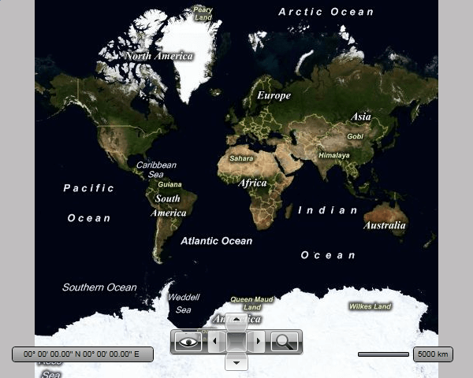

# Getting Started with Map

The `RadMap` control allows you to display rich geographical information from various sources, including Microsoft Azure Maps, as well as to overlay the map with your own custom data. This topic will help you to quickly get started using the control. It will focus on the following:      

## Adding Telerik Assemblies Using NuGet

To use RadMap when working with NuGet packages, install the `Telerik.Windows.Controls.DataVisualization.for.Wpf.Xaml` package. The [package name may vary]() slightly based on the Telerik dlls set - [Xaml or NoXaml]()

Read more about NuGet installation in the [Installing UI for WPF from NuGet Package]() article.

>tip With the 2025 Q1 release, the Telerik UI for WPF has a new licensing mechanism. You can learn more about it [here]().

## Adding Assembly References Manually

If you are not using NuGet packages, you can add a reference to the following assemblies:

* __Telerik.Licensing.Runtime__
* __Telerik.Windows.Controls__
* __Telerik.Windows.Controls.DataVisualization__
* __Telerik.Windows.Data__

>For __.NET 6__ and later you will need to install also the `System.ServiceModel.Http` NuGet package. This is __required only if the Telerik assemblies are referenced manually__ in the project. In case you install the dlls using NuGet or the Telerik Visual Studio Extension, this package is included automatically.

You can find the required assemblies for each control from the suite in the[Controls Dependencies]() help article.

## Creating a RadMap

After adding references to the aforementioned dlls, you can declare a new RadMap instance.        

#### __[XAML] Defining map in XAML__
{{region radmap-getting-started_0}}
   	<UserControl xmlns:telerik="http://schemas.telerik.com/2008/xaml/presentation">
		<Grid x:Name="LayoutRoot">
			<telerik:RadMap x:Name="radMap" />
		</Grid>
	</UserControl> 
{{endregion}}

## Specifying a Provider

The RadMap control doesn't display a map on itself, it needs a map provider from which to consume the required data. Currently the RadMap control supports a few providers out of the box:        

* [Azure Maps]() 
* [OpenStreet Maps](#openstreet-maps) 
* [ArcGIS Online]() 
* [Empty Provider]() 
* [URI Image provider]() 
* __WMS__

This example will use Azure Maps as its provider. In order to do that you have to set the `Provider` property of the RadMap to the built-in `AzureMapProvider` class.        

#### __[XAML] Specifying a provider to the RadMap control__
{{region radmap-getting-started_1}}
	<UserControl xmlns:telerik="http://schemas.telerik.com/2008/xaml/presentation">
		<Grid x:Name="LayoutRoot">
			<telerik:RadMap x:Name="radMap">
				<telerik:RadMap.Provider>
					<telerik:AzureMapProvider SubscriptionKey="Azure_Maps_Subscription_Key"/>
				</telerik:RadMap.Provider>
			</telerik:RadMap>
		</Grid>
	</UserControl> 
{{endregion}}        

>important To use the Azure Maps with the RadMap control, you have to provide a valid subscription key. To learn how to obtain such a key, read [this topic](https://learn.microsoft.com/en-us/azure/azure-maps/how-to-manage-account-keys). Note that the Azure Map will not appear in your RadMap control, without supplying a valid subscription key.          

After specifying the provider, you should be able to see the respective map appear in the RadMap control.

## Displaying Data

You are able to display data on the top of the visualized map. The data may be represented by any framework element or map shape objects. This can be accomplished via the RadMap's layers.        

There are two visualization engines in the RadMap package:

* The old implementation of the map objects' (points and shapes) visualization consists of three layers: `InformationLayer`, `DynamicLayer` and `VirtualizationLayer`. This visualization engine, however, lacks certain features and has a few performance issues.     

The major goals of the new engine are:

* Improve the performance of the data visualization.

* Allow reading map shapes from different sources (KML, ESRI, and SQL Geospatial) in the background thread.

* Integrating clustering and items virtualization into the core. This simplifies the usage of both features.

* Ability to attach/detach almost any input event available for the FrameworkElement to the map shape visualization.

* Support of items selection in the engine core.

To learn more about the layers and how to display the different types of elements in them, please read the [Visualization layer]() section.

## Setting a Theme

The controls from our suite support different themes. You can see how to apply a theme different than the default one in the [Setting a Theme]() help article.

>important Changing the theme using implicit styles will affect all controls that have styles defined in the merged resource dictionaries. This is applicable only for the controls in the scope in which the resources are merged. 


## Telerik UI for WPF Learning Resources

* [Telerik UI for WPF Map  Component](https://www.telerik.com/products/wpf/map.aspx)
* [Getting Started with Telerik UI for WPF Components]()
* [Telerik UI for WPF Installation]()
* [Telerik UI for WPF and WinForms Integration]()
* [Telerik UI for WPF Visual Studio Templates]()
* [Setting a Theme with Telerik UI for WPF]()
* [Telerik UI for WPF Virtual Classroom (Training Courses for Registered Users)](https://learn.telerik.com/learn/course/external/view/elearning/16/telerik-ui-for-wpf) 
* [Telerik UI for WPF License Agreement](https://www.telerik.com/purchase/license-agreement/wpf-dlw-s)


## See Also

 * [Overview]()
 * [Visual Structure]()
