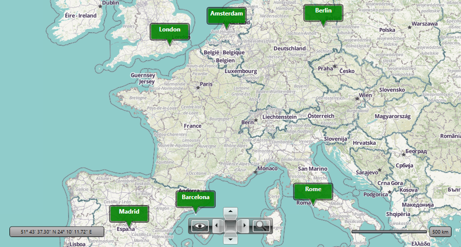

# Wraparound with Virtualization in VisualizationLayer

When using wraparound functionality, the virtualization of the RadMap control needs to be further customized.

	

In order to enable the UI Virtualization feature, you should configure the ZoomLevelGridList object and you should set the VirtualizationSource property of the [Visualization Layer](). The ZoomLevelGridList property allows dividing the map into regions. The data provided to the VisualizationLayer should be wrapped in a class that implements the __IMapItemsVirtualizationSource__ interface. This interface contains a __MapItemsRequest()__ method, which is used by the __VisualizationLayer__ to request new data whenever the ZoomLevel or Center properties of the RadMap control are changed. The event arguments are of type __MapItemsRequestEventArgs__ which give you the currently visible area of the map. This method generally serves as an event handler and you have to calculate and decide which objects to be displayed in the given viewport. 

In WrapAround mode, this portion will have Longitude value exceeding the valid geographical boundaries (-180; 180). The RadMap control provides public methods which you can use to normalize such locations. You can take a look a the [Location Conversion]() section in the WrapAround help article.

In the next part of this article, we will display points of interest (POIs) over the cities (Berlin, London, Amsterdam, Madrid, Barcelona, Rome) in the map in MVVM scenario and set the virtualization when the wraparound mode of the map is on. In __Example 1__ we will specify the business object which will hold the Longitude, Latitude values, the name of the cities and their location.

#### __[C#] Example 1:  Business object__
{{region c#-radmap-radmap-howto-wraparound-virtualization-visualizationlayer_0}}
	public class CityLocation : ViewModelBase
    {
        private double \_lattitude;
        private double \_longitude;
        private string \_cityName;
        public CityLocation(double latitude, double longitude, string cityName)
        {
            this.Latitude = latitude;
            this.Longitude = longitude;
            this.CityName = cityName;
        }

        public double Latitude
        {
            get
            {
                return this.\_lattitude;
            }
            set
            {
                Location old = this.Location;
                this.\_lattitude = value;
                this.OnPropertyChanged("Latitude");
                this.OnPropertyChanged("Location");
            }
        }

        public double Longitude
        {
            get
            {
                return this.\_longitude;
            }
            set
            {
                Location old = this.Location;

                this.\_longitude = value;
                this.OnPropertyChanged("Longitude");
                this.OnPropertyChanged("Location");
            }
        }

        public Location Location
        {
            get
            {
                return new Location(this.Latitude, this.Longitude);
            }
        }

        public string CityName
        {
            get
            {
                return this.\_cityName;
            }
            set
            {
                this.\_cityName = value;
                this.OnPropertyChanged("CityName");
            }
        }
    }
{{endregion}}

Then you can create custom class which implement the __IMapItemsVirtualizationSource__ interface. In the handler of the __MapItemRequest()__ event you can get the __LocationRect__ region from the arguments and normalize the region by using GetCoercedLocation method of RadMap. Then you need to calculate which cities should be displayed in the normalized region.

#### __[C#] Example 2: Custom class__
{{region c#-radmap-radmap-howto-wraparound-virtualization-visualizationlayer_1}}
	public class VirtualizationSource : IMapItemsVirtualizationSource
    {
        private bool isFirstRequest = true;
        private RadMap map;
        private ExampleViewModel dataContext;

        public VirtualizationSource(ExampleViewModel dataContext)
        {
            this.dataContext = dataContext;
        }

        public void MapItemsRequest(object sender, MapItemsRequestEventArgs eventArgs)
        {
            if (this.isFirstRequest)
            {
                this.map = eventArgs.Layer.MapControl;
                this.isFirstRequest = false;
            }

            double minZoom = eventArgs.MinZoom;
            // Coercing (normalizing) the map portion of the request in normal [-180; 180] longitude range.
            Location upperLeft = map.GetCoercedLocation(eventArgs.UpperLeft);
            Location lowerRight = map.GetCoercedLocation(eventArgs.LowerRight);

            if (this.dataContext == null)
                return;
            List<CityLocation> list = this.dataContext.GetCities(
                  upperLeft.Latitude,
                  upperLeft.Longitude,
                  lowerRight.Latitude,
                  lowerRight.Longitude);
            dataContext.SetCities(list, eventArgs);
        }
    }
{{endregion}}

In the ViewModel we shift the locations by shifting their longitudes using __SetCities()__ and __TryGetLongitudeMatchInRange()__ methods.

#### __[C#] Example 3: Create view model__
{{region c#-radmap-radmap-howto-wraparound-virtualization-visualizationlayer_2}}
	public class ExampleViewModel : ViewModelBase
	{
		private MapProviderBase mapProvider;
		public List<CityLocation> PinLocations { get; set; }
		public ExampleViewModel()
		{
			SetProvider();
			this.ZoomLevel = 3;
			this.Center = new Location(52.5243700, 13.4105300);
			PinLocations = new List<CityLocation>();
			GetLocations();
		}

		private void GetLocations()
		{
			PinLocations.Add(new CityLocation(52.52437, 13.41053, "Berlin"));
			PinLocations.Add(new CityLocation(51.50853, -0.12574,"London"));
			PinLocations.Add(new CityLocation(52.37403, 4.88969, "Amsterdam"));
			PinLocations.Add(new CityLocation(40.41650, -3.70256, "Madrid"));
			PinLocations.Add(new CityLocation(41.38879, 2.15899, "Barcelona"));
			PinLocations.Add(new CityLocation(41.89193, 12.51133, "Rome"));           
		}

		private void SetProvider()
		{
			OpenStreetMapProvider provider = new OpenStreetMapProvider();
			provider.Layer = OpenStreetMapLayer.Humanitarian;
			this.mapProvider = provider;
		}

		public MapProviderBase Provider
		{
			get
			{
				return this.mapProvider;
			}
		}

		private int \_zoomLevel;
		public int ZoomLevel
		{
			get
			{
				return this.\_zoomLevel;
			}
			set
			{
				if (this.\_zoomLevel != value)
				{
					this.\_zoomLevel = value;
					this.OnPropertyChanged("ZoomLevel");
				}
			}
		}

		private Location \_center;
		public Location Center
		{
			get
			{
				return this.\_center;
			}
			set
			{
				if (this.\_center != value)
				{
					this.\_center = value;
					this.OnPropertyChanged("Center");
				}
			}
		}
		public List<CityLocation> GetCities(double upperLeftLat, double upperLeftLong, double lowerRightLat, double lowerRightLong)
		{
			List<CityLocation> locations = new List<CityLocation>();  

			var latLonCondition = PinLocations.Where(x=>
			x.Latitude < upperLeftLat && 
			x.Latitude > lowerRightLat &&
			x.Longitude >upperLeftLong &&
			x.Longitude < lowerRightLong
			);           
			foreach (var item in latLonCondition)
			{
				locations.Add(new CityLocation(item.Latitude,item.Longitude,item.CityName));
			}              
			return locations;

		}
		/// 

		/// Callback of the GetCities async call.
		/// The method uses the web service response to building objects on the dynamic layer.
		/// 

		internal void SetCities(List<CityLocation> list, MapItemsRequestEventArgs request)
		{
			if (list.Count == 0)
				return;
			// Shifts the cities to the current portion of the request.
			foreach (CityLocation cityLocation in list)
			{
				// Shifts the city to the current portion of the request.
				cityLocation.Longitude = this.TryGetLongitudeMatchInRange(cityLocation.Longitude, request.UpperLeft.Longitude, request.LowerRight.Longitude);
			}
			request.CompleteItemsRequest(list);
		}

		private double TryGetLongitudeMatchInRange(double longitude, double left, double right)
		{
			if (left <= longitude && longitude <= right)
				return longitude;

			double range = this.mapProvider.SpatialReference.MaxLongitude - this.mapProvider.SpatialReference.MinLongitude;

			while (longitude < left)
			{
				longitude += range;
			}
			while (longitude > right)
			{
				longitude -= range;
			}
			return longitude;
		}
	}
{{endregion}}

Then you can declare the RadMap control in XAML where you can specify custom __DataTemplate__ for the POI and then you can set it to the ItemTemplate property of the __VisualizationLayer__.

#### __[XAML] Example 4: Declare RadMap in XAML__
{{region c#-radmap-radmap-howto-wraparound-virtualization-visualizationlayer_3}}
    <Window.Resources>
		<local:ExampleViewModel x:Key="ViewModel" />
		<DataTemplate x:Key="pointTemplate">
			<Canvas Width="80" 
						Height="35" 
						VerticalAlignment="Top"
						HorizontalAlignment="Center"
						Opacity="0.9"
						telerik:MapLayer.Location="{Binding Location}">
				<Border Width="80" 
							Height="35" 
							BorderBrush="Black" 
							BorderThickness="1" 
							CornerRadius="4">
					<Border Background="Green" 
								BorderBrush="#7F000000" 
								BorderThickness="2" 
								CornerRadius="3">
						<Grid Margin="15,0,15,-18" 
								  VerticalAlignment="Bottom" 
								  Height="22" 
								  HorizontalAlignment="Center" Width="15">
							<Path Stroke="White" 
									  Stretch="Fill" 
									  Margin="0,6,0,0" 
									  Data="M0.5,0.5 L15.5,0.5 8.160662,15.5 z"/>
							<Path Margin="0,3" 
									  Data="M0.5,0.5 L15.5,0.5 8.160662,15.5 z" 
									  StrokeThickness="2"
									  Stroke="#7F000000"  />
							<Path Stretch="Fill" 
									  Margin="0,0,0,6" 
									  Fill="Green" 
									  Data="M0.5,0.5 L15.5,0.5 8.160662,15.5 z"  />
						</Grid>
					</Border>
				</Border>
				<Grid Width="80">
					<TextBlock TextWrapping="Wrap"
								   HorizontalAlignment="Center"
								   FontSize="12" 
								   FontWeight="Bold" 
								   Foreground="White"
								   Margin="4" 
								   TextAlignment="Center" 
								   Text="{Binding CityName}" />
				</Grid>
			</Canvas>
		</DataTemplate>
	</Window.Resources>
    <Grid x:Name="LayoutRoot" 
		  DataContext="{StaticResource ViewModel}">
        <telerik:RadMap x:Name="radMap" WrapAround="True"
			            Provider="{Binding Provider}"
                        Center="{Binding Center, Mode=TwoWay}" 
                        ZoomLevel="{Binding ZoomLevel, Mode=TwoWay}"                         
                        MiniMapExpanderVisibility="Collapsed">
         
            <telerik:VisualizationLayer Name="visualizationLayer" 
                                        ItemTemplate="{StaticResource pointTemplate}">
                <telerik:VisualizationLayer.ZoomLevelGridList>
                    <telerik:ZoomLevelGrid MinZoom="3" />
                    <telerik:ZoomLevelGrid MinZoom="9" />
                </telerik:VisualizationLayer.ZoomLevelGridList>
            </telerik:VisualizationLayer>
        </telerik:RadMap>
    </Grid>
{{endregion}}

The final step is to set the custom __VirtualizationSource__ class to the __VirtualizationSource__ property of the __VisualizationLayer__.  You can check __Example 5__.

#### __[C#] Example 5: Set the custom VirtualizationSource class to the VirtualizationSource property__
{{region c#-radmap-radmap-howto-wraparound-virtualization-visualizationlayer_4}}
	public MainWindow()
	{
		InitializeComponent();
		this.visualizationLayer.VirtualizationSource = new VirtualizationSource(this.LayoutRoot.DataContext as ExampleViewModel);
	}
{{endregion}}

Similar and more complex example you can find in our [GitHub repository](https://github.com/telerik/xaml-sdk/tree/master/Map/WPF/WrapAroundAndVirtualization).

## See Also
 * [VisualizationLayer - Introduction]()
 * [Wraparound] () 
