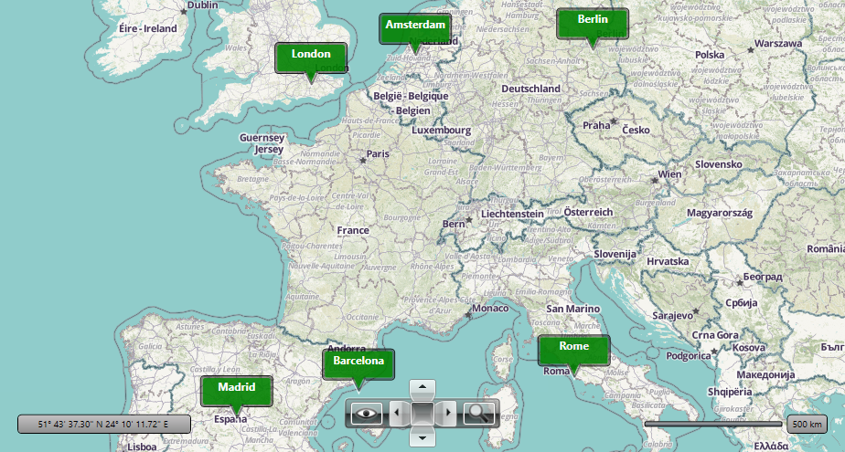

# Wraparound with Virtualization in VisualizationLayer

When using wraparound functionality, the virtualization of the RadMap control needs to be further customized.

	

In order to enable the UI Virtualization feature, you should configure the ZoomLevelGridList object and you should set the VirtualizationSource property of the [Visualization Layer](). The ZoomLevelGridList property allows dividing the map into regions. The data provided to the VisualizationLayer should be wrapped in a class that implements the __IMapItemsVirtualizationSource__ interface. This interface contains a __MapItemsRequest()__ method, which is used by the __VisualizationLayer__ to request new data whenever the ZoomLevel or Center properties of the RadMap control are changed. The event arguments are of type __MapItemsRequestEventArgs__ which give you the currently visible area of the map. This method generally serves as an event handler and you have to calculate and decide which objects to be displayed in the given viewport. 

In WrapAround mode, this portion will have Longitude value exceeding the valid geographical boundaries (-180; 180). The RadMap control provides public methods which you can use to normalize such locations. You can take a look a the [Location Conversion]() section in the WrapAround help article.

In the next part of this article, we will display points of interest (POIs) over the cities (Berlin, London, Amsterdam, Madrid, Barcelona, Rome) in the map in MVVM scenario and set the virtualization when the wraparound mode of the map is on. In __Example 1__ we will specify the business object which will hold the Longitude, Latitude values, the name of the cities and their location.

__Example 1:  Business object__
<snippet id='radmap-how-to-howto-wraparound-virtualization-visualizationlayer-block_1-cs' />

Then you can create custom class which implement the __IMapItemsVirtualizationSource__ interface. In the handler of the __MapItemRequest()__ event you can get the __LocationRect__ region from the arguments and normalize the region by using GetCoercedLocation method of RadMap. Then you need to calculate which cities should be displayed in the normalized region.

__Example 2: Custom class__
<snippet id='radmap-how-to-howto-wraparound-virtualization-visualizationlayer-block_2-cs' />

In the ViewModel we shift the locations by shifting their longitudes using __SetCities()__ and __TryGetLongitudeMatchInRange()__ methods.

__Example 3: Create view model__
<snippet id='radmap-how-to-howto-wraparound-virtualization-visualizationlayer-block_3-cs' />

Then you can declare the RadMap control in XAML where you can specify custom __DataTemplate__ for the POI and then you can set it to the ItemTemplate property of the __VisualizationLayer__.

__Example 4: Declare RadMap in XAML__
<snippet id='radmap-how-to-howto-wraparound-virtualization-visualizationlayer-block_4-xaml' />

The final step is to set the custom __VirtualizationSource__ class to the __VirtualizationSource__ property of the __VisualizationLayer__.  You can check __Example 5__.

__Example 5: Set the custom VirtualizationSource class to the VirtualizationSource property__
<snippet id='radmap-how-to-howto-wraparound-virtualization-visualizationlayer-block_5-cs' />

Similar and more complex example you can find in our [GitHub repository](https://github.com/telerik/xaml-sdk/tree/master/Map/WPF/WrapAroundAndVirtualization).

## See Also
 * [VisualizationLayer - Introduction]()
 * [Wraparound] () 