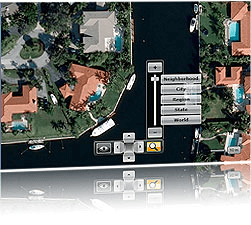

# {{ site.framework_name }} Map Overview

Thank you for choosing Telerik __RadMap__!        

Visualize rich geographical information with Telerik __RadMap__, zoom and pan smoothly to any corner of the earth. If you want to give geographical context to your data – that’s easy. __RadMap__ allows adding any elements or shapes to it. The control supports items virtualization through web services to guarantee blazing fast performance.        





__RadMap's__ key features include:        

* __Map Sources__ - with Telerik __RadMap__ you can visualize rich geographical information from external geo imagery sources. Currently the __RadMap__ supports Azure Map Source, empty provider, OpenStreetMap provider and also offers custom provider extensibility options.          

* __Pan and Zoom__ - Telerik __RadMap__ supports panning and zooming through the mouse, the keyboard and the navigational controls.          

* __Map Views__ - Telerik __RadMap__ provides 3 different views: Road View, Aerial View and Bird’s Eye View.          

* __Navigation Controls__ - __RadMap__ has 3 navigation controls which give your users more flexibility when using the control: navigation control, command bar for switching between the three views of the map and zoom bar control for switching the zoom level. Also, __RadMap__ provides out-of-the-box scale control so you can easily track the distance on the currently selected zoom level.          

* __Information Layer__ - the information layer allows you to add any __FrameworkElements__ and __MapShape__ objects on the map, setting their geographical coordinates. For example you can use pie charts that visualize a city’s demographics in terms of age groups and show the charts on the map, linking the charts to the respective cities.          

* __Dynamic Layer__- the dynamic layer takes the information layer one step further allowing items virtualization using web services. This means that items are only loaded when the region of the map they belong to is visible. The result is a blazing fast __RadMap__.          

* __KML Data Import__- __RadMap__ provides support for stunning map overlays through its KML-import feature.  Once you have the desired set of features (place marks, images, polygons, textual descriptions, etc.) encoded in KML, you can easily import the data and visualize it through the __RadMap__ control.

* __Routing__ - the control provides Azure Maps routing support.          

* __Geocode__ - __RadMap__ has Azure Maps geocoding support.          

Do not miss the online demos at: [https://demos.telerik.com/silverlight/#Map/SalesDashboard](https://demos.telerik.com/silverlight/#Map/SalesDashboard)[https://demos.telerik.com/wpf/#Map/SalesDashboard](https://demos.telerik.com/wpf/#Map/SalesDashboard)


## Telerik UI for WPF Support and Learning Resources

* [Telerik UI for WPF Map  Homepage](https://www.telerik.com/products/wpf/map.aspx)
* [Get Started with the Telerik UI for WPF Map ]()
* [Telerik UI for WPF API Reference](https://docs.telerik.com/devtools/wpf/api/)
* [Getting Started with Telerik UI for WPF Components]()
* [Telerik UI for WPF Virtual Classroom (Training Courses for Registered Users)](https://learn.telerik.com/learn/course/external/view/elearning/16/telerik-ui-for-wpf) 
* [Telerik UI for WPF Map  Forums](https://www.telerik.com/forums/wpf)
* [Telerik UI for WPF Knowledge Base](https://docs.telerik.com/devtools/wpf/knowledge-base)


## See Also
 * [Visual Structure]()
 * [Getting Started]()
 * [Styles and Templates]()
 * [Events]()
