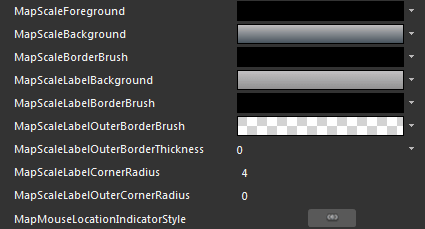
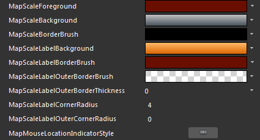
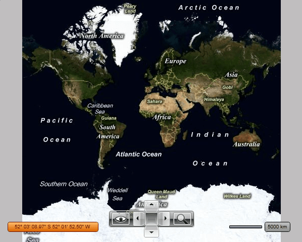

# Styling the MapMouseLocationIndicator

The __MapMouseLocationIndicator__exposes a __Style__ property which allows you to apply a style to it and modify its appearance.

You have two options:

* To create an empty style and set it up on your own. 

* To copy the default style of the control and modify it.

This topic will show you how to perform the second one.

## Modifying the Default Style

>tipAs the __MapMouseLocationIndicator__control is part of the template of the __RadMap__, you can edit the __RadMap's__ template and directly style that instance of the control. More about styling the __RadMap__ can be found [here]().

To copy the default styles, load your project in Expression Blend and open the User Control that holds the __MapMouseLocationIndicator__. In the 'Objects and Timeline' pane, select the __MapMouseLocationIndicator__that you want to style. From the menu choose *Object -> Edit Style -> Edit a Copy*. You will be prompted for the name of the style and where to be placed.

>tipIf you choose to define the style in Application, it would be available for the entire application. This allows you to define a style only once and then reuse it where needed.

After clicking 'OK', Expression Blend will generate the default style of the __MapMouseLocationIndicator__control in the __Resources__ section of your User Control. The properties available for the style will be loaded in the 'Properties' pane and you will be able to modify their default values. You can also edit the generated XAML in the XAML View or in Visual Studio.

If you go to the 'Resources' pane, you will see an editable list of resources generated together with the style and used by it. In this list you will find the brushes, styles and templates needed to change the visual appearance of the __MapMouseLocationIndicator____.__ Their names indicate to which part of the __MapMouseLocationIndicator__appearance they are assigned.

         
      

* __MapScaleForeground__ - a brush that represents the foreground color of the control.

* __MapScaleLabelBackground__ - a brush that represents the background color of control.

* __MapScaleLabelBorderBrush__ - a brush that represents the inner border color of the control.

* __MapScaleLabelOuterBorderBrush__ - a brush that represents the outer border color of the control.

* __MapScaleLabelOuterBorderThickness__ - represents the thickness of the outer border of the control.

* __MapScaleLabelCornerRadius__ - represents the corner radius of the inner border of the control.

* __MapScaleLabelOuterCornerRadius__ - represents the corner radius of the outer border of the control.

* __MapMouseLocationIndicatorStyle__ - represents the __Style__ applied to the __MapMouseLocationIndicator__control.

Here is an example of these resources modified:

         
      

And here is a snapshot of the result.

         
      

# See Also

 * [Template Structure]()

 * [Styling the RadMap]()

 * [Styling the MapCommandBar]()

 * [Styling the MapNavigation]()

 * [Styling the MapZoomBar]()

 * [Styling the MapScale]()
