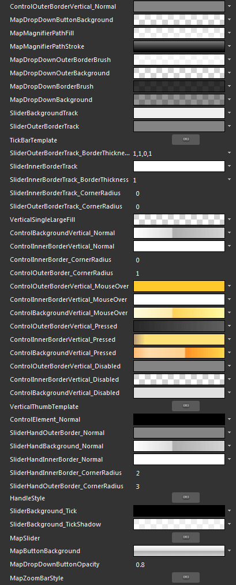
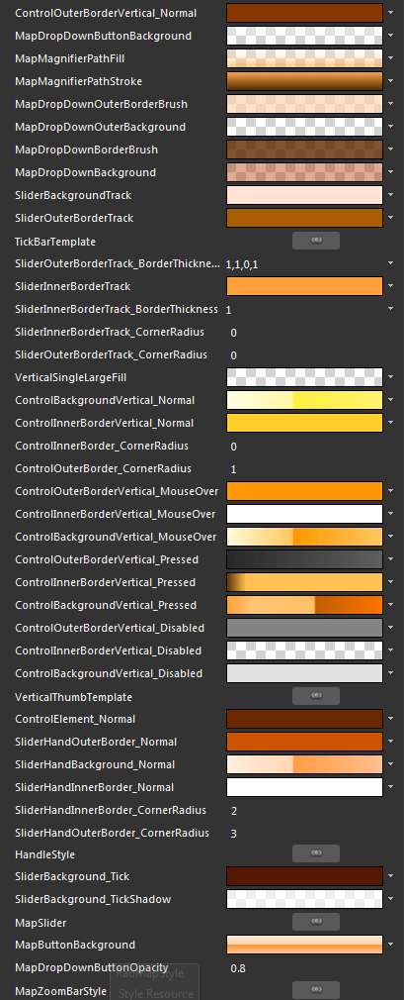
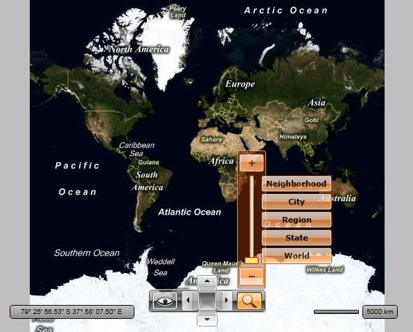

# Styling the MapZoomBar

The __MapZoomBar__ exposes a __Style__ property which allows you to apply a style to it and modify its appearance.

You have two options:

* To create an empty style and set it up on your own. 

* To copy the default style of the control and modify it.

This topic will show you how to perform the second one.

## Modifying the Default Style

>tipAs the __MapZoomBar__ control is part of the template of the __RadMap__, you can edit the __RadMap's__ template and directly style that instance of the control. More about styling the __RadMap__ can be found [here]().

To copy the default styles, load your project in Expression Blend and open the User Control that holds the __MapZoomBar__. In the 'Objects and Timeline' pane, select the __MapZoomBar__ you want to style. From the menu choose *Object -> Edit Style -> Edit a Copy*. You will be prompted for the name of the style and where to be placed.

>tipIf you choose to define the style in Application, it would be available for the entire application. This allows you to define a style only once and then reuse it where needed.

After clicking 'OK', Expression Blend will generate the default style of the __MapZoomBar__ control in the __Resources__ section of your User Control. The properties available for the style will be loaded in the 'Properties' pane and you will be able to modify their default values. You can also edit the generated XAML in the XAML View or in Visual Studio.

If you go to the 'Resources' pane, you will see an editable list of resources generated together with the style and used by it. In this list you will find the brushes, styles and templates needed to change the visual appearance of the __MapZoomBar__. Their names indicate to which part of the __MapZoomBar__ appearance they are assigned.

>To change the button's default toggled and hover colors, you have to edit their default styles.



* __ControlOuterBorderVertical_Normal__ - a brush that represents the outer border color of the drop down button, the preset buttons and the slider thumb.

* __MapDropDownButtonBackground__- a brush that represents the background color of the drop down button.

* __MapMagnifierPathFill__ - a brush that represents the fill color of the magnifier shape.

* __MapMagnifierPathStroke__ - a brush that represents the stroke color of the magnifier shape.

* __MapDropDownOuterBorderBrush__ - a brush that represents the outer border color of the drop down area.

* __MapDropDownOuterBackground__ - a brush that represents the outer background color of the drop down area.

* __MapDropDownBorderBrush__ - a brush that represents the inner border color of the drop down area.

* __MapDropDownBackground__ - a brush that represents the inner background color of the drop down area.

* __SliderBackgroundTrack__ - a brush that represents the background color of the slider tracker.

* __SlideOuterBorderTrack__ - a brush that represents the outer border of the slider track.

* __TickBarTemplate__ - represents the ControlTemplate for the slider tracker.

* __SliderOuterBorderTrack_BorderThickness__ - represents the thickness of the outer border of the slider track.

* __SliderInnerBorderTrack__ - a brush that represents the inner border color of the slider track.

* __SliderInnerBorderTrack_BorderThickness__ - represents the thickness of the inner border of the slider track.

* __SliderInnerBorderTrack_CornerRadius__ - represents the corner radius of the inner border of the slider track.

* __SliderOuterBorderTrack_CornerRadius__ - represents the corner radius of the outer border of the slider track.

* __ControlBackgroundVertical_Normal__ - a brush that represents the background color of the slider thumb in its normal state.

* __ControlInnerBorderVertical_Normal__ - a brush that represents the inner border color of the slider thumb in its normal state.

* __ControlInnerBorder_CornerRadius__ - represents the corner radius of the inner border of the slider thumb.

* __ControlOuterBorder_CornerRadius__ - represents the corner radius of the outer border of the slider thumb.

* __ControlOuterBorderVertical_MouseOver__ - a brush that represents the outer border color of the slider thumb, when the mouse is over it.

* __ControlInnerBorderVertical_MouseOver__ - a brush that represents the inner border color of the slider thumb, when the mouse is over it.

* __ControlBackgroundVertical_MouseOver__ - a brush that represents the background color of the slider thumb, when the mouse is over it.

* __ControlOuterBorderVertical_Pressed__ - a brush that represents the outer border color of the slider thumb, when it gets pressed.

* __ControlInnerBorderVertical_Pressed__ - a brush that represents the inner border color of the slider thumb, when it gets pressed.

* __ControlBackgroundVertical_Pressed__ - a brush that represents the background color of the slider thumb, when it gets pressed.

* __ControlOuterBorderVertical_Disabled__ - a brush that represents the outer border color of the slider thumb, when it is disabled.

* __ControlInnerBorderVertical_Disabled__ - a brush that represents the inner border color of the slider thumb, when it is disabled.

* __ControlBackgroundVertical_Disabled__ - a brush that represents the background color of the slider thumb, when it is disabled.

* __VerticalThumbTemplate__ - represents the __ControlTemplate__ for the slider thumb.

* __ControlElement_Normal__ - a brush that represents the foreground color of the two zoom buttons.

* __SliderHandOuterBorder_Normal__ - a brush that represents the outer border color of the two zoom buttons.

* __SliderHandBackground_Normal__ - a brush that represents the background color of the two zoom buttons.

* __SliderHandInnerBorder_Normal__ - a brush that represents the inner border color of the two zoom buttons.

* __SliderHandInnerBorder_CornerRadius__ - represents the corner radius of the inner border of the two zoom buttons.

* __SliderHandOuterBorder_CornerRadius__ - represents the corner radius of the outer border of the two zoom buttons.

* __HandleStyle__ - represents the __Style__ applied to the two zoom buttons.

* __SliderBackgroundTick__ - a brush that represents the background color of the slider ticks.

* __SliderBackground_TickShadow__ - a brush that represents the color of the tick's shadow.

* __MapSlider__ - represents the __Style__ applied to the __MapSlider__.

* __MapDropDownButtonOpacity__ - represents the opacity of the drop down button.

* __MapZoomBarStyle__ - represents the __Style__ applied to the __MapZoomBar__. 

Here is an example of these resources modified:



And here is a snapshot of the result.



# See Also

 * [Template Structure]()

 * [Styling the RadMap]()

 * [Styling the MapCommandBar]()

 * [Styling the MapNavigation]()

 * [Styling the MapScale]()

 * [Styling the MapMouseLocationIndicator]()
