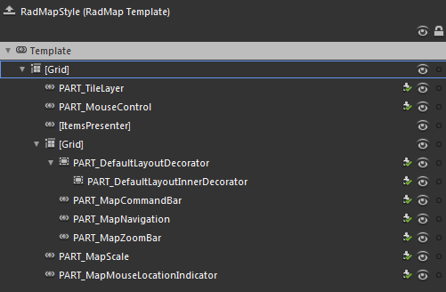
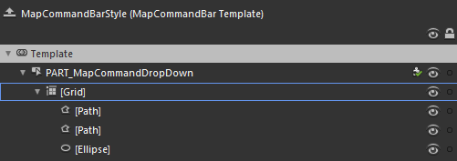
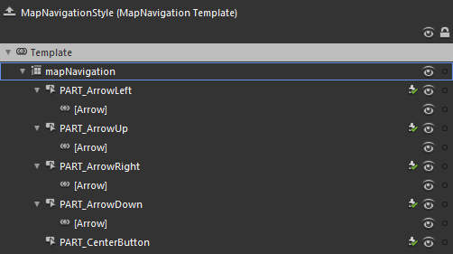
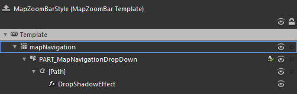
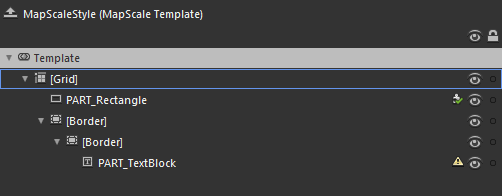
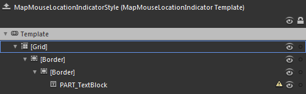

# Template Structure

Like most controls, the __RadMap__ also allows you to template it in order to change the control from the inside. Except for templating the whole control, you can also template parts of it. This topic will make you familiar with the template structures of the:

* [RadMap](#RadMap)

* [MapCommandBar](#MapCommandBar)

* [MapNavigation](#MapNavigation)

* [MapZoomBar](#MapZoomBar)

* [MapScale](#MapScale)

* [MapMouseLocationIndicator](#MapMouseLocationIndicator)

>For more information about templating and how to modify the default templates of the __RadControls__ read [the common topics](http://www.telerik.com/help/silverlight/common-styling-appearance-edit-control-templates-blend.html) on this matter.

## RadMap

         
      

* __[Grid]__ - layouts the elements of the __RadMap's__ template and is of type __Grid__.

* __PART_TileLayer__ - represents the control responsible for the displaying of the map tiles and is of type __TileLayer__.

* __PART_MouseControl__ - represents the control responsible for handling the mouse actions and is of type __MouseControl__.

* __[ItemsPresenter]__ - holds and displays the items of the __RadMap__ - __InformationLayers__ and __DynamicLayers__.

* __[Grid]__ - layouts the zoom, navigation and view commands controls and is of type __Grid__.

* __PART_DefaultLayoutDecorator__ - represents the outer border of the control bar and is of type __Border__.

* __PART_DefaultLayoutInnerDecorator__ - represents the inner border and the background of the control bar and is of type __Border__.

* __PART_MapCommandBar__ - represents the control responsible for the view commands and is of type __MapCommandBar__.

* __PART_MapNavigation__ - represents the control responsible for the navigation and is of type __MapNavigation__.

* __PART_MapZoomBar__ - represents the control responsible for the zooming and is of type __MapZoomBar__.

* __PART_MapScale__ - represents the control displaying the current scale and distance values and is of type __MapScale__.

* __PART_MapMouseLocationIndicator__ - represents the control that displays the current mouse location in geographical or numerical format and is of type __MapMouseLocationIndicator__.

## MapCommandBar

         
      

* __PART_MapCommandDropDown__ - represents the __CommandBar__ and is of type __RadDropDownButton__. In order to change the appearance of the popup, modify the value of its __DropDownContent__ property.

* __[Grid]__ - layouts the elements responsible for the button's icon and is of type __Grid__.

* __[Path]__ - represents part of the button's icon and is of type __Path__.

* __[Path]__ - represents part of the button's icon and is of type __Path__.

* __[Ellipse]__ - represents part of the button's icon and is of type __Ellipse__.

## MapNavigation

         
      

* __mapNavigation__ - layouts the elements of the __MapNavigation's__ template and is of type __Grid__.

* __PART_ArrowLeft__ - represents the left arrow button and is of type __RadButton__.

* __[Arrow]__ - represents the button's arrow.

* __PART_ArrowUp__ - represents the up arrow button and is of type __RadButton__.

* __[Arrow]__ - represents the button's arrow.

* __PART_ArrowRight__ - represents the right arrow button and is of type __RadButton__.

* __[Arrow]__ - represents the button's arrow.

* __PART_ArrowDown__ - represents the down arrow button and is of type __RadButton__.

* __[Arrow]__ - represents the button's arrow.

* __PART_CenterButton__ - represents the button in the center of the __MapNavigaiton__ control and is of type __RadButton__.

## MapZoomBar

         
      

* __mapNavigation__ - layouts the elements of the __MapZoomBar's__ template and is of type __Grid__.

* __PART_MapNavigationDropDown__ - represents the __MapZoomBar__ and is of type __RadDropDownButton__. In order to change the appearance of the popup, modify the value of its __DropDownContent__ property.

* __[Path]__ - represents the icon of the button and is of type __Path__.

* __DropShadowEffect__ - represents the shadow under the icon.

## MapScale

         
      

* __[Grid]__ - layouts the elements of the __MapScale's__ template and is of type __Grid__.

* __PART_Rectangle__ - represents the visual element for the scale ratio and is of type __Rectangle__.

* __[Border]__ - represents the outer border of the scale numerical value and is of type __Border__.

* __[Border]__ - represents the inner border and the background of the scale numerical value, and is of type __Border__.

* __PART_TextBlock__ - displays the numerical value of the scale and is of type __TextBlock__.

## MapMouseLocationIndicator

         
      

* __[Grid]__ - layouts the elements of the __MapMouseLocationIndicator's__ template and is of type __Grid__.

* __[Border]__ - represents the outer border of the control and is of type __Border__.

* __[Border]__ - represents the inner border and the background of the control and is of type __Border__.

* __PART_TextBlock__ - displays the value for the mouse location and is of type __TextBlock__.

# See Also

 * [Visual Structure]()

 * [Styling the RadMap]()

 * [Styling the MapCommandBar]()

 * [Styling the MapNavigation]()

 * [Styling the MapZoomBar]()

 * [Styling the MapScale]()

 * [Styling the MapMouseLocationIndicator]()
